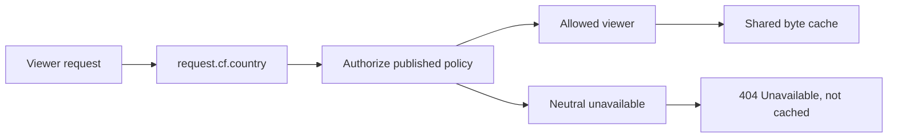

# Image delivery country

Image placement bytes stay on one region-neutral URL. A published allow may name the countries
where that tuple is denied. The worker authorizes the viewer before it reads or stores those bytes.

`request.cf.country` is the only country attribution. `CF-IPCountry` and any other caller header
cannot override it. `XX`, `T1`, a missing `cf` object, and any code outside the supported country
lookup are unknown.

Unknown geography fails closed only when the published denied-country set is non-empty. An allow
with an empty set is delivered. A withheld tuple is denied for every viewer. The unavailable body
is the same for a denied country and an unknown country, and it is not written to the shared cache.
An allowed viewer can use bytes cached for that same URL.

This is separate from [sanctions geo-blocking](reference-geo-blocking.md), which still reads the
`cf-ipcountry` header and fails open when `cf-ray` is absent. Production image DNS remains the
CloudFront distribution described in [routing](reference-routing.md). This module is the
authorization contract for that viewer check.
