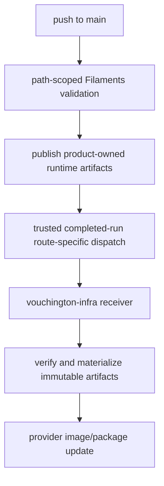

# Deployment reference

[Back to Deployment](deployment.md)

## CI/CD flow

`ci.yml` runs on pull requests and manual dispatch. It validates backend and web images but does
not publish runtime artifacts.

The completed source-run receiver emits exactly one route-specific event for each successful
default-branch source workflow. A successful `main-web` run triggered only to validate Lambda or
Cloudflare Worker changes is the exception: `web-deploy-intent` is skipped and no web event is sent.

| Source workflow          | Event type                              |
| ------------------------ | --------------------------------------- |
| `main-backend`           | `filaments-deploy-backend-v2`           |
| `main-web`               | `filaments-deploy-web-v2`               |
| `main-lambdas`           | `filaments-deploy-lambdas-v2`           |
| `main-cloudflare-worker` | `filaments-deploy-cloudflare-worker-v2` |
| `sync-articles`          | `filaments-publish-articles-v2`         |
| `main-storybook`         | `filaments-publish-storybook-v2`        |
| `docs-publish`           | `filaments-publish-docs-v2`             |

### Ownership boundary

After one of the allowed source workflows completes successfully from the trusted default branch,
Filaments sends one route-specific event containing only source repository, revision, workflow, run
ID, and attempt. It contains no
resource names, ARNs, buckets, registry endpoints, desired counts, queue placement, scaling
settings, or other infrastructure topology.

The receiver does not run or update OpenTofu during an application deployment. OpenTofu planning
and explicitly authorized saved-plan apply remain independent infrastructure workflows.

[`vouchington-infra`](https://github.com/vouchington/vouchington-infra) validates the sender and
source identity, verifies product-published artifacts for migrated routes, and owns durable
materialization, migrations, OpenTofu, provider mutations, resource mappings, desired counts,
autoscaling, worker placement, promotion, rollback, and serialization. Routes not yet migrated still
use the legacy infrastructure-side build. The handoff is asynchronous: Filaments does not poll or
wait for the receiver.

For Storybook, the successful trusted-main workflow uploads one protected
`storybook-<run-id>-<run-attempt>` artifact with one-day retention. The receiver selects that exact
source-run artifact by immutable artifact ID and publishes the validated static tree without
checking out or rebuilding product source. PR and dependency-bot Storybook runs stay test-only.

For documentation, the successful trusted-main workflow uploads one protected
`docs-<run-id>-<run-attempt>` artifact with one-day retention. It contains the generated OpenAPI
HTML and source JSON plus the rendered PostgreSQL schema reference under its sole `docs/` root; the
receiver selects that exact source-run artifact by immutable artifact ID. Filaments does not create
the documentation landing page or hold provider credentials.

### Operations and failure handling

- A successful Filaments run proves validation and dispatch only. Confirm the matching private
  receiver run by source repository, workflow, run ID, attempt, and revision.
- A receiver failure is retried from the private repository after the failure is understood.
  Filaments does not mutate provider state to recover it.
- Production is not live. Its promotion and rollback path must be implemented in the private
  repository before production is enabled.
- The global CI apply workflow and its trust remain disabled. Operator-controlled global applies
  use the private repository's separately authorized exact saved-plan procedure.

A destructive staging reset is not a receiver rerun. The private repository owns the manual-only
staging database reset (the "Staging database reset" step of the first-deploy checklist in the
private `vouchington-infra` repository), which requires organization access, including deploy/apply
admission, service quiescence, recovery evidence, and restoration. It resets only the PostgreSQL `public` schema;
Valkey, queues, object storage, analytics warehouse/event data, and infrastructure state are
retained.
