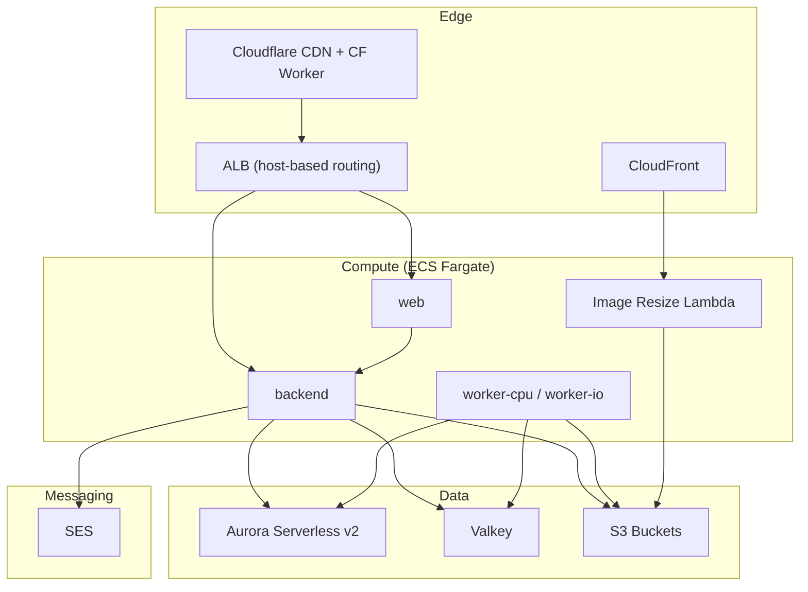

# Infrastructure reference

[Back to Infrastructure](infrastructure.md)

## Architecture Overview

The diagram below shows how the edge, compute, and data resources connect; staging and production each provision their own copy of the compute and data tiers behind the same Cloudflare/ALB edge, routed by host header.

Traffic flows: Cloudflare → ALB → ECS Fargate services. Each environment has its own backend, web, and worker services. See [deployment.md](deployment.md) for routing rules.

## ECS Services

Filaments validates and dispatches source revisions for the `api`, `web`, `worker-cpu`, and optional
`worker-io` artifacts. The private `vouchington-infra` repository builds and publishes those
artifacts and is the source of truth for live ECS service counts, task sizing, task definitions,
autoscaling, and worker queue placement. The Filaments worker queue policy classifies queue
capabilities without selecting a deployed topology. See
[Worker Performance](../../development/worker-performance.md).

Staging runs all ECS services on Fargate Spot only for cost control. In production, web and api
keep one on-demand Fargate task as the baseline and use Spot only for scale-out tasks; worker
services run Spot-only in every environment (queues self-heal from durable state, so a Spot
reclaim there is safe). Min/max task counts are configured per environment.

Public subnets with `assign_public_ip = true`. Each task gets one public IPv4 (~$3.60/mo, shared by all containers in that task); security groups limit ingress to ALB-only. Per-task IPs are cheaper than a managed NAT gateway (~$33/mo/AZ) at current scale — see [Networking](networking.md).

## Aurora Serverless v2

- PostgreSQL 18.3 (Aurora PostgreSQL; matches backend schema requirements for UUIDv7 helpers and virtual generated columns)
- `db_min_acu = 0` default intentionally enables auto-pause for staging cost control; `db_max_acu` defaults to 8 but staging caps it to 2 to bound autoscaler overreaction on a tiny workload (production keeps the 8 default)
- Private subnets only
- pgvector extension installed via migrations
- Databases: `voucha_staging` (staging), `voucha` (production)

### Deferred: IAM database authentication

`iam_database_authentication_enabled` is intentionally not set (defaults off). Considered and deferred in [#2496](https://github.com/jonathanong/filaments/issues/2496).

**Why deferred:** Zero AWS cost (token signing is a free local op), but real permanent complexity — two auth paths through the DB connection layer, mandatory TLS + RDS CA bundle, a host-aware async token callback (writer vs reader pool), an out-of-band `voucha_iam` Postgres role bootstrap (can't be done by Terraform or the migration runner), and a code path that only runs against real Aurora (not locally or in CI). The issue's stated motivation — avoiding static password copies — is partly mitigated: ECS reads the Aurora-managed Secrets Manager password directly and the backend assembles its connection URL at startup, so OpenTofu no longer copies the password into a `database-url` SSM value. IAM auth would still eliminate the static password entirely by replacing it with short-lived tokens.

**Revisit when any of these apply:**

- You want to eliminate the static password from `DATABASE_URL` entirely (zero-secrets posture, compliance requirement, or to harden against credential-staleness during idle periods).
- Multiple services or roles need individually scoped, IAM-managed DB access with per-role revocation.
- You need break-glass revocation of app DB access without a DB password reset.

## Valkey Strategy

### Phase 1 (Launch): Single Node-Based Instance

One `cache.t4g.micro` (~$12/month per env) for all 5 client groups per environment. This is required because GlideMQ (Worker Queue) uses `FUNCTION LOAD`/`FCALL` which ElastiCache Serverless blocks.

All 5 env vars point to the same instance:

- `VALKEY_SESSION_URL`
- `VALKEY_CACHE_URL`
- `VALKEY_RATE_LIMITER_URL`
- `VALKEY_DYNAMIC_CONFIG_URL`
- `VALKEY_WORKER_QUEUE_URL`

The backend deduplicates connections via `upsertValkeyClientByUrl` keyed by `(url, readFrom)`. With all URLs pointing to the same instance, this results in 2 shared clients (one `primary`, one `preferReplica`) plus a separate GlideMQ client for the worker queue. This mirrors local dev where all groups share one localhost instance.

**Trade-offs:**

- **Mixed eviction policies**: Only one policy per instance. Use `noeviction` (required by Worker Queue + Dynamic Config). Session/Cache/Rate Limiter keys have TTLs and expire naturally. Monitor memory usage.
- **No auto-scaling** (node-based). Fine at low traffic.
- **`appendonly yes`** for Worker Queue durability adds slight overhead for ephemeral groups. Acceptable.

### Phase 2 (Scale): Split to Serverless + Node-Based

Split when:

- Memory pressure from cache competing with worker queue
- Need auto-scaling for cache/session traffic
- Want different eviction policies per group

Migration plan:

1. Create ElastiCache Serverless instance (~$6/month minimum)
2. Point `VALKEY_SESSION_URL`, `VALKEY_CACHE_URL`, `VALKEY_RATE_LIMITER_URL`, `VALKEY_DYNAMIC_CONFIG_URL` → Serverless
3. Keep `VALKEY_WORKER_QUEUE_URL` → node-based
4. Deploy. No data migration needed:
   - Caches rebuild automatically from DB
   - Session tokens expire naturally (max 30 days device, 2 days session)
   - Rate limiter state is ephemeral
   - Dynamic Config re-initializes on startup

## CloudFront + Lambda (Image Resize)

- Lambda Function URL behind CloudFront distribution
- CloudFront OAC with AWS_IAM Lambda Function URL authentication
- The dedicated `images{,-staging}.voucha.ai` origin handles `/images/*` and `/sideload/*` directly; browser image requests do not traverse the apex Worker
- `/sideload/*` requires `VOUCHA_SIDELOAD_SIGNING_KEYS` in staging/production; the image Lambda fetches the SSM SecureString at runtime and missing keys fail closed
