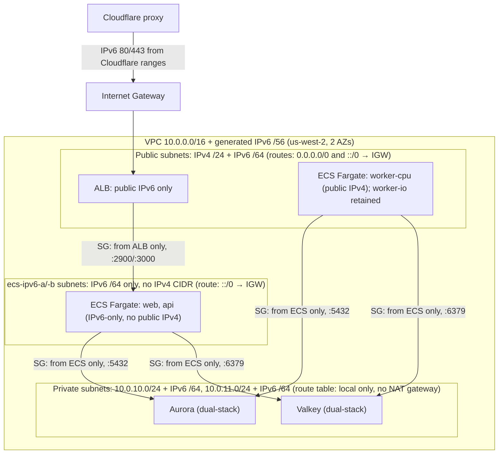

# Networking reference

[Back to Networking](networking.md)

## Topology

VPC `10.0.0.0/16` plus an Amazon-provided IPv6 `/56` across 2 AZs in us-west-2:

| Subnet     | IPv4 CIDR    | IPv6 CIDR                     | Route table               | Purpose                                  |
| ---------- | ------------ | ----------------------------- | ------------------------- | ---------------------------------------- |
| public-a   | 10.0.1.0/24  | VPC `/64` #1                  | `0.0.0.0/0`, `::/0` → IGW | ALB, worker-cpu ECS (worker-io retained) |
| public-b   | 10.0.2.0/24  | VPC `/64` #2                  | `0.0.0.0/0`, `::/0` → IGW | ALB, worker-cpu ECS (worker-io retained) |
| ecs-ipv6-a | none         | VPC `/64` #20 (`ipv6_native`) | `::/0` → IGW              | web, api ECS (IPv6-only)                 |
| ecs-ipv6-b | none         | VPC `/64` #21 (`ipv6_native`) | `::/0` → IGW              | web, api ECS (IPv6-only)                 |
| private-a  | 10.0.10.0/24 | VPC `/64` #10                 | local only                | Aurora, Valkey (dual-stack)              |
| private-b  | 10.0.11.0/24 | VPC `/64` #11                 | local only                | Aurora, Valkey (dual-stack)              |

There is no NAT gateway. The current runtime's `worker-cpu` ECS Fargate task runs in the public
subnets with `assign_public_ip = true`; the retained `worker-io` design uses the same path only
when private infrastructure re-enables it. `web` and `api` run in
the dedicated `ecs-ipv6-a`/`ecs-ipv6-b` subnets — `ipv6_native = true`, no IPv4 CIDR at all, so
those tasks receive only an IPv6 address (`assign_public_ip = false`). Aurora and Valkey are in the
private subnets, which now carry both an IPv4 and an IPv6 CIDR (`network_type = "DUAL"` /
`"dual_stack"`) so both the public-IPv4 workers and the IPv6-only web/api tasks can reach them;
Valkey leaves `ip_discovery` unset because AWS rejects that knob on the single-node,
cluster-mode-disabled replication group. The ALB spans both public subnets and exposes only public
IPv6 addresses. Its two target groups —
`backend` (api) and `web` — are both `ip_address_type = "ipv6"`, matching the IPv6-only ECS
subnets those services now run in; `worker-cpu`/`worker-io` are not ALB-fronted, so no target
group carries IPv4.

Internet egress: `worker-cpu` reaches external endpoints directly via the IGW using its public IPv4;
worker-io uses the same path only when re-enabled. `web`/`api` reach external endpoints via the IGW using their public IPv6 (`::/0` route
on the `ecs-ipv6` route table and the dedicated ECS IPv6 egress security-group rule). The
IPv6-native ECS subnets explicitly enable resource-name AAAA records because AWS rejects the provider
default of `false` on a subnet with no IPv4 CIDR. See [Public IPv4 cost model](#public-ipv4-cost-model)
below.

Source: `vouchington-infra/opentofu/vpc.tf`.

## Public IPv4 Cost Model

AWS has charged for public IPv4 addresses since 2024-02-01. Fargate always uses
`awsvpc` networking — exactly one ENI per _task_. With `assign_public_ip = true`
that ENI gets one public IPv4. **All containers in a task share it** — cost is
per-task, not per-container.

The private `vouchington/vouchington-docs` repository is the canonical source for the current
ECS task public IPv4 subtotal. The ALB uses `dualstack-without-public-ipv4`, so its base
LCU-hours remain billed but it no longer adds public IPv4 address charges. `web` and `api` moved off
public IPv4 entirely by running IPv6-only (see [Topology](#topology) above); only
`worker-cpu` still incurs the per-task charge. Worker-io incurs the same cost only when
private infrastructure re-enables its task, since a worker task needs to reach
the IPv4-only Bedrock Runtime endpoint directly (see the [AWS Application Endpoint
Inventory](reference-networking-aws-application-endpoint-inventory.md#aws-application-endpoint-inventory)).
