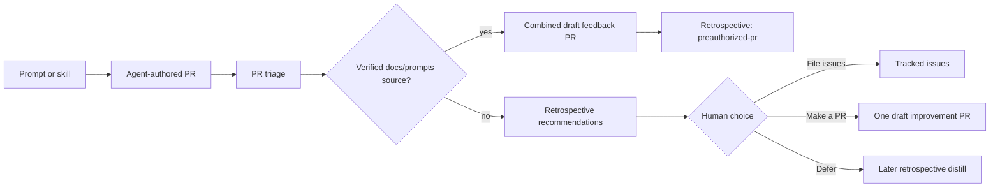

# Automation Prompts

Automation prompt text lives here so workflow YAML stays focused on triggers, permissions, and context wiring.

## Prompt Surfaces

| Surface                    | Source                                                             | Used by                                                                                                                                                                      |
| -------------------------- | ------------------------------------------------------------------ | ---------------------------------------------------------------------------------------------------------------------------------------------------------------------------- |
| Code review inline overlay | [code-review-inline-comments.md](code-review-inline-comments.md)   | Default `inline_prompt_path` overlay for the `code-review` composite action; see the file itself for the full contract and consumers                                         |
| Scheduled prompts          | [scheduled/](scheduled/) (indexed in [SCHEDULED.md](SCHEDULED.md)) | [scheduled-prompts.yml](../../.github/workflows/scheduled-prompts.yml) and the [workflow inventory](../../.github/workflows/README.md)                                       |
| Automation templates       | [automation](automation/)                                          | Templates rendered by [ci/render-harness-prompt.mts](../../ci/render-harness-prompt.mts) before calling [harness-dispatch.yml](../../.github/workflows/harness-dispatch.yml) |

Automation templates use `{{UPPER_SNAKE_CASE}}` placeholders. Render them with [ci/render-harness-prompt.mts](../../ci/render-harness-prompt.mts), passing short values with `--var NAME=value` and multiline or user-provided values with `--var-file NAME=path`.

The main-branch fix template is [fix-main.md](automation/fix-main.md). Scheduled runs use the
[scheduled prompt template](automation/scheduled-prompt.md) or the
[scheduled issue template](automation/scheduled-issue.md), depending on the selected prompt scope.
Scheduled prompt references include [supply-chain security](scheduled/supply-chain-security.md)
and [UI internationalization](scheduled/ui-internationalization.md).

These templates are Vitest fixtures, not docs-only markdown. `TEST_FIXTURE_DOCS` in
[`ci-detect-changes.yml`](../../.github/workflows/ci-detect-changes.yml) keeps a pull request that
touches any markdown file under this whole tree (`docs/prompts/.+\.mdx?`) from being
misclassified `docs-only`, which would otherwise skip `test-tooling` outright; and the `tooling`
group in [`ci-path-filters.yml`](../../.github/ci-path-filters.yml) covers all of `docs/prompts/**`,
so CI runs the full `test-tooling` suite (the `github-actions`, `ci-tools`, and `dev-tools` Vitest
projects) for any change under this directory. See
[area test suites](../development/ci.md#area-test-suites).

## Agent-Authored PR Feedback Loop

PR-triage skills use the canonical
[agent-authored PR creation feedback](../../.agents/skills/agent-workflow/code-review.md#agent-authored-pr-creation-feedback)
rubric to turn evidence from generated PRs into improvements to their verified
source prompt, producing skill, or shared workflow. `/triage-prs` automatically combines actionable,
verified `docs/prompts/**` findings from its batch into one Plan issue and one draft feedback PR;
other sources keep the normal human disposition. Individual scheduled prompt bodies change only when
evidence identifies that exact prompt as the source.

