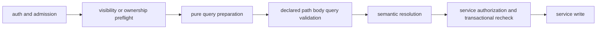

# Request validation

[Back to API Routes](README.md#route-helpers)

Routes authenticate and complete admission, visibility, suspension, and non-mutating ownership
preflights before detailed declared request validation. The declared path/body/query check then
runs before semantic resolution or writes; services retain authorization guards and transactional
rechecks. A lag-sensitive mutation preflight reads from the primary when it must observe a
preceding write.

`validateRequestContract` is backed by `@services/runtime-request-validation`, which compiles the
checked-in bundle with `@vouchington/request-contract-validation`. Routes use the adapter rather
than its registry. A 422 names the carrier and does not include a JSON pointer. Signature-verified and raw-body routes keep their specialized
parsers. Query routes prepare a normalized wire projection before asynchronous identifier
resolution, preserving pagination clamping and malformed limit/cursor 400 behavior while malformed
typed values remain visible for 422. There is no shared Ajv coercion, and UUID routes retain
`validateUUIDParam` alongside declared path validation. A paginated list route runs its pagination
parser first, overwrites `limit` and `after` in the prepared query with the parsed values, and then
validates, so clamping and the parser's `400` survive and only the filters are checked;
[`validate-paginated-query.mts`](../../../backend/api/validate-paginated-query.mts) wraps those steps.
A lenient filter (an unknown enum that falls back to its default, or an ignored key) is validated
from its settled value so it cannot answer `422`.

An exposed request carrier must have a meaningful declared schema; invoking the adapter against
an empty object is not coverage. Maintain the checked-in bundle alongside handler types through the
[fixture update flow](../../development/testing/backend/api-fixtures.md#update-flow). Route HTTP tests
verify carrier behavior, invocation order, status, and rejected execution without compiler discovery.

## Route-family references

- [Content, list, household and public user routes](reference-content-routes-request-validation.md)
  describe selected request and status behavior for that family.
- [Staff, admin, and operations routes](reference-staff-operations-request-validation.md) describe
  selected status behavior and specialized request handling.
- [Copyright notice, appeal, and counter-notice routes](reference-copyright-submission-request-validation.md)
  describe request ordering and status behavior.
- [Copyright guest capability and guest filing routes](reference-copyright-guest-request-validation.md)
  describe request ordering and capability-token behavior.
- [Copyright EU, UK, and territorial policy routes](reference-copyright-territorial-request-validation.md)
  describe request bodies and the route's legal status outcomes.
- [Copyright repeat-infringer and staff queue routes](reference-copyright-staff-request-validation.md)
  describe handler ordering and status behavior.
- [Copyright email-intake routes](reference-copyright-email-intake-request-validation.md) describe
  request parsing and status behavior.
- [Copyright submission review routes](reference-copyright-submission-review-request-validation.md)
  describe request parsing and status behavior.
- [Copyright staff decision routes](reference-copyright-staff-decision-request-validation.md)
  describe request parsing and status behavior.
