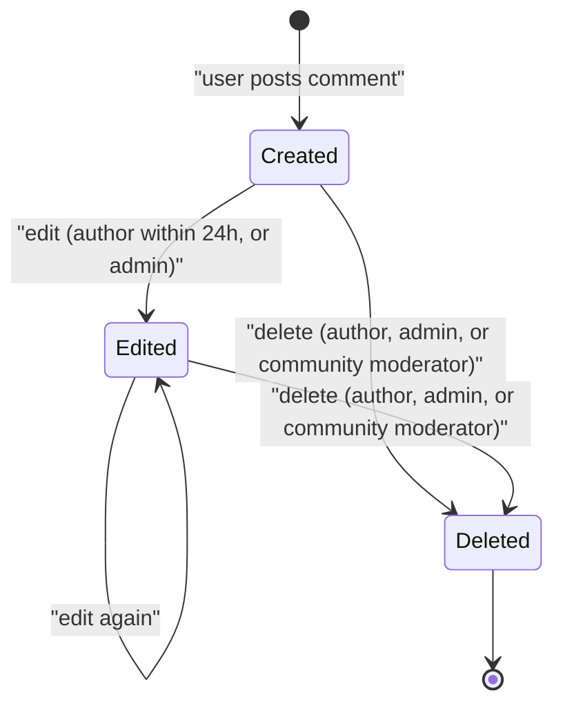

# Comments

See also: [Entity × Action Matrix — comment](../reference-comment.md#comment) · [Entity × Lifecycle Flow Matrix — comment](../reference-comments.md#comments)

## Comment Component

Signed-in users can post comments on posts.
When creating a comment, the comment is shown at the top.

Swift and .NET provide native routed post-detail/comment-permalink thread surfaces with root,
ancestor, descendant, sort, collapse, vote, reply, quote, save, report, edit, delete, and
lock/unlock controls. Admin moderation sidecars remain a web/staff surface.
Native parity must stay native; do not use WebView/open-web comment surfaces.

Comments are shown as a tree, Reddit-style:

- The rows are:
  - Comment Header:
    - User profile image - if available
    - User display name - links to their profile page
    - Time ago - links to the comment's permalink page
    - next - goes to the next comment in the same level. hide if none exist
    - prev - goes to the previous comment in the same level. hide if none exist
    - root - goes to the root comment (not the root post), aka the comment ancestor whose `root_id` is the post. hide if it's the root or if root = parent (they would do the same thing).
    - parent - goes to the parent comment.
    - toggle - toggles hiding and showing this comment and its children. when hidden, only show this row. Clicking anywhere on the metadata row (chevron, avatar, username, timestamp) collapses the thread; inner navigable links (username, timestamp) remain clickable without collapsing. Collapsed state persists per-user via `localStorage` keyed by `comments-collapsed:<rootPostId>:<userId>` for authenticated users (`comments-collapsed:<rootPostId>` for anonymous viewers).
  - HTML content
  - Action Buttons:
    - Upvote
    - Downvote
    - Reply
  - Header `...` kebab (signed-in, not comment author):
    - Report — opens `ReportDialog` to submit a moderation report via `POST /api/v1/reports`. See [REPORTING.md](../moderation/REPORTING.md).

## Comment Tree

Show a comment tree.

- Each reply is indented one level to the right of its parent
- A vertical line runs along the left edge of each nested level, connecting a parent comment to its children
- The lines are clickable, collapsing the entire sub-thread

Example:

```
Comment A          | (line 1)
├─ Reply B         | | (line 1 + line 2)
│  ├─ Reply D      | | | (3 lines)
│  └─ Reply E      | | | (3 lines)
├─ Reply C         | | (line 1 + line 2)
```

Set a constant for the depth of comments to show.
By default, set a depth of 5.
When a comment of that depth is reached,
instead of showing the replies,
show a link saying "See all X replies", which goes to that comment's permalink.

## Comment Search

Search Options:

- Sort
  - New (default)
  - Best

## Reply

A user can reply with just a single auto-expanding textbox.
The only buttons available are `Submit` and `Cancel` (only for comment replies).
The post reply box is **always shown** — even when the post has no comments yet.

- **Logged-in users**: see the reply textarea with placeholder "What are your thoughts?"
- **Unauthenticated users**: see a "Sign in to comment" prompt in place of the textarea

A comment reply box is only shown when clicking `reply` on the comment.
Replies can be posted anonymously. Anonymous comments show `Anonymous` to everyone except the creator and admins.

## Comment Permalink

A comment permalink page allows reviewing comments in deeply nested structures much easier.
The format is:

- Post
- ...Ancestors
- Comment (subject of this permalink)
- Comment's Descendant Tree

Since the ancestors need to be visually distinguished, we'll have a `|` in the middle of the comment (horizontally centered) to denote that it's the child.
It will look like:

```
Post
    |
Comment A
    |
Comment B
├─ Reply D
└─ Reply E
```

Canonical comment permalink mentions use the same route:

- `/:post-type/:idOrSlug/comment/:commentId`
- `!` mentions may target this canonical route in relative or same-site absolute form

## Comment Edit

An inline edit form is shown in `CommentNodeActions` when the comment response includes `can_edit_content=true` (author within 24h, or admin with no window). Editing replaces the comment body in place without a page navigation.

## Comment Delete

A Delete button is shown in `CommentNodeActions` when the comment response includes `can_delete=true` (author or admin; community moderators may also delete community-post comments). Clicking opens an `AlertDialog` confirmation; on confirm the comment content is replaced with a `[deleted]` placeholder and the author attribution is removed.

The following diagram summarizes the comment content lifecycle described above:



## Comment Save

A Save/Unsave toggle (`EntityBookmarkButton`, predicate `save`) is shown in `CommentNodeActions`. Signed-in users only. Allows bookmarking a comment for later retrieval.

## Related

- [Web rules](../../../web/CLAUDE.md) — UI, routing, and client conventions
- [Backend rules](../../../backend/CLAUDE.md) — service, API, and data conventions

- [docs/requirements/navigation/ACCESSIBILITY.md](../navigation/ACCESSIBILITY.md)
- [docs/requirements/users/ACCOUNT-DELETION-DATA-REQUEST.md](../users/ACCOUNT-DELETION-DATA-REQUEST.md)
