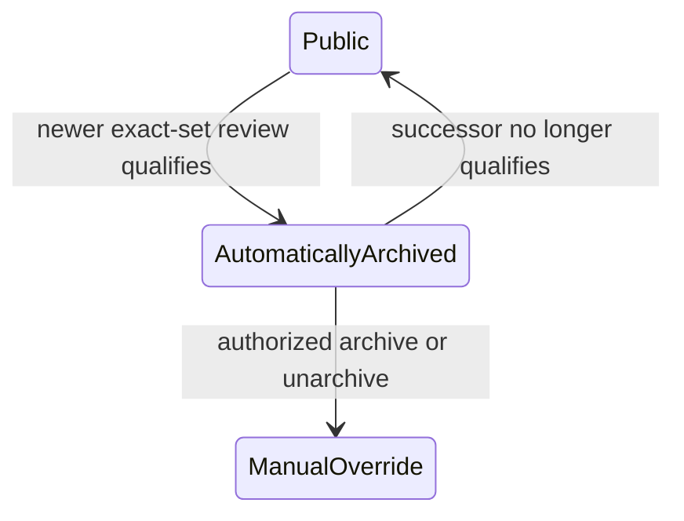

# Review succession

Root reviews with the same non-null author and exact nonempty rated-topic set form a succession
group. Publication reconciliation chooses the newest currently public review, automatically archives
older public predecessors, and records immutable archive-time evidence in `review_successions`.

Topic edits use the current set for later routing; stored archive evidence never changes. A manual
action terminalizes only its acted-on predecessor epoch, so reconciliation never guesses across it.
See the [historical audit runbook](../../operations/review-succession-history-audit.md).
