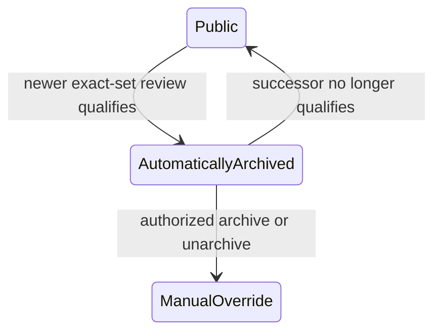

# Review succession

Root reviews with the same non-null author and exact nonempty rated-topic set form a succession
group. Publication reconciliation chooses the newest currently public review, automatically archives
older public predecessors, and records immutable archive-time evidence in `review_successions`.
The exact nonempty topic set is `review_succession_topics`, each row referencing the succession and
a retained topic identity. Later rating edits do not change that set.

```mermaid
stateDiagram-v2
  Public --> AutomaticallyArchived: newer exact-set review qualifies
  AutomaticallyArchived --> Public: successor no longer qualifies
  AutomaticallyArchived --> ManualOverride: authorized archive or unarchive
```

Topic edits use the current set for later routing; stored archive evidence never changes. A manual
action terminalizes only its acted-on predecessor epoch, so reconciliation never guesses across it.
See the [historical audit runbook](../../operations/review-succession-history-audit.md).

Every automatic archive and restore also writes an `update` row to `post_revisions` in the same
statement, with NULL `revised_by_id` and the exact archive epoch timestamp in the `archived_at`
before/after change. Only posts that actually change state gain a revision; replay adds none.
Manual overrides retain the existing manual revision path. The entity-listener reconciliation
sweep emits `post_updated` with `contentChanged: false` for automatic lifecycle revisions.
