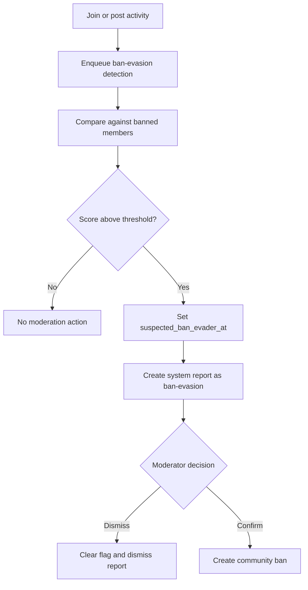

# Ban Evasion

Ban-evasion detection identifies users who appear to be returning to a community after a community ban.

## Scope

- Services: `backend/services/communities/ban-evasion/`
- Queues: `backend/queues/ban-evasion/`
- System reporter: `ban-evasion`
- Tables: `community_members` ban-evasion fields, `moderation_reports`

## Signals

Detection compares the candidate user's community posts against banned users using content hashes, embedding similarity, and referral-link overlap. A combined score above the configured threshold flags the member.

## Flow

1. Join/post activity enqueues detection. Post-triggered jobs retain the triggering post ID so content and embedding comparisons do not rescan the candidate's full post history.
2. A suspected match sets `community_members.suspected_ban_evader_at`.
3. The `ban-evasion` system user creates a system-generated user report.
4. Community moderators confirm or dismiss.
5. Confirming creates a community ban; dismissing clears the flag and dismisses the system report.

The `ban-evasion` username is load-bearing: report redaction treats reports from that system user as system-generated.

See also: [Community Bans](./COMMUNITY-BANS.md), [Reporting](./REPORTING.md).
