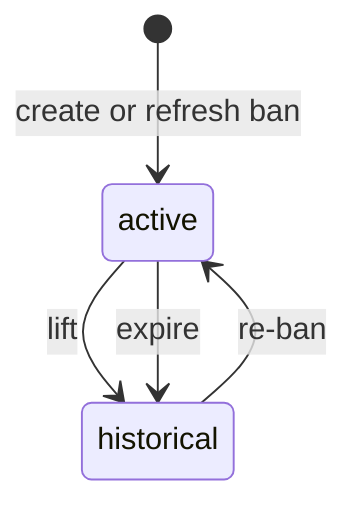

# Community Bans

Community bans prevent a user from participating in one community while preserving their global account.

## Scope

- Table: `community_bans`
- Services: `backend/services/communities/bans/`
- Surfaces: community member list, moderation settings, ban-evasion review queue
- Audit: `moderator_actions` action types `ban` and `lift_ban`

## Roles

| Role                | Can create | Can lift | Notes                                                         |
| ------------------- | ---------- | -------- | ------------------------------------------------------------- |
| Community owner     | Yes        | Yes      | Cannot ban self.                                              |
| Community moderator | Yes        | Yes      | Scoped to communities they moderate.                          |
| Administrator       | Yes        | Yes      | May bypass active-member checks for ban-evasion confirmation. |

## Lifecycle

1. Moderator creates a ban with optional reason and expiry.
2. Active membership is removed and future joins/posts are blocked while the ban is active.
3. A lifted or expired ban remains as history.
4. Re-banning creates or refreshes the active enforcement record.

## API And Data

- Create/lift routes: `POST/DELETE /api/v1/communities/:idOrSlug/bans`
- Enforcement happens in community membership and publication services.
- Ban-evasion confirmation calls `banUserFromCommunity()` and records the action through the same path.

See also: [Moderation Flows](./MODERATION-FLOWS.md), [Ban Evasion](./BAN-EVASION.md), [Modlog](./MODLOG.md).
