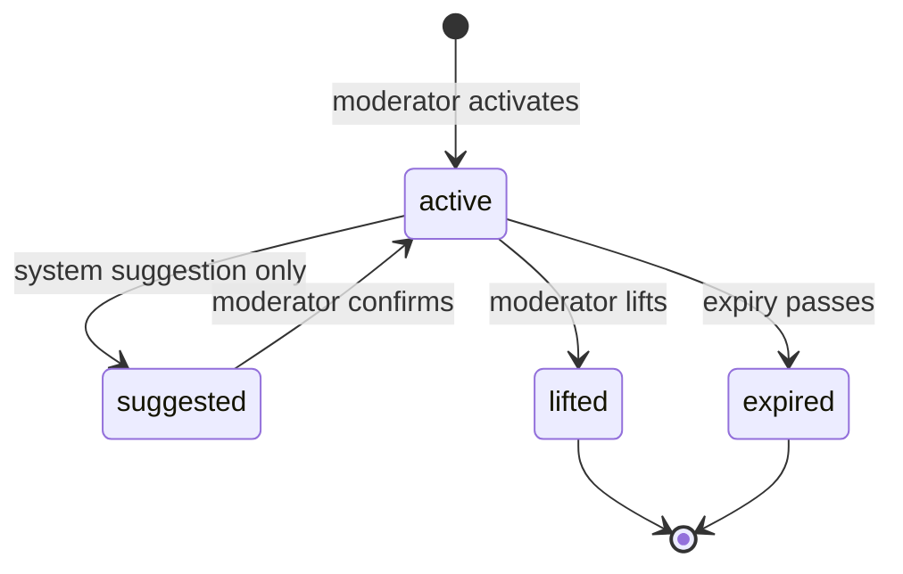

# Community Restrictions

Community restrictions are temporary community-level controls such as raid mode.

## Scope

- Table: `community_restrictions`
- Services: `backend/services/communities/restrictions/`
- Audit: `moderator_actions` action types `activate_restriction` and `lift_restriction`

## Restriction Types

Raid mode limits risky participation during coordinated abuse. Enforcement is community-scoped and should be checked at membership, posting, and publication boundaries rather than through global user state.

## Roles

| Role                | Activate | Lift | Notes                 |
| ------------------- | -------- | ---- | --------------------- |
| Community owner     | Yes      | Yes  | Full community scope. |
| Community moderator | Yes      | Yes  | Community scope only. |
| Administrator       | Yes      | Yes  | Platform override.    |

## Lifecycle

1. Moderator activates a restriction with reason and optional expiry.
2. Enforcement services read the active restriction set.
3. Suggestions can propose restrictions, but activation remains a moderator action.
4. Moderator lifts the restriction or it expires.

See also: `backend/services/communities/restrictions/README.md`, [Modlog](./MODLOG.md).
