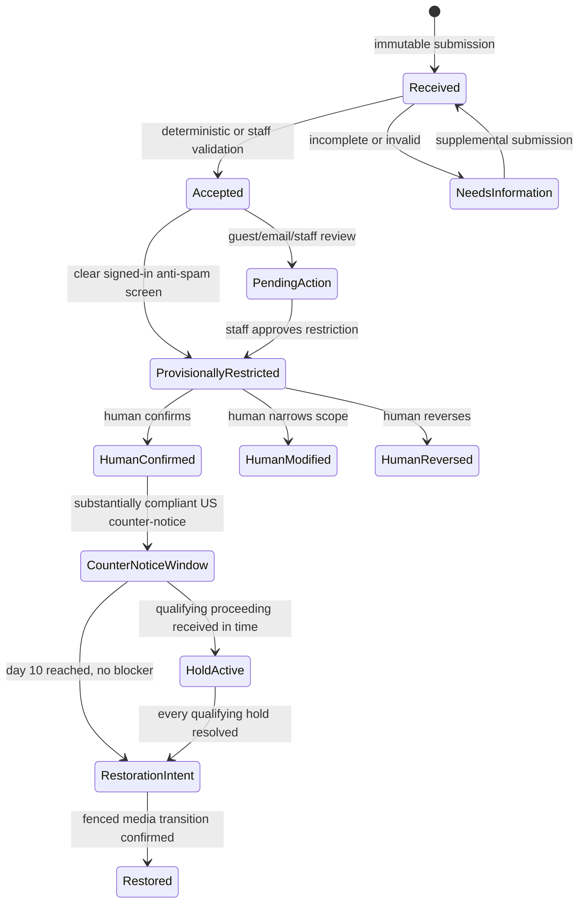

# Copyright Notice Lifecycle

Copyright notices are legal cases, not `MODERATION_POLICY` reports. They may refer to content that
is otherwise allowed by platform policy, and an ordinary moderation appeal does not become a US
statutory counter-notice. The copyright domain therefore owns its records and deadlines while
reusing staff authorization, notifications, modlog, and approved-correspondence patterns.

The implementation remains disabled by default through `COPYRIGHT_INTAKE_ENABLED`. It must not be
enabled until CAPTCHA, agent recovery, notification, reversible-media, staff UI, and production
evidence-storage dependencies are deployed and the activation checklist below is complete.
The flag controls only new form/email intake and new agent disclosure. Disabling intake must never
hide accepted complaints or interrupt an existing case's staff review, appeal, counter-notice,
hold, delivery, enforcement, or restoration obligations.

## Ownership boundaries

| Owner                               | Responsibility                                                                                                                                                 |
| ----------------------------------- | -------------------------------------------------------------------------------------------------------------------------------------------------------------- |
| `@services/copyright-notices`       | Case creation, immutable submissions and evidence metadata, compliance assessments, human review, public projection, deadlines, holds, and restoration intents |
| Copyright intake routes and workers | Authenticate or verify CAPTCHA/attestation, encrypt private fields, preserve email source, and call the domain service                                         |
| Media placement service             | Authoritative current placement revision, reversible delivery state, and non-copyright blockers such as deletion, replacement, safety action, or court order   |
| Staff moderation surfaces           | Human review, corrections, appeals, correspondence approval, and legal escalation                                                                              |
| Notifications and email delivery    | Idempotent delivery intents, retries, bounce visibility, and verified case-scoped access                                                                       |

No caller may update copyright tables directly. In particular, a delivery worker cannot decide that
a counter-notice is compliant or that a hold is qualifying.

## Delivery obligations

Each claimant receipt, poster restriction notice, status update, and counter-notice forwarding is
recorded as an idempotent `copyright_notice_delivery_intents` row before it reaches a transport.
The row is staff-visible through the private case aggregate and transitions from `pending` to
`claimed`, then `sent`, `failed`, or `bounced`. A retryable failure returns to `pending`; bounded
retry uses exponential backoff and stops after five attempts so poison deliveries cannot
starve newer obligations; terminal failures remain staff-visible. A sent or bounced delivery cannot
be rewritten. The transport records its SES message ID when available, so the
SES bounce/complaint stream can be correlated without treating an attempted send as proof of
delivery. Because SES acceptance precedes the database transition, a crash in that narrow window
can produce a duplicate legal email; every send keeps the stable case and delivery identity so staff
can correlate it. Copyright emails opt out of the generic operational BCC because they may contain
statutory personal information. The email transport worker is activation-blocking infrastructure: it must claim these
rows, resolve private recipient evidence case-scoped, and report SES bounces before
`COPYRIGHT_INTAKE_ENABLED` is enabled.

## Placement enforcement boundary

Hosted post media is addressed by a durable, media-neutral placement identity. The image binding is
immutable, while a monotonic placement revision advances whenever the attachment is retired,
reactivated, withheld, or restored. Copyright action workers re-read and lock that authoritative
placement, the exact image binding, the expected revision, every legal blocker, and the restriction
state before applying an intent. Withholding one placement never deletes the source image or blocks
another post that independently uses the same image.

Application projections omit retired or withheld placements, and persisted post image URLs use
`/images/placements/<placement-id>/<revision>/<image-id>`. The resize Lambda validates the route
shape and keeps the placement segments out of the S3 key. Those application controls do not by
themselves revoke a warm CDN response or prevent a caller from trying a historical generic image
URL. Complete delivery enforcement therefore also requires the separately deployed infrastructure
edge registry, viewer authorization, direct-origin denial, legacy-route retirement, cache
invalidation, and cross-store reconciliation. Intake must remain disabled until those controls pass
cold-cache, warm-cache, stale-revision, mismatched-image, and direct-origin tests.

Staff may request image-similarity candidates from existing embeddings. Candidates are advisory,
exclude unavailable or moderated media, and return placement identifiers and state rather than S3
keys, vectors, or public URLs. They never expand a notice target or apply a restriction
automatically; a missing source embedding schedules the ordinary batch pipeline without delaying
the legal case.

## Derived state machine

There is no mutable `status` column. State is derived from immutable facts and one-way timestamps.

Every automatic provisional restriction, including a later restriction added to an already reviewed
case, must receive its own recorded `confirm` or `reverse` decision from an identified
staff user. It cannot become final merely because no appeal arrived. Each restriction is independent.
Reversing or lifting one does not override another copyright case, a safety restriction, deletion,
replacement, or a court order affecting the same placement. Erasing a staff account may null its
foreign key, but cannot erase the decision timestamp, outcome, or lifecycle record.
If erasure happens after a form rejection but before its effects finish, recovery uses the durable
rejection to reverse provisional restrictions and close pending automated enforcement requests.

## Submission and evidence integrity

Each form, email, supplement, appeal, counter-notice, withdrawal, and proceeding notice is a separate
immutable submission with its original receipt time. Compliance decisions are appended as separate
assessments, so parsing or moderation cannot rewrite receipt history. Guest and email assessments
require an identified moderator, and a restriction consumes only the current substantially compliant
allegation assessment. Email MIME and attachments are
private evidence artifacts identified by an object key, byte length, media type, and SHA-256 digest.
The evidence bytes remain in private storage and are never read through a public media URL.
An inbound correspondence body freezes on receipt; an outbound body freezes once delivered (and an
agent-composed outbound message also freezes when a staff reviewer approves it).

Designated-inbox email first becomes a private immutable **email intake**, not an immediately
actionable case: the worker preserves the complete original MIME object, hashes it, records parsed
attachment metadata, sanitizes and wraps untrusted text for the advisory extraction agent, and
persists the encrypted structured result. The agent may flag obvious spam or missing information
but cannot create a restriction, correspondence, or legal case. A moderator must review the source
and agent output, then explicitly accept or reject it before a valid email submission can enter the
case lifecycle, even when the recommendation is `potentially_valid`.

Email extraction includes the claimant, contact, work, hosted URLs, signature, and both statutory
declarations, with short source excerpts for moderator verification. Missing declarations remain
null; the agent cannot infer them. RFC `Message-ID`, `In-Reply-To`, and `References` values are
encrypted and retained for case-scoped correspondence threading using keyed digests only. A matched reply keeps
its original MIME evidence, still receives the same advisory structured extraction and recommendation, and waits
for moderator classification; it cannot trigger a restriction or outbound message automatically. An approval normally names
the recommendation reviewed. If the agent is unavailable or fails, staff must instead record an
explicit manual-fallback reason while reviewing the preserved original.

The signed-in form is already structured. Its agent is only an anti-spam and obvious-invalidity
screen, not a legal merits decision. The recommendation remains a separate immutable record; it
cannot supply a declaration, contact detail, work description, hosted target, or signature. Only a
deterministically complete immutable US DMCA form, with a `not_obviously_invalid` screen, may be
provisionally withheld automatically, and it enters urgent mandatory human review. An incomplete
form can never auto-restrict. Guest forms
always require moderator approval. A signed-in form classified as `invalid_or_spam`, or left without
a result after agent failure, is held for a moderator decision so a false positive or exhausted
agent outage cannot strand a legal notice. Form routes require Turnstile, enforce CSRF through the normal
authenticated route boundary, apply route-scoped rate limits, and store only a purpose-separated
HMAC-derived guest network digest rather than the source address.

Hosted-use selection accepts canonical post URLs, including `/story/:id`, and verifies their images
through the post API. Query strings, fragments, and foreign hosts are rejected.

Email admission trusts the SES receipt-rule classification and the configured
`copyright-incoming/` object prefix, never recipient headers inside untrusted MIME. The original S3
version and ETag are pinned and copied into the private evidence bucket before parsing. Parse
failures remain immutable staff-visible intakes with the original evidence; they are not dropped or
promoted automatically.

Private contact details, signatures, raw text, attachments, staff rationale, agent output, and
storage keys are never member fields. Accepted cases use an explicit authenticated-member allowlist.
The claimant link comes from the account's current public profile, not a legal-name or signature
snapshot. A target reference is returned only when that viewer may otherwise see the target.

## Member and staff surfaces

`/copyright/notices` and `/copyright/notices/:id` require authentication. They list only accepted
US cases and project case identifier, dates, target URL, restriction state, and a metadata-free
lifecycle timeline. They never expose claimant or poster identity, email, mailing address, signature,
raw email, evidence artifacts, encrypted fields, moderator rationale, or agent recommendation.

Claimants and affected posters receive a participant projection for their own submissions. Copyright
review staff receive a separate queue and private case projection. Staff-only routes may expose
evidence metadata and agent recommendations needed to perform human review, but not to ordinary
members. All mutation routes remain server-authorized even when an authenticated page renders an
appeal or counter-notice form.

The web uses Turnstile for each notice, appeal, and counter-notice form. Native clients use the
attestation route described by the CAPTCHA boundary. CAPTCHA is an intake abuse control, not a
legal-validity or merits assessment.

## Global launch gate

The product is a US startup, but it targets users globally. The currently implemented public intake
is US DMCA-only and remains disabled until a designated agent is registered with the US Copyright
Office, its published contact channel is monitored, and the runbook activation checklist passes.
Do not claim that a designated agent is active before those facts are true.

Before accepting EU notices, appoint any required DSA legal representative and contact points,
implement Article 16 notice handling and Article 17 statements of reasons, assess Article 24(5)
transparency reporting, and obtain counsel's Article 17 DSM analysis. Before accepting UK notices,
complete a UK copyright and Online Safety Act applicability assessment and publish the resulting
process. These are activation requirements, not claims of current compliance.

## US counter-notice timing

A substantially compliant US counter-notice starts its clock at the immutable `received_at` of the
submission found compliant. Its exact requested restoration targets are immutable assessment scope;
an unlisted target cannot restore under that deadline. The parsing time, assessment time, staff approval time, and forwarding
time do not move it.

The persisted schedule uses `America/New_York` and the US federal business calendar:

- `earliest_restoration_at`: start of business day 10;
- `escalation_at`: start of business day 14; and
- `restoration_deadline_at`: exclusive end of business day 14.

The forwarding correspondence must send the original claimant the canonical counter-notice: the
submitter's name, address, telephone, signature, each exact target identifier and hosted URL, and
each required declaration and consent. The claimant receives only that case-scoped private
correspondence; these details and any original email evidence are never part of a member-visible
case projection. An ordinary correction or appeal starts no statutory clock. Missing the deadline is
an overdue incident and urgent escalation, not a reason to keep otherwise eligible material down.

The service creates a preliminary restore intent only while holding the relevant case, placement
target, restriction, deadline, and a shared placement advisory lock. The same lock serializes every
copyright restriction imposed for that placement. The transaction rechecks the expected placement
revision, every active same-placement copyright restriction, every unresolved target-specific
qualifying hold, and mandatory human review. The intent is not delivery authorization: the media
worker must atomically recheck deletion, replacement, safety and other durable blockers against the
authoritative placement record before completing the fenced transition.

## Court and CCB holds

A proceeding blocks restoration only when the designated agent received it before restoration and
staff recorded all applicable facts:

- it came from the original notifying claimant;
- a federal-court action or CCB proceeding was commenced, rather than threatened;
- it identifies the same material; and
- a CCB filing is a qualifying claim or counterclaim under 17 USC 1507(d).

Assess every received filing separately and bind its material scope to the exact notice targets it
covers. Restoration remains blocked while any qualifying assessment for that target is unresolved.
When staff record that no qualifying proceeding exists, the assessment carries no proceeding dates
or CCB claim kind, even if staff previously entered those fields while reviewing the filing.
Dismissal, the end of a proceeding, or a superseding assessment is an immutable hold resolution,
never an edit or deletion of the original filing. Assessments that reactivate a lifted restriction
or extend an existing legal-hold restriction carry immutable restriction bindings, so resolving the
final overlapping hold replays a previously blocked restoration. A hold on an ordinary active DMCA
restriction blocks restoration while unresolved; resolving that hold does not bypass the ordinary
counter-notice deadline or human reversal requirement.

## Jurisdiction and public meaning

US timing does not govern EU or UK cases. The initial intake contract therefore accepts only
`us_dmca`. EU and UK intake must stay disabled until their distinct schemas, reasons, automation
disclosures, free human complaint paths, representatives, and jurisdiction-specific review rules
are implemented and legally reviewed. Conflicting grounds go to qualified staff or counsel, and
removing one ground cannot remove another.

A member-visible case records an allegation and, where applicable, a provisional restriction or reviewed
outcome. It never describes the claimant as the proven owner or the poster as an infringer.

## Activation gates

Before accepting live notices, the operator must register and publish the actual US designated
agent, appoint any required EU/UK representatives, approve retention and repeat-infringer policies,
staff the response targets, provision a versioned encrypted evidence bucket and least-privilege
SES/worker IAM, and obtain US legal review. EU/UK intake additionally requires the representatives
and legal review described above. Placeholder addresses, credentials, or registration claims are
forbidden. See the [copyright operations runbook](../../runbooks/copyright-notices.md).
