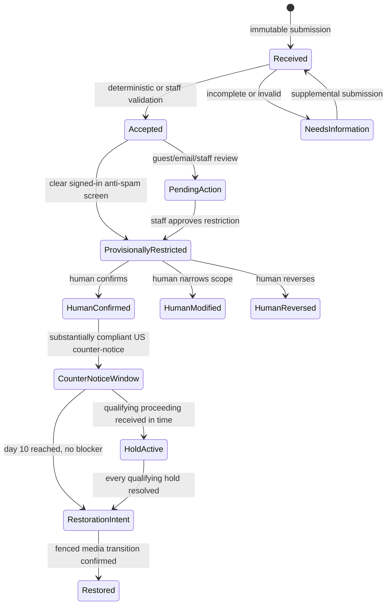

# Copyright Notice Lifecycle

Copyright notices are legal cases, not `MODERATION_POLICY` reports. They may refer to content that
is otherwise allowed by platform policy, and an ordinary moderation appeal does not become a US
statutory counter-notice. The copyright domain therefore owns its records and deadlines while
reusing staff authorization, notifications, modlog, and approved-correspondence patterns.

Layer 1 is deliberately inert: it stores legal facts and decisions but exposes no intake route and
changes no media delivery. Intake is enabled only after the later CAPTCHA, agent-screening,
notification, reversible-media, and staff UI layers are complete.

## Ownership boundaries

| Owner                               | Responsibility                                                                                                                                                 |
| ----------------------------------- | -------------------------------------------------------------------------------------------------------------------------------------------------------------- |
| `@services/copyright-notices`       | Case creation, immutable submissions and evidence metadata, compliance assessments, human review, public projection, deadlines, holds, and restoration intents |
| Copyright intake routes and workers | Authenticate or verify CAPTCHA/attestation, encrypt private fields, preserve email source, and call the domain service                                         |
| Media placement service             | Authoritative current placement revision, reversible delivery state, and non-copyright blockers such as deletion, replacement, safety action, or court order   |
| Staff moderation surfaces           | Human review, corrections, appeals, correspondence approval, and legal escalation                                                                              |
| Notifications and email delivery    | Idempotent delivery intents, retries, bounce visibility, and verified case-scoped access                                                                       |

No caller may update copyright tables directly. In particular, a delivery worker cannot decide that
a counter-notice is compliant or that a hold is qualifying.

## Derived state machine

There is no mutable `status` column. State is derived from immutable facts and one-way timestamps.

Every automatic provisional restriction, including a later restriction added to an already reviewed
case, must receive its own recorded `confirm`, `modify`, or `reverse` decision from an identified
staff user. It cannot become final merely because no appeal arrived. Each restriction is independent.
Reversing or lifting one does not override another copyright case, a safety restriction, deletion,
replacement, or a court order affecting the same placement. Erasing a staff account may null its
foreign key, but cannot erase the decision timestamp, outcome, or lifecycle record.

## Submission and evidence integrity

Each form, email, supplement, appeal, counter-notice, withdrawal, and proceeding notice is a separate
immutable submission with its original receipt time. Compliance decisions are appended as separate
assessments, so parsing or moderation cannot rewrite receipt history. Guest and email assessments
require an identified moderator, and a restriction consumes only the current substantially compliant
allegation assessment. Email MIME and attachments are
private evidence artifacts identified by an object key, byte length, media type, and SHA-256 digest.
The evidence bytes remain in private storage and are never read through a public media URL.
An inbound correspondence body freezes on receipt; an outbound body freezes once delivered (and an
agent-composed outbound message also freezes when a staff reviewer approves it).

Private contact details, signatures, raw text, attachments, staff rationale, agent output, and
storage keys are never member fields. Accepted cases use an explicit authenticated-member allowlist.
The claimant link comes from the account's current public profile, not a legal-name or signature
snapshot. A target reference is returned only when that viewer may otherwise see the target.

## US counter-notice timing

A substantially compliant US counter-notice starts its clock at the immutable `received_at` of the
submission found compliant. Its exact requested restoration targets are immutable assessment scope;
an unlisted target cannot restore under that deadline. The parsing time, assessment time, staff approval time, and forwarding
time do not move it.

The persisted schedule uses `America/New_York` and the US federal business calendar:

- `earliest_restoration_at`: start of business day 10;
- `escalation_at`: start of business day 14; and
- `restoration_deadline_at`: exclusive end of business day 14.

The forwarding correspondence must tell the original claimant that restoration will occur in ten
business days. An ordinary correction or appeal starts no statutory clock. Missing the deadline is
an overdue incident and urgent escalation, not a reason to keep otherwise eligible material down.

The service creates a preliminary restore intent only while holding the relevant case, placement
target, restriction, deadline, and a shared placement advisory lock. The same lock serializes every
copyright restriction imposed for that placement. The transaction rechecks the expected placement
revision, every active same-placement copyright restriction, every unresolved target-specific
qualifying hold, and mandatory human review. The intent is not delivery authorization: the media
worker must atomically recheck deletion, replacement, safety and other durable blockers against the
authoritative placement record before completing the fenced transition.

## Court and CCB holds

A proceeding blocks restoration only when the designated agent received it before restoration and
staff recorded all applicable facts:

- it came from the original notifying claimant;
- a federal-court action or CCB proceeding was commenced, rather than threatened;
- it identifies the same material; and
- a CCB filing is a qualifying claim or counterclaim under 17 USC 1507(d).

Assess every received filing separately and bind its material scope to the exact notice targets it
covers. Restoration remains blocked while any qualifying assessment for that target is unresolved.
Dismissal, the end of a proceeding, or a superseding assessment is an immutable hold resolution,
never an edit or deletion of the original filing.

## Jurisdiction and public meaning

US timing does not govern EU or UK cases. EU and UK notices receive their own reasons, automation
disclosure, free human complaint path, and jurisdiction-specific review. Conflicting grounds go to
qualified staff or counsel, and removing one ground cannot remove another.

A member-visible case records an allegation and, where applicable, a provisional restriction or reviewed
outcome. It never describes the claimant as the proven owner or the poster as an infringer.

## Activation gates

Before accepting live notices, the operator must register and publish the actual US designated
agent, appoint any required EU/UK representatives, approve retention and repeat-infringer policies,
staff the response targets, and obtain US/EU/UK legal review. Placeholder addresses, credentials, or
registration claims are forbidden. See the [copyright operations runbook](../../runbooks/copyright-notices.md).
