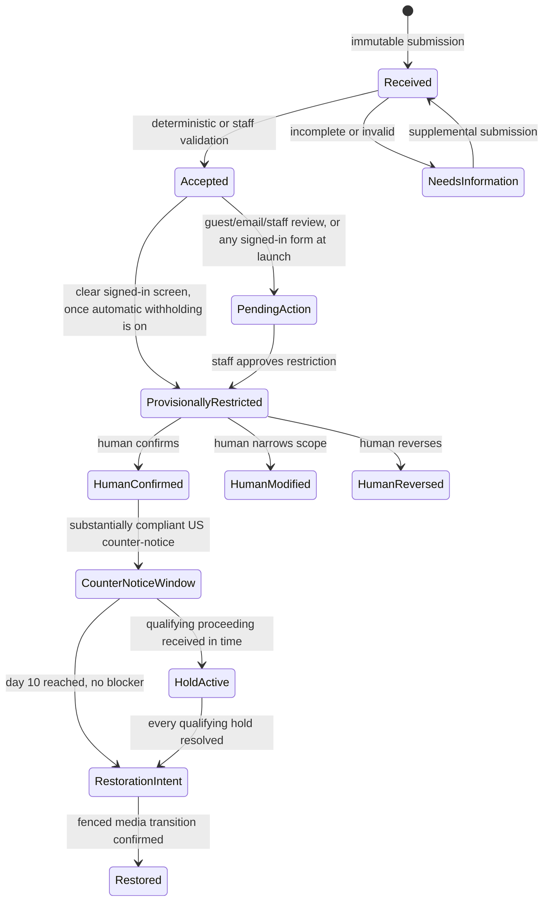

# Copyright Notice Lifecycle

Copyright notices are legal cases, not `MODERATION_POLICY` reports. They may refer to content that
is otherwise allowed by platform policy, and an ordinary moderation appeal does not become a US
statutory counter-notice. The copyright domain therefore owns its records and deadlines while
reusing staff authorization, notifications, modlog, and approved-correspondence patterns.

The implementation remains disabled by default through `COPYRIGHT_INTAKE_ENABLED`. It must not be
enabled until CAPTCHA, agent recovery, notification, reversible-media, staff UI, and production
evidence-storage dependencies are deployed and the activation checklist below is complete.
The flag controls only new claimant intake and new agent disclosure. While it is off, one shared
guard returns 503 from the three new-intake routes: the signed-in and guest form
(`POST /api/v1/copyright-notices`) and EU and UK notice submission. Every designated-agent email,
including a reply on an existing case, enters through email intake, so the SES worker leaves inbound
mail unprocessed in storage until the switch is on again and staff watch that inbox directly (see the
[runbook](../../runbooks/copyright-notices.md#intake-activation)). Disabling intake must never hide accepted complaints or
interrupt an existing case's staff review, appeal, counter-notice, court or CCB filing, correction,
withdrawal, EU or UK redress, hold, delivery, enforcement, or restoration obligations. Those in-case
routes and every staff decision route stay open. A route test classifies every non-GET copyright
route as new intake, in-case response, or staff and fails on an unclassified route.

## Ownership boundaries

| Owner                               | Responsibility                                                                                                                                                 |
| ----------------------------------- | -------------------------------------------------------------------------------------------------------------------------------------------------------------- |
| `@services/copyright-notices`       | Case creation, immutable submissions and evidence metadata, compliance assessments, human review, public projection, deadlines, holds, and restoration intents |
| Copyright intake routes and workers | Authenticate or verify CAPTCHA/attestation, encrypt private fields, preserve email source, and call the domain service                                         |
| Media placement service             | Authoritative current placement revision, reversible delivery state, and non-copyright blockers such as deletion, replacement, safety action, or court order   |
| Staff moderation surfaces           | Human review, corrections, appeals, correspondence approval, and legal escalation                                                                              |
| Notifications and email delivery    | Idempotent delivery intents, retries, bounce visibility, and verified case-scoped access                                                                       |

No caller may update copyright tables directly. In particular, a delivery worker cannot decide that
a counter-notice is compliant or that a hold is qualifying.

## Current screening authority

One [current execution](../../../backend/services/copyright-notices/form-screening-executions.mts)
per structured form selects its immutable successful screening result. Intake commits unclaimed
pending state before enqueue or model work. Starting a new screening immediately blocks new
automated assessments and restriction admission. Failed attempts keep that block. Duplicate
wakeups skip live provider claims, expired/failed retries advance the attempt token, and stale
completion cannot select a result. Identical input and prompt may produce distinct successful
results; only completion of the current token supplies idempotency.

Automatic authority requires a current completed clear result for the same intake, an exact
associated current compliant assessment, complete signed-in statutory fields, and no rejected form
review. The [canonical predicate](../../../backend/data-stores/psql/migrations/0641-00-00-copyright-delivery-transport.sql)
is checked again under the form fence at enforcement claim and final admission. Pending/failed
staff projections expose their state with null recommendation and rationale; stale private
rationale never appears as current. A staff approval during either state creates human authority.

Restriction admission and screening start serialize under the form fence. A restriction admitted
first stays effective, including before its action delivery runs. A newer pending attempt blocks
remaining targets in a partially processed request. Re-screening never lifts an existing takedown,
changes its revision/deadline, or gates its delivery workers.

## Delivery obligations

Each claimant receipt, poster restriction notice, status update, and counter-notice forwarding is
recorded as an idempotent `copyright_notice_delivery_intents` row before it reaches a transport.
The row is staff-visible through the private case aggregate and transitions from `pending` to
`claimed`, then `sent`, `failed`, or `bounced`. A retryable failure returns to `pending`; bounded
retry uses exponential backoff and stops after five attempts so poison deliveries cannot
starve newer obligations; terminal failures remain staff-visible. A sent or bounced delivery cannot
be rewritten. The transport records its SES message ID when available, so the
SES bounce/complaint stream can be correlated without treating an attempted send as proof of
delivery. Because SES acceptance precedes the database transition, a crash in that narrow window
can produce a duplicate legal email; every send keeps the stable case and delivery identity so staff
can correlate it. Copyright emails opt out of the generic operational BCC because they may contain
statutory personal information. The email transport worker is activation-blocking infrastructure: it must claim these
rows, resolve private recipient evidence case-scoped, and report SES bounces before
`COPYRIGHT_INTAKE_ENABLED` is enabled.

## Placement enforcement boundary

Hosted images are addressed by a durable, concrete image-placement identity. The image binding is
immutable, while a monotonic placement revision advances whenever the attachment is retired,
reactivated, withheld, or restored. Copyright action workers re-read and lock that authoritative
placement, the exact image binding, the expected revision, every legal blocker, and the restriction
state before applying an intent. Withholding one placement never deletes the source image or blocks
another post that independently uses the same image.

Each legal target stores a foreign key to the retained placement binding, and its target-image row
checks the exact placement, image, and post-family tuple. The observed revision is immutable evidence,
not a foreign key to the mutable current revision. Legal references pin the retained binding and image
through bounded orphan cleanup after live media is removed; retained identity alone never grants
delivery. Staff/email response fields that display `image-placement:<id>` derive that string from the
UUID at the API boundary. No encoded placement relationship is stored.

Application projections omit retired or withheld placements, and persisted post image URLs use
`/images/placements/<placement-id>/<revision>/<image-id>`. The resize Lambda validates the route
shape and keeps the placement segments out of the S3 key. Those application controls do not by
themselves revoke a warm CDN response or prevent a caller from trying a historical generic image
URL. Complete delivery enforcement therefore also requires the separately deployed infrastructure
edge registry, viewer authorization, direct-origin denial, generic-route retirement, cache
invalidation, and cross-store reconciliation. Intake must remain disabled until those controls pass
cold-cache, warm-cache, stale-revision, mismatched-image, and direct-origin tests.

The application outbox requires exact image and placement foreign keys. Independently committed
rollback wakeups reference an already committed registry key through a restrictive foreign key and
contain only that key, rotating token, and timestamps, never an uncommitted entity snapshot.
Recovery joins the registry's typed tuple and rechecks committed binding authority without borrowing
another placement's revision. An uncommitted first registry insert cannot publish an allow; its
rollback creates no repair obligation. The fresh-bootstrap schema and recovery protocol are
documented in [media-delivery safety](../../overview/architecture/services/media-delivery-safety/README.md).

Staff may request image-similarity candidates from existing embeddings. Candidates are advisory,
exclude unavailable or moderated media, and return placement identifiers and state rather than S3
keys, vectors, or public URLs. They never expand a notice target or apply a restriction
automatically; a missing source embedding schedules the ordinary batch pipeline without delaying
the legal case.

## Derived state machine

There is no mutable `status` column. State is derived from immutable facts and one-way timestamps.

```mermaid
stateDiagram-v2
  [*] --> Received: immutable submission
  Received --> Accepted: deterministic or staff validation
  Received --> NeedsInformation: incomplete or invalid
  NeedsInformation --> Received: supplemental submission
  Accepted --> PendingAction: guest/email/staff review, or any signed-in form at launch
  Accepted --> ProvisionallyRestricted: clear signed-in screen, once automatic withholding is on
  PendingAction --> ProvisionallyRestricted: staff approves restriction
  ProvisionallyRestricted --> HumanConfirmed: human confirms
  ProvisionallyRestricted --> HumanModified: human narrows scope
  ProvisionallyRestricted --> HumanReversed: human reverses
  HumanConfirmed --> CounterNoticeWindow: substantially compliant US counter-notice
  CounterNoticeWindow --> HoldActive: qualifying proceeding received in time
  CounterNoticeWindow --> RestorationIntent: day 10 reached, no blocker
  HoldActive --> RestorationIntent: every qualifying hold resolved
  RestorationIntent --> Restored: fenced media transition confirmed
```

Every automatic provisional restriction, including a later restriction added to an already reviewed
case, must receive its own recorded `confirm` or `reverse` decision from an identified
staff user. It cannot become final merely because no appeal arrived. Each restriction is independent.
Reversing or lifting one does not override another copyright case, a safety restriction, deletion,
replacement, or a court order affecting the same placement. Erasing a staff account may null its
foreign key, but cannot erase the decision timestamp, outcome, or lifecycle record.
If erasure happens after a form rejection but before its effects finish, recovery uses the durable
rejection to reverse provisional restrictions and close pending automated enforcement requests.

Lifecycle events hold one typed source reference per event (except the case-level initial receipt),
with a concrete foreign key and database-checked same-case ownership. Action events point to the
action intent, which owns its restriction; legal-hold target membership remains in the assessment's
child rows. Review outcomes, encrypted rationale, recovery origin, and replay reason are typed columns,
not a JSON relationship envelope. Member timelines still project only event type and timestamp.

## Submission and evidence integrity

Each form, email, supplement, appeal, counter-notice, withdrawal, and proceeding notice is a separate
immutable submission with its original receipt time. Compliance decisions are appended as separate
assessments, so parsing or moderation cannot rewrite receipt history. Guest and email assessments
require an identified moderator, and a restriction consumes only the current substantially compliant
allegation assessment. Email MIME and attachments are
private evidence artifacts identified by an object key, byte length, media type, and SHA-256 digest.
The evidence bytes remain in private storage and are never read through a public media URL.
An inbound correspondence body freezes on receipt; an outbound body freezes once delivered (and an
agent-composed outbound message also freezes when a staff reviewer approves it).

Designated-inbox email first becomes a private immutable **email intake**, not an immediately
actionable case: the worker preserves the complete original MIME object, hashes it, records parsed
attachment metadata, sanitizes and wraps untrusted text for the advisory extraction agent, and
persists the encrypted structured result. The agent may flag obvious spam or missing information
but cannot create a restriction, correspondence, or legal case. A moderator must review the source
and agent output, then explicitly accept or reject it before a valid email submission can enter the
case lifecycle, even when the recommendation is `potentially_valid`.

Email extraction includes the claimant, contact, work, hosted URLs, signature, and both statutory
declarations, with short source excerpts for moderator verification. Missing declarations remain
null; the agent cannot infer them. RFC `Message-ID`, `In-Reply-To`, and `References` values are
encrypted and retained for case-scoped correspondence threading using keyed digests only. A matched reply keeps
its original MIME evidence, still receives the same advisory structured extraction and recommendation, and waits
for moderator classification; it cannot trigger a restriction or outbound message automatically. An approval normally names
the recommendation reviewed. If the agent is unavailable or fails, staff must instead record an
explicit manual-fallback reason while reviewing the preserved original.
For email approvals, staff resolve each recommended hosted URL to live image placements and select
verified targets. If a URL cannot be resolved, the review surface explains the failure and allows
manual target identification; approval still validates the chosen target against the live placement.

The signed-in form is already structured. Its agent is only an anti-spam and obvious-invalidity
screen, not a legal merits decision. The recommendation remains a separate immutable record; it
cannot supply a declaration, contact detail, work description, hosted target, or signature. Only a
deterministically complete immutable US DMCA form, with a `not_obviously_invalid` screen, may be
provisionally withheld automatically, and it enters urgent mandatory human review. That automation
is off at launch; see [Moderator-first launch](#moderator-first-launch). An incomplete
form can never auto-restrict. Guest forms
always require moderator approval. A signed-in form classified as `invalid_or_spam`, or left without
a result after agent failure, is held for a moderator decision so a false positive or exhausted
agent outage cannot strand a legal notice. Form routes require Turnstile, enforce CSRF through the normal
authenticated route boundary, apply route-scoped rate limits, and store only a purpose-separated
HMAC-derived guest network digest rather than the source address.

Hosted-use selection accepts canonical post URLs, including `/story/:id`, and verifies their images
through the post API. Query strings, fragments, and foreign hosts are rejected.

Email admission trusts the SES receipt-rule classification and the configured
`copyright-incoming/` object prefix, never recipient headers inside untrusted MIME. The original S3
version and ETag are pinned and copied into the private evidence bucket before parsing. Parse
failures remain immutable staff-visible intakes with the original evidence; they are not dropped or
promoted automatically.

Private contact details, signatures, raw text, attachments, staff rationale, agent output, and
storage keys are never member fields. Accepted cases use an explicit authenticated-member allowlist.
The claimant link comes from the account's current public profile, not a legal-name or signature
snapshot. A target reference is returned only when that viewer may otherwise see the target.

## Member and staff surfaces

`/copyright/notices` and `/copyright/notices/:id` require authentication. They list only accepted
US cases and project case identifier, dates, target URL, restriction state, a metadata-free
lifecycle timeline, and the claimant's current public profile when one exists. They never expose
legal claimant or poster identity, email, mailing address, signature, raw email, evidence artifacts,
encrypted fields, moderator rationale, or agent recommendation. A guest or erased claimant has no
member-visible profile link.

A guest who is not signed in acts only with a hashed, expiring, revocable capability for one case.
Staff issue that token once, with an expiry no more than 30 days after issue. The capability records
the issuing staff member, and issue and revocation each append a lifecycle event that names the
acting staff member. The guest sends the token in the Copyright-Guest-Capability header. Mail, a
thread, or a token for another case does not authorize a correction, withdrawal, or court filing.
Each guest filing records the capability that authorized it. A correction does not move the
original receipt time or an existing restoration deadline. A withdrawal records the filing and
leaves existing restrictions in place until staff assess it. Receiving a withdrawal, whether filed
by a guest or admitted from claimant email, revokes every live capability on the case in the same
transaction and appends an actorless `guest_capability_revoked_by_withdrawal` event for each one. A
court or CCB filing is classified urgent and does not itself block restoration. A capability may
file at most one court or CCB hold; a second attempt is refused with a conflict. Staff may ask for
more information without extending the capability. Staff list a case's capabilities, newest first
with issuer, expiry, and revocation state but never the token, at
`GET /api/v1/copyright-notices/:id/guest-capabilities`, so they can revoke tokens after a reload.

Claimants and affected posters receive a participant projection for their own submissions. Copyright
review staff receive a separate queue and private case projection. Staff-only routes may expose
evidence metadata and agent recommendations needed to perform human review, but not to ordinary
members. All mutation routes remain server-authorized even when an authenticated page renders an
appeal or counter-notice form.

The staff queue lists a case while it has any open item: an unreviewed form intake, restriction,
appeal, counter-notice, or qualifying court or CCB filing; a failed action or delivery; an
incomplete enforcement request; or an open restoration deadline at or past `escalation_at`. An open
deadline before escalation does not queue a case by itself. Each case carries its distinct
`reasons`, the `waiting_since` time of its oldest open item, and its earliest open deadline. The
queue orders cases by urgency: a missed restoration deadline first, then a deadline past escalation,
then all other work, each oldest wait first. Urgency depends on the clock, so a case can move to an
earlier tier between pages. The staff pages are reached from the Moderation sidebar's Copyright
group, and the public policy page shows its staff queue links only to administrators and moderators.

The web uses Turnstile for each notice, appeal, and counter-notice form. Native clients use the
attestation route described by the CAPTCHA boundary. CAPTCHA is an intake abuse control, not a
legal-validity or merits assessment.

## Moderator-first launch

Copyright launches moderator-first. The `automaticProvisionalWithholding` switch in the audited
`copyright` dynamic-config namespace defaults to `false`. Only a developer or an administrator can
change it, and every change records the actor and the previous and next values. While the switch is
off:

- a clear screen on a signed-in form creates no automated assessment and no restriction, so the
  intake waits in the staff queue like a guest form;
- a moderator's acceptance of that intake records a human assessment and withholds its targets, and
  a rejection closes it;
- an automated enforcement request that already exists stays pending and in the staff queue, and
  enforces nothing, until a moderator decides the intake; and
- restrictions that already exist are unchanged and still need their own human decision.

Keep the switch off until both prerequisites ship:

- claimant abuse controls ([#1209](https://github.com/vouchington/vouchington/issues/1209)); and
- the GDPR Article 22 automated-decision disclosure
  ([#1230](https://github.com/vouchington/vouchington/issues/1230)).

Turning the switch on releases the backlog. The next sweep withholds every clear-screened signed-in
intake that still lacks a moderator review and enforces every pending automated request. Clear the
queue first, and follow the [runbook](../../runbooks/copyright-notices.md#automatic-provisional-withholding).

## Global launch gate

The product is a US startup, but it targets users globally. The currently implemented public intake
is US DMCA-only and remains disabled until a designated agent is registered with the US Copyright
Office, its published contact channel is monitored, and the runbook activation checklist passes.
Do not claim that a designated agent is active before those facts are true.

Before accepting EU notices, appoint any required DSA legal representative and contact points,
implement Article 16 notice handling and Article 17 statements of reasons, assess Article 24(5)
transparency reporting, and obtain counsel's Article 17 DSM analysis. Before accepting UK notices,
complete a UK copyright and Online Safety Act applicability assessment and publish the resulting
process. These are activation requirements, not claims of current compliance.

## US counter-notice timing

A substantially compliant US counter-notice starts its clock at the immutable `received_at` of the
submission found compliant. Its exact requested restoration targets are immutable assessment scope;
an unlisted target cannot restore under that deadline. The parsing time, assessment time, staff approval time, and forwarding
time do not move it.

The persisted schedule uses `America/New_York` and the US federal business calendar:

- `earliest_restoration_at`: start of business day 10;
- `escalation_at`: start of business day 14; and
- `restoration_deadline_at`: exclusive end of business day 14.

The forwarding correspondence must send the original claimant the canonical counter-notice: the
submitter's name, address, telephone, signature, each exact target identifier and hosted URL, and
each required declaration and consent. The claimant receives only that case-scoped private
correspondence; these details and any original email evidence are never part of a member-visible
case projection. An ordinary correction or appeal starts no statutory clock. Missing the deadline is
an overdue incident and urgent escalation, not a reason to keep otherwise eligible material down.

The service creates a preliminary restore intent only while holding the relevant case, placement
target, restriction, deadline, and a shared placement advisory lock. The same lock serializes every
copyright restriction imposed for that placement. The transaction rechecks the expected placement
revision, every active same-placement copyright restriction, every unresolved target-specific
qualifying hold, and mandatory human review. The intent is not delivery authorization: the media
worker must atomically recheck deletion, replacement, safety and other durable blockers against the
authoritative placement record before completing the fenced transition.

## Court and CCB holds

A proceeding blocks restoration only when the designated agent received it before restoration and
staff recorded all applicable facts:

- it came from the original notifying claimant;
- a federal-court action or CCB proceeding was commenced, rather than threatened;
- it identifies the same material; and
- a CCB filing is a qualifying claim or counterclaim under 17 USC 1507(d).

Until staff record that assessment, an admitted court or CCB filing blocks restoration of every
target on the case. Recording the assessment ends that case-wide block. A qualifying assessment
then blocks only the targets it names. A restore intent that delivery already marked blocked is
reopened for any target that assessment does not still block.

Assess every received filing separately and bind its material scope to the exact notice targets it
covers. Restoration remains blocked while any qualifying assessment for that target is unresolved.
When staff record that no qualifying proceeding exists, the assessment carries no proceeding dates
or CCB claim kind, even if staff previously entered those fields while reviewing the filing.
Dismissal, the end of a proceeding, or a superseding assessment is an immutable hold resolution,
never an edit or deletion of the original filing. Assessments that reactivate a lifted restriction
or extend an existing legal-hold restriction carry immutable restriction bindings, so resolving the
final overlapping hold replays a previously blocked restoration. A hold on an ordinary active DMCA
restriction blocks restoration while unresolved; resolving that hold does not bypass the ordinary
counter-notice deadline or human reversal requirement.

Hold assessment or resolution and replay of an existing eligible restore are one transaction,
fenced across every placement on the case before taking the case lock. Replay retains the original
intent, restriction, deadline, revision and restoration authority, and rechecks their current
validity and placement safety. Queue delivery starts only after commit. The existing reconciler
automatically retries eligible historical blocked restorations after the filing is assessed or
the final hold resolves. Neither hold transitions nor periodic recovery reopen exhausted provider
failures; these require explicit operator replay. Unresolved
or unassessed filings and another independent restriction never lose their protective effect.

## Jurisdiction and public meaning

US timing does not govern EU or UK cases. The public form and email intake still accept only
`us_dmca`. EU and UK use separate contracts and stay unavailable until an unwithdrawn territorial
policy approval exists. That approval is an operator record, not a seeded row. New EU and UK notices
need both it and `COPYRIGHT_INTAKE_ENABLED`, and neither replaces the other. Redress, supervised
complaints, and staff decisions on an existing EU or UK notice do not depend on
`COPYRIGHT_INTAKE_ENABLED`. Representatives, counsel review, and the activation checklist remain
required before any live intake is advertised. Conflicting grounds go to qualified staff or
counsel, and removing one ground cannot remove another.

## EU and UK contracts

The fail-closed flow is diagrammed in the
[copyright notices service README](../../../backend/services/copyright-notices/README.md).

Receipt stores the notifier's contact, content location, and grounds. It does not resolve a
placement, write a lifecycle event, or create a US restoration deadline. Acknowledgment is an
administrative obligation with no due timestamp. A failed attempt can be recorded until the fifth
failure, the same attempt bound used for copyright delivery, and that fifth failure escalates.
Success does not invent a response deadline.

A statement of reasons, UK review, and redress decision exist only when an identified staff user
supplies the text. `automation_disclosure` is `human`. The staff disposition on redress is
`maintain` or `revoke` as selected by that user. The service does not choose it and does not
withhold media. A supervised complaint records an external authority reference and escalates that
record. Transparency reporting counts facts bound to the current EU approval inside a period the
caller supplies. It does not choose the period.

UK review and redress do not write EU reason, complaint, or report rows. Neither contract imports
the US counter-notice clock.

A member-visible case records an allegation and, where applicable, a provisional restriction or reviewed
outcome. It never describes the claimant as the proven owner or the poster as an infringer.

## Repeat-infringer incidents

A human `confirm` on a restriction or its immutable appeal review creates one incident for the
non-deleted post author of that placement. A `reverse` in either review is terminal for that
restriction and dominates every confirmation. Appeal decisions synchronize incidents in the same
transaction. Several targets on the same notice stay one incident per account; reversing one
target preserves incidents supported by other confirmed targets. A guest placement with no author
does not create one. Restoration does not remove the incident. A staff disposition of `withdrawn`,
`duplicate`, or `abusive` makes its incident non-operative.

The second operative incident for an account opens a staff review. Opening that review does not
suspend or delete the account. Incident synchronization locks all affected authors through the
existing publication lifecycle lock before recomputing state, and the open-review unique index
keeps concurrent confirmations at one open review. A later reversal does not close an already-open
review; enforcing outcomes recheck the operative threshold. Similarity candidates never create an
incident. Retention durations remain an operator policy and are not stored here.

A copyright reviewer may close that review with `warning` or `no_action`, or record `withdrawn`,
`duplicate`, or `abusive` on one incident. Each decision stores an encrypted rationale. `restrict`
and `terminate` require an administrator. Both call the existing account suspension.
`terminate` makes a later unsuspend refuse until an administrator records `reinstatement`.
Reinstatement does not itself unsuspend the account. Restrict and terminate also require two
operative incidents at decision time. The outcome, a newly needed suspension, its moderator action,
and publication dirty work share one account-lifecycle-serialized transaction, so a failed outcome
does not partially enforce and the still-open review can be retried.

`deleteUser` returns 409 while the account has an operative incident, or an unresolved qualifying
legal hold on a placement whose post author is that account. A qualifying hold is an assessment
with an original claimant, the same material, a proceeding kind, a commencement time, and a
designated-agent receipt, and with no resolution row. An open review alone does not block deletion.

## Evidence retention preview

Evidence retention is preview-only. The server gate is inserted disabled, and no table stores a
retention duration. A preview names the case evidence and every reason it is blocked: the gate,
an unapproved policy, an open case, an unresolved legal hold, or an open deadline. Recording a
disposition writes `refused` or `not_destroyed`. Neither outcome deletes an evidence object or a
preserved email. Actual destruction needs a separate human and legal authority.

## Staff alerts

Review age, urgent provisional filings, missed restoration deadlines, failed or bounced deliveries,
and deliveries that need reconciliation are staff alerts derived from the notice, deadline, and
delivery rows. Each source and condition keeps one alert. Staff acknowledgement records that
episode and stays in history when a later episode reopens the same source. Private work and contact
fields are returned only to copyright reviewers, and only while an approved alert policy is active.
No alert destination or operator threshold is stored. A failed alert delivery does not resolve the
deadline or the delivery obligation.

## Review-target page

A five-minute sweep sends one Sentry warning when copyright work is late. It counts four sets:

- notices with a staff-queue item, other than a deadline, open longer than `reviewTargetMinutes`;
- email intakes on the email-review queue received longer than `reviewTargetMinutes` ago;
- notices with an open counter-notice deadline at or past `escalation_at`; and
- notices with an open deadline at or past `restoration_deadline_at`.

The email set uses the email-review queue's own rule: no intake review, and either no notice link
or a matched reply whose correspondence is neither admitted nor rejected. An intake counts whether
or not its parse was recorded, and the queue lists an unparsed intake too, so a stuck email is
never invisible to staff.

`reviewTargetMinutes` lives in the audited `copyright` dynamic-config namespace. Its default is `0`,
which means unset: both waiting counts stay off until an operator records an approved target. Missed
deadlines page whether or not a target is set. The warning carries only counts and at most 20 notice
or email intake IDs per set. It never carries claimant, poster, work, correspondence, sender,
subject, or body fields. When every count is zero, nothing is sent. See the
[runbook](../../runbooks/copyright-notices.md#review-target-page).

## Activation gates

Before accepting live notices, the operator must register and publish the actual US designated
agent, appoint any required EU/UK representatives, approve retention and repeat-infringer policies,
staff the response targets, provision a versioned encrypted evidence bucket and least-privilege
SES/worker IAM, and obtain US legal review. EU/UK intake additionally requires the representatives
and legal review described above. Placeholder addresses, credentials, or registration claims are
forbidden. See the [copyright operations runbook](../../runbooks/copyright-notices.md).
