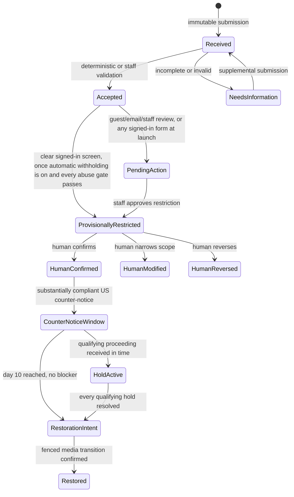

# Copyright Notice Lifecycle

Copyright notices are legal cases, not `MODERATION_POLICY` reports. They may refer to content that
is otherwise allowed by platform policy, and an ordinary moderation appeal does not become a US
statutory counter-notice. The copyright domain therefore owns its records and deadlines while
reusing staff authorization, notifications, modlog, and approved-correspondence patterns.

The implementation remains disabled by default through `COPYRIGHT_INTAKE_ENABLED`. It must not be
enabled until CAPTCHA, agent recovery, notification, reversible-media, staff UI, and production
evidence-storage dependencies are deployed and the activation checklist below is complete.
The flag controls only new claimant intake and new agent disclosure. While it is off, one shared
guard returns 503 from the three new-intake routes: the signed-in and guest form
(`POST /api/v1/copyright-notices`) and EU and UK notice submission. It also guards staff approval of
an emailed notice (`POST /api/v1/copyright-email-intakes/:id/approvals`), because approval opens a
new case, and it keeps the AI email-intake recommendation job and the AI form-screening job from
running, including a job already on the queue or a retry of one. The dispatch reconciler also stops
starting either job. It still re-enqueues an appeal recommendation and applies a saved form
screening for a form already received, because both belong to an open case and the second calls no
model. Every designated-agent email, including a reply on an existing case, is still ingested,
parsed, and queued for staff while the flag is off, so no message waits unseen in storage. Staff can reject an email or record a
matched reply as correspondence, and an email ingested during the pause receives its recommendation
after the switch is turned on unless staff already decided it (see the
[runbook](../../runbooks/copyright-notices.md#intake-activation)). Disabling intake must never hide accepted complaints or
interrupt an existing case's staff review, appeal, counter-notice, court or CCB filing, correction,
withdrawal, EU or UK redress, hold, delivery, enforcement, or restoration obligations. Those in-case
routes and every staff decision route stay open. A route test classifies every non-GET copyright
route as new intake, in-case response, or staff and fails on an unclassified route.

## Ownership boundaries

| Owner                               | Responsibility                                                                                                                                                 |
| ----------------------------------- | -------------------------------------------------------------------------------------------------------------------------------------------------------------- |
| `@services/copyright-notices`       | Case creation, immutable submissions and evidence metadata, compliance assessments, human review, public projection, deadlines, holds, and restoration intents |
| Copyright intake routes and workers | Authenticate or verify CAPTCHA/attestation, encrypt private fields, preserve email source, and call the domain service                                         |
| Media placement service             | Authoritative current placement revision, reversible delivery state, and non-copyright blockers such as deletion, replacement, safety action, or court order   |
| Staff moderation surfaces           | Human review, corrections, appeals, correspondence approval, and legal escalation                                                                              |
| Notifications and email delivery    | Idempotent delivery intents, retries, bounce visibility, and verified case-scoped access                                                                       |

No caller may update copyright tables directly. In particular, a delivery worker cannot decide that
a counter-notice is compliant or that a hold is qualifying.

## Work claim ownership

Action intents, delivery intents (case deliveries and replies to declined email intakes alike), and
form screening executions rotate a UUID `lease_token` on each claim or reclaim. Workers carry that token through
completion and failure; a worker whose claim was reclaimed cannot change the newer owner's state.
Action delivery also checks ownership under its row lock before placement mutations and again after
external projection. A per-intent advisory lock prevents reclaim during compensation; action
workers take it before placement or intent row locks, and compensation releases those nested media
locks before its fenced failure update. Form screening retains its attempt-number fence alongside the token. Existing
claim expiration and recovery windows are unchanged; there are no claim renewal paths.

## Current screening authority

One [current execution](../../../backend/services/copyright-notices/form-screening-executions.mts)
per structured form selects its immutable successful screening result. Intake commits unclaimed
pending state before enqueue or model work. Starting a new screening immediately blocks new
automated assessments and restriction admission. Failed attempts keep that block. Duplicate
wakeups skip live provider claims, expired/failed retries advance the attempt token, and stale
completion cannot select a result. Identical input and prompt may produce distinct successful
results; only completion of the current token supplies idempotency.

Automatic authority requires a current completed clear result for the same intake, an exact
associated current compliant assessment, complete signed-in statutory fields, and no rejected form
review. The [canonical predicate](../../../backend/data-stores/psql/migrations/0641-00-00-copyright-delivery-transport.sql)
is checked again under the form fence when a restriction is imposed. Pending/failed
staff projections expose their state with null recommendation, rationale, and guidance; stale
private rationale never appears as current. A staff approval during either state creates human
authority.

A completed screening also carries advisory moderator guidance: a summary, a 512(c)(3) element
checklist with gaps, risk notes (possible fair use, abuse signals, mismatched claimant), and a
suggested action. The model sees no claimant contact details, email, address, or signature text.
The staff case labels it "AI guidance — not a decision"; no workflow predicate reads it, so it
never creates an assessment or restriction.

The staff case keeps the screening and guidance after a moderator records the intake review, so a
later reviewer of a restriction, appeal, or counter-notice sees what the intake reviewer saw. The
case's `form_review.review` is null while the intake awaits a decision. Once decided it holds the
`accepted` decision, `reviewed_at`, and `reviewed_by_id`, which is null after the reviewer's
account is erased. The moderator's rationale is not part of that projection. Only an unreviewed
intake offers the approve and reject actions; the intake review reason still leaves the queue once
the decision is recorded.

Restriction admission and screening start serialize under the form fence. A restriction admitted
first stays effective, including before its action delivery runs. A newer pending attempt blocks
remaining targets in a partially processed request. Re-screening never lifts an existing takedown,
changes its revision/deadline, or gates its delivery workers.

## Delivery obligations

Each claimant receipt, poster restriction notice, status update, counter-notice forwarding, and
staff information request is recorded as an idempotent `copyright_notice_delivery_intents` row before it reaches a transport.
The row is staff-visible through the private case aggregate and transitions from `pending` to
`claimed`, then `sent`, `failed`, or `bounced`. A retryable failure returns to `pending`; bounded
retry uses exponential backoff and stops after five attempts so poison deliveries cannot
starve newer obligations; terminal failures remain staff-visible. A sent or bounced delivery cannot
be rewritten. The transport records its SES message ID when available, so the
SES bounce/complaint stream can be correlated without treating an attempted send as proof of
delivery. Because SES acceptance precedes the database transition, a crash in that narrow window
can produce a duplicate legal email; every send keeps the stable case and delivery identity so staff
can correlate it. Copyright emails opt out of the generic operational BCC because they may contain
statutory personal information. The email transport worker is activation-blocking infrastructure: it must claim these
rows, resolve private recipient evidence case-scoped, and report SES bounces before
`COPYRIGHT_INTAKE_ENABLED` is enabled.

The reply to a declined email intake is the same kind of row, with no case: it carries the intake's
id instead of a notice id, a `delivery_kind` of `email_intake_rejected` or
`email_intake_needs_information`, and the `correspondent` role. A check keeps exactly one of the
two ids set, and a unique constraint keeps one delivery per intake and kind. The rendered body is stored
encrypted on the row and cannot change, so every retry sends the same text and never the staff
rationale. The sender's address goes in the row's recipient record, so SES bounces correlate to it
like any other delivery. These rows never appear as a case in the staff queue or the case
aggregate, and never match an inbound reply to a case.

### Immutable decision statements

US copyright restrictions record a statement when imposed, when a person first confirms or reverses
an automatic decision, and when the restriction ends. A review reversal is distinct from restoration:
the review statement remains available even if restoration is blocked or its delivery fails. The lift
statement says whether restoration is authorized pending delivery, the image remains hidden by another
restriction, or the image is unavailable. It never treats pending or failed edge delivery as proof
that the image is already visible.
The statement identifies the case, receipt time, public target URLs, global image visibility restriction,
US copyright basis, and actual automatic-decision and AI-guidance provenance. Moderator deletion does
not turn a human decision into an automatic decision. Statements exclude contact details, signatures,
private evidence, and staff rationale. Only supported US copyright grounds are rendered.

Each affected poster receives one immutable email and in-app obligation per event. The notifier receives
one decision pair per notice, using the retained receipt email address for email delivery; guest and
email-only notifiers receive email only. Stable event keys reuse the original text on retry. The private
participant response exposes only that participant's stored email statements and their `sent_at`
(or null while unsent); staff receive an empty statement list and erased bodies are omitted. Public
member cases never expose these texts. Web renders them under “Notices sent to you”.

A successful first parse of a new email queues an arrival receipt only while intake is enabled, with
stored DMARC pass, no spam or virus failure, and no reply references. It sends to the parsed sender.
Receipt and later rejection or information-request obligations coexist; staff reply status and replay
exclude arrival receipts. Promotion keeps the arrival receipt and says that the message is now a case
when a receipt already exists in a nonfailed, nonbounced state. Otherwise it uses the ordinary case
receipt. The email worker must receive `COPYRIGHT_INTAKE_ENABLED` through its environment contract.

## Placement enforcement boundary

Hosted images are addressed by a durable, concrete image-placement identity. The image binding is
immutable, while a monotonic placement revision advances whenever the attachment is retired,
reactivated, withheld, or restored. Copyright action workers re-read and lock that authoritative
placement, the exact image binding, the expected revision, every legal blocker, and the restriction
state before applying an intent. Withholding one placement never deletes the source image or blocks
another post that independently uses the same image.

Each legal target stores a foreign key to the retained placement binding, and its target-image row
checks the exact placement, image, and post-family tuple. The observed revision is immutable evidence,
not a foreign key to the mutable current revision. Legal references pin the retained binding and image
through bounded orphan cleanup after live media is removed; retained identity alone never grants
delivery. Staff/email response fields that display `image-placement:<id>` derive that string from the
UUID at the API boundary. No encoded placement relationship is stored.

Application projections omit retired or withheld placements, and persisted post image URLs use
`/images/placements/<placement-id>/<revision>/<image-id>`. The resize Lambda validates the route
shape and keeps the placement segments out of the S3 key. Those application controls do not by
themselves revoke a warm CDN response or prevent a caller from trying a historical generic image
URL. Complete delivery enforcement therefore also requires the separately deployed infrastructure
edge registry, viewer authorization, direct-origin denial, generic-route retirement, cache
invalidation, and cross-store reconciliation. Intake must remain disabled until those controls pass
cold-cache, warm-cache, stale-revision, mismatched-image, and direct-origin tests.

The application outbox requires exact image and placement foreign keys. Independently committed
rollback wakeups reference an already committed registry key through a restrictive foreign key and
contain only that key, rotating token, and timestamps, never an uncommitted entity snapshot.
Recovery joins the registry's typed tuple and rechecks committed binding authority without borrowing
another placement's revision. An uncommitted first registry insert cannot publish an allow; its
rollback creates no repair obligation. The fresh-bootstrap schema and recovery protocol are
documented in [media-delivery safety](../../overview/architecture/services/media-delivery-safety/README.md).

Staff may request image-similarity candidates from existing embeddings. Candidates are advisory,
exclude unavailable or moderated media, and return placement identifiers and state rather than S3
keys, vectors, or public URLs. They never expand a notice target or apply a restriction
automatically; a missing source embedding schedules the ordinary batch pipeline without delaying
the legal case.

## Derived state machine

There is no mutable `status` column. State is derived from immutable facts and one-way timestamps.

```mermaid
stateDiagram-v2
  [*] --> Received: immutable submission
  Received --> Accepted: deterministic or staff validation
  Received --> NeedsInformation: incomplete or invalid
  NeedsInformation --> Received: supplemental submission
  Accepted --> PendingAction: guest/email/staff review, or any signed-in form at launch
  Accepted --> ProvisionallyRestricted: clear signed-in screen, once automatic withholding is on and every abuse gate passes
  PendingAction --> ProvisionallyRestricted: staff approves restriction
  ProvisionallyRestricted --> HumanConfirmed: human confirms
  ProvisionallyRestricted --> HumanModified: human narrows scope
  ProvisionallyRestricted --> HumanReversed: human reverses
  HumanConfirmed --> CounterNoticeWindow: substantially compliant US counter-notice
  CounterNoticeWindow --> HoldActive: qualifying proceeding received in time
  CounterNoticeWindow --> RestorationIntent: day 10 reached, no blocker
  HoldActive --> RestorationIntent: every qualifying hold resolved
  RestorationIntent --> Restored: fenced media transition confirmed
```

Every automatic provisional restriction, including a later restriction added to an already reviewed
case, must receive its own recorded `confirm` or `reverse` decision from an identified
staff user. It cannot become final merely because no appeal arrived. Each restriction is independent.
Reversing or lifting one does not override another copyright case, a safety restriction, deletion,
replacement, or a court order affecting the same placement. Erasing a staff account may null its
foreign key, but cannot erase the decision timestamp, outcome, or lifecycle record.
If erasure happens after a form rejection but before its effects finish, recovery uses the durable
rejection to reverse provisional restrictions; an automated assessment on a rejected form owes no
restriction.

Lifecycle events hold one typed source reference per event (except the case-level initial receipt),
with a concrete foreign key and database-checked same-case ownership. Action events point to the
action intent, which owns its restriction; legal-hold target membership remains in the assessment's
child rows. Review outcomes, encrypted rationale, recovery origin, and replay reason are typed columns,
not a JSON relationship envelope. Timelines project only event type and timestamp, filtered by
audience (see Member and staff surfaces).

## Submission and evidence integrity

Each form, email, supplement, appeal, counter-notice, withdrawal, and proceeding notice is a separate
immutable submission with its original receipt time. Compliance decisions are appended as separate
assessments, so parsing or moderation cannot rewrite receipt history. Guest and email assessments
require an identified moderator, and a restriction consumes only the current substantially compliant
allegation assessment. Email MIME and attachments are
private evidence artifacts identified by an object key, byte length, media type, and SHA-256 digest.
The evidence bytes remain in private storage and are never read through a public media URL.
An inbound correspondence body freezes on receipt; an outbound body freezes once delivered (and an
agent-composed outbound message also freezes when a staff reviewer approves it).

Designated-inbox email first becomes a private immutable **email intake**, not an immediately
actionable case: the worker preserves the complete original MIME object, hashes it, records parsed
attachment metadata, sanitizes and wraps untrusted text for the advisory extraction agent, and
persists the encrypted structured result. The agent may flag obvious spam or missing information
but cannot create a restriction, correspondence, or legal case. A moderator must review the source
and agent output, then explicitly accept or reject it before a valid email submission can enter the
case lifecycle, even when the recommendation is `potentially_valid`.

On the staff email review page a moderator decides an initial intake with **Approve structured
intake**, **Request information**, **Reject email intake**, or **Record as legal process**. A request for information carries a
required message (not blank, at most 10,000 characters) that follows the fixed reply text, and like
a rejection it closes the intake without opening a case. Reply wording is owned by counsel.

The page shows a parsed email's sender, subject, and body as labelled text, with the body
preformatted so its newlines are real. A failed parse shows `Parse failed:` with the parser error,
and a parse that was never recorded shows `No parsed email`; either way the page tells staff to
download the original email and enter the statutory fields by hand (unless SES withheld it). A
missing agent recommendation shows `No agent recommendation yet`. Sender, subject, body, and parser
error are untrusted claimant input and render only as inert text, never HTML or markdown.

A rejection, or a request for more information, replies to the sender only when there is one. With
a succeeded parse the reply goes to the parsed sender. With no parse row or a failed parse the
moderator may type a reply address, validated like the claimant email on approval; without one no
reply is queued, and the decision response reports `reply_queued: false` so staff see that nothing
was sent. An address typed beside a parsed sender is refused. A parse that lands after the decision
sends nothing, because the response is created only at decision time. When that reply fails or
bounces, the intake returns to the email review page with the reason (`reply_failed` or
`reply_bounced`) and how long it has waited since the failure, so a declined sender who was never
answered is visible to staff. Staff can retry a `reply_failed` reply from that page, and a reply that
fails again can be retried again; the retry resends the exact stored text and writes a
`delivery_intent_replayed` lifecycle event naming the
reviewer, with no case, because the reply to a declined intake belongs to the intake. A
`reply_bounced` reply stays terminal. See the [API](../api/v1/copyright-notices/README.md) for the
contract.

An initial intake that is legal process, such as a §512(h) subpoena, is closed with **Record as
legal process** (`POST /api/v1/copyright-email-intakes/:id/legal-process`), because a rejection
always replies to a known sender. It needs a short reason (not blank, at most 1,000 characters),
which may name a legal matter, so it is encrypted like the review rationale and never logged or
returned in an error. The intake's review row records the decision as `legal_process`, with who
decided and when; that row is the audit record. Nothing is queued: no reply and no email of any
kind. It is not an approval or a rejection, so it opens no case and creates no assessment,
restriction, or claimant-visible event. The intake leaves the email review page and the
[review-target sweep](#review-target-page), which count only undecided intakes. The decision is
final: a second decision of any kind on the intake, repeated or different, is a `409`, and so is
recording legal process on an intake that was already approved or rejected. The action is for
initial intakes only. A reply to an existing case thread, or one waiting for its root case, is not
offered it; those are classified as correspondence. The same staff roles as approve and reject may
use it.

Email extraction includes the claimant, contact, work, hosted URLs, signature, and both statutory
declarations, with short source excerpts for moderator verification. Missing declarations remain
null; the agent cannot infer them. RFC `Message-ID`, `In-Reply-To`, and `References` values are
encrypted and retained for case-scoped correspondence threading using keyed digests only. A matched reply keeps
its original MIME evidence, still receives the same advisory structured extraction and recommendation, and waits
for moderator classification; it cannot trigger a restriction or outbound message automatically. An approval normally names
the recommendation reviewed. If the agent is unavailable or fails, staff must instead record an
explicit manual-fallback reason while reviewing the preserved original.
For email approvals, staff resolve each recommended hosted URL to live image placements and select
verified targets. If a URL cannot be resolved, the review surface explains the failure and allows
manual target identification; approval still validates the chosen target against the live placement.
Staff approval is not gated by who can view the post: it resolves any existing hosted placement,
including a signed-in-only, followers-only, private-community, draft, or archived post. Hosted
material is subject to a notice wherever it resides on the service, not only where an anonymous
visitor can find it.

The signed-in form is already structured. Its agent is only an anti-spam and obvious-invalidity
screen, not a legal merits decision. The recommendation remains a separate immutable record; it
cannot supply a declaration, contact detail, work description, hosted target, or signature. Only a
deterministically complete immutable US DMCA form, with a `not_obviously_invalid` screen, may be
provisionally withheld automatically, and it enters urgent mandatory human review. That automation
is off at launch; see [Moderator-first launch](#moderator-first-launch). An incomplete
form can never auto-restrict. Guest forms
always require moderator approval. A signed-in form classified as `invalid_or_spam`, or left without
a result after agent failure, is held for a moderator decision so a false positive or exhausted
agent outage cannot strand a legal notice. Form routes require Turnstile, enforce CSRF through the normal
authenticated route boundary, apply route-scoped rate limits, and store only a purpose-separated
HMAC-derived guest network digest rather than the source address.

Hosted-use selection accepts canonical post URLs, including `/story/:id`, and verifies their images
through the post API. Query strings, fragments, and foreign hosts are rejected.

A claimant form resolves a target only if the claimant could open that post directly at submission,
the same check as the post API rather than anonymous discovery. A signed-in-only post resolves for
any signed-in claimant, a followers-only post for a follower, a private-community post for a member,
and an unapproved post for its author. Archived posts and posts by suspended authors remain
viewable. A post awaiting community review is hidden from everyone but staff, including its author,
and staff claimants pass for any post that is not deleted. Any other target gets the same 422 as a
target that does not exist (same status, message, and body, with nothing stored), so the form
cannot be used to learn whether a post or image the claimant cannot see exists. A replay of an
already accepted notice is answered before this check.

Email admission trusts the SES receipt-rule classification and the configured
`copyright-incoming/` object prefix, never recipient headers inside untrusted MIME. The original S3
version and ETag are pinned and copied into the private evidence bucket before parsing. Parse
failures remain immutable staff-visible intakes with the original evidence; they are not dropped or
promoted automatically.

Each email intake records the five verdicts Amazon SES reached when it received the message: SPF,
DKIM, DMARC, spam, and malware. Each is `pass`, `fail`, `gray`, `processing_failed`, or `unknown`,
and is written once with the intake, so a replay keeps the first values. They come only from the
headers SES itself prepended above `X-SES-RECEIPT`; a header a sender planted below it is ignored,
and a verdict SES did not report is `unknown`, never `pass`. That boundary assumes SES always writes
`X-SES-RECEIPT` on a received message. DKIM `pass` means a signature validated, not that the signing
domain aligns with the From address. The staff review page shows all five. An SPF, DKIM, or DMARC
failure (or a spam verdict) is a risk note beside the evidence and never rejects, delays, or
decides a notice, because a legitimate claimant can fail them through a forwarder or mailing list.
A stored DMARC pass permits an arrival receipt after a successful first parse of a new message,
provided spam and malware did not fail. Intake paused or reply references present means no arrival
receipt; failed authentication waits for staff promotion to receive its case acknowledgement.

A malware `fail` quarantines the original: the raw `.eml` route refuses with `409` (code
`COPYRIGHT_EMAIL_QUARANTINED`), the intake response carries `raw_email.download_url: null`, and the
review page shows a warning instead of the link. Staff review the parsed text only, and the intake can
still be decided. Any other malware verdict keeps the download available. `gray` means SES
could not classify the message, `processing_failed` means the scan did not complete, and `unknown`
means SES reported nothing. The review page warns staff to open the original only in isolation. Blocking
on `processing_failed` would hand the decision to the sender, because a malformed MIME message can force
that verdict and so keep a valid notice out of staff view.

Private contact details, signatures, raw text, attachments, staff rationale, agent output, and
storage keys are never member fields. Accepted cases use an explicit authenticated-member allowlist.
The claimant link comes from the account's current public profile, not a legal-name or signature
snapshot. A target reference is returned only when that viewer may otherwise see the target.

## Member and staff surfaces

`/copyright/notices` and `/copyright/notices/:id` require authentication. They list only accepted
US cases and project case identifier, dates, target URL, restriction state, a metadata-free
allowlisted lifecycle timeline, and the claimant's current public profile when one exists. They
never expose legal claimant or poster identity, email, mailing address, signature, raw email,
evidence artifacts, encrypted fields, moderator rationale, or agent recommendation. A guest or
erased claimant has no member-visible profile link.

### Statements of reasons and decision notices

An accepted case participant sees their own immutable statement texts and delivery times under
“Notices sent to you”. Posters receive restriction, first human review, and restriction-ended
notices; signed-in notifiers see the notice decision. Staff and unrelated members do not receive
that projection. A member who is both notifier and poster receives both sets addressed to them.
Stored poster reasons contain only the affected target's public-eligible URL, never another owner's
or a non-public target's URL. A deleted poster receives no new account delivery obligations; retained
historical obligations do not authorize the erased account. Counter-notice deadline restoration
states that it was automatic, distinct from a provisional restriction awaiting human review.
Guest and email-only claimants receive the reasons and usable redress in the email itself, without
an instruction to open an inaccessible authenticated case page. A rejection before email promotion
is an intake decision: it does not invent a case identifier or establish US legal grounds.
[Delivery obligations](#immutable-decision-statements) define the privacy boundary
and distinguish review reversal from image restoration.

`/copyright/notices/new` is public. A signed-out visitor files with the same Turnstile check,
statutory fields, and § 512(f) warning as a signed-in member, and the notice is a guest filing as
described below. The API returns only the case identifier, and a guest has no case read, so after
filing the form shows an in-page receipt with that identifier in place of the sign-in-only case
list. The receipt states what a guest can rely on: the receipt email to the address on the notice
and, only if staff issue one, a capability token for `/copyright/notices/:id/guest`. There is no
online status view for a guest. The notifier receives a decision email and staff can send an
information request to the retained receipt address. The hosted
material field and its lookup error both point to the designated-agent page for a claimant who
cannot open the image. That copy is the same for every lookup failure, so it never says whether a
hidden image exists.

The timeline is an audience allowlist decided per event type in
`backend/services/copyright-notices/timeline-visibility.mts`, and a database-backed test fails when
a lifecycle event type has no decision. Any signed-in member sees only case-facing events: notice
received, provisional restriction imposed, placement withheld and restored, appeal received and
reviewed, counter-notice received and reviewed, and withdrawal received. A case's claimant or an
affected poster, through `/copyright/notices/:id/participant`, sees the same events. Staff receive
the unfiltered timeline through that participant read model only. A received court or CCB hold,
supplements, counter-notice deadline starts, restoration and placement-retention internals,
submission and legal-hold assessments, human-review completion, evidence and correspondence
handling, action, delivery, and registry replays, and every guest-capability event are staff-only.
Whether a poster may see a received court or CCB hold, which explains why restoration did not
happen, is an open owner and counsel decision. A new event type stays invisible to members and
participants until it is added to the allowlist.

A guest who is not signed in acts only with a hashed, expiring, revocable capability for one case.
Staff issue that token once, with an expiry no more than 30 days after issue. The capability records
the issuing staff member, and issue and revocation each append a lifecycle event that names the
acting staff member. The guest sends the token in the Copyright-Guest-Capability header. Mail, a
thread, or a token for another case does not authorize a correction, withdrawal, or court filing.
Each guest filing records the capability that authorized it. Guest court or CCB filings store the
encrypted JSON statement `{ "summary": <statement> }`, matching email-admitted holds so staff case
and queue projections can read either source. Supplements and withdrawals retain their encrypted
plain-text statements. A correction does not move the
original receipt time or an existing restoration deadline. A withdrawal records the filing and
leaves existing restrictions in place until staff assess it. Receiving a withdrawal, whether filed
by a guest or admitted from claimant email, revokes every live capability on the case in the same
transaction and appends an actorless `guest_capability_revoked_by_withdrawal` event for each one. A
court or CCB filing is classified urgent. Until staff assess it, it blocks restoration of every
target on the case (see Court and CCB holds). A capability may
file at most one court or CCB hold; a second attempt is refused with a conflict. Staff may ask for
more information without extending the capability. Staff list a case's capabilities, newest first
with issuer, expiry, and revocation state but never the token, at
`GET /api/v1/copyright-notices/:id/guest-capabilities`, so they can revoke tokens after a reload.

That request is the provider's attempt to contact the notifier about a deficient notice (17 U.S.C.
§ 512(c)(3)(B)(ii)), so it never depends on staff reaching the claimant another way. In one
transaction it records the outbound correspondence and exactly one email delivery intent with a
`delivery_kind` of `staff_information_request` and the `claimant` role, addressed to the claimant
email retained from the case's receipt. Guest and signed-in form notices behave alike, and the
claimant need not hold a capability or an account. A constraint keeps that kind to the claimant
role, the email channel, no user, and a correspondence row. The text is encrypted on the
correspondence row and never logged, and a retry sends the same text. The case aggregate shows the
delivery as queued, sent, failed, or bounced beside the request, and a failed or bounced one also
raises the queue's `delivery_failed` reason. A case with no retained claimant email refuses the
request with 422 rather than recording a request nobody can receive. Issuing a capability sends no
email: staff hand the token over themselves, and a claimant email address proves nothing about who
may act on the case.

Claimants and affected posters receive a participant projection for their own submissions. Copyright
review staff receive a separate queue and private case projection. Staff-only routes may expose
evidence metadata and agent recommendations needed to perform human review, but not to ordinary
members. All mutation routes remain server-authorized even when an authenticated page renders an
appeal or counter-notice form.

The staff queue lists a case while it has any open item: an unreviewed form intake, restriction,
appeal, counter-notice, or unassessed court or CCB filing, or an unresolved qualifying hold; an unreviewed possible re-upload
([staydown matching](#staydown-matching)); a failed action or delivery; a compliant
assessment with a target it has not yet restricted (`enforcement_pending`); or an open
restoration deadline at or past `escalation_at`. An open deadline before escalation does not
queue a case by itself. Each case carries its distinct
`reasons`, the `waiting_since` time of its oldest open item, and its earliest open deadline. The
queue orders cases by urgency: a missed restoration deadline first, then a deadline past escalation or an unassessed court or CCB filing,
then all other work, each oldest wait first. Urgency depends on the clock, so a case can move to an
earlier tier between pages. The staff pages are reached from the Moderation sidebar's Copyright
group, and the public policy page shows its staff queue links only to administrators and moderators.

The web uses Turnstile for each notice, appeal, and counter-notice form. Native clients use the
attestation route described by the CAPTCHA boundary. CAPTCHA is an intake abuse control, not a
legal-validity or merits assessment.

## Moderator-first launch

Copyright launches moderator-first. The `automaticProvisionalWithholding` switch in the audited
`copyright` dynamic-config namespace defaults to `false`. Only a developer or an administrator can
change it, and every change records the actor and the previous and next values. While the switch is
off:

- a clear screen on a signed-in form creates no automated assessment and no restriction, so the
  intake waits in the staff queue like a guest form;
- a moderator's acceptance of that intake records a human assessment and withholds its targets, and
  a rejection closes it;
- an automated assessment that already exists and has not yet restricted its targets stays in the
  staff queue as `enforcement_pending`, and restricts nothing, until a moderator decides the intake;
  and
- restrictions that already exist are unchanged and still need their own human decision.

Keep the switch off until the GDPR Article 22 automated-decision disclosure
([#1230](https://github.com/vouchington/vouchington/issues/1230)) ships and an operator has set every
abuse gate below.

### Claimant abuse controls

The misuse ledger records whatever the switch says. The gates apply only while it is on, and each
must pass before an automated assessment may withhold:

- **Ledger.** `copyright_claimant_misuse_events` records a notice withdrawn, a notice a moderator
  rejects on form review or compliance assessment, and a restriction reversed by counter-notice
  restoration or appeal (DSA Article 23 and 17 U.S.C. 512(f) evidence). The staff case shows the
  claimant's counts per outcome. Nothing reads the ledger to act: a warned suspension of a notifier
  is a moderator action through the existing user suspension path.
- **Gates.** The claimant's account must be live, not suspended, at least
  `automaticWithholdingMinAccountAgeDays` old, and at trust tier `automaticWithholdingMinTrustTier`
  or higher. In a rolling 24 hours, no claimant may have more than `automaticWithholdingClaimantDailyCap`
  notices, and no poster more than `automaticWithholdingPosterDailyCap`, withheld automatically.
- **No invented defaults.** The four thresholds are audited `copyright` fields that launch unset
  (-1). While any is unset, or the switch has no audited off-to-on change on record, automatic
  withholding is refused. Zero is a real value; a cap of zero refuses everything.
- **Fallback.** A refused or over-cap notice is never dropped. A sticky
  `copyright_automatic_withholding_refusals` row keeps it in the staff queue for a moderator, who
  may accept it as any other form intake. A later cap clearing does not retry it.
- **Suspension.** When a claimant is suspended, the five-minute reconcile reverses their pending
  automatic restrictions (no moderator has reviewed them) through the ordinary reversal path, as the
  suspending administrator, and marks each in `copyright_claimant_suspension_reversals`. A
  moderator-confirmed restriction stays. This holds with the switch off too.
- **Stale requests.** Automation acts only on a submission received since the latest audited
  off-to-on change of the switch. An automated assessment left pending while the switch was off, or
  a notice received before it went on, is not enforced when the switch flips on. It stays in the
  staff queue as `enforcement_pending` until a moderator decides. Turning the switch on therefore
  does not release a backlog.

Follow the [runbook](../../runbooks/copyright-notices.md#automatic-provisional-withholding): set
the thresholds before flipping the switch.

## Staydown matching

DSM Directive Article 17(4)(b)-(c) obliges only an online content-sharing service provider (OCSSP)
to keep confirmed-infringing works down. Whether Voucha is an OCSSP is a legal question for counsel,
so the capability ships switched off. `staydownMatching` in the audited `copyright` dynamic-config
namespace defaults to `false`. Only a developer or an administrator can change it, and every change
records the actor and the previous and next values. Counsel must decide the OCSSP question before
anyone enables it.

The feature never blocks, hides, or delays an upload. Article 17(7) and CJEU C-401/19 forbid
preventing lawful uses such as quotation, criticism, review, caricature, parody, and pastiche, and
an image match cannot tell those uses from infringement. A match only creates a staff review item.
The upload publishes as usual.

While the switch is off, nothing is hashed at confirmation, nothing is matched at upload, and no
review item is created. Existing registry entries stay inert until their restriction is lifted. While
it is on:

- **Registry.** It holds only images whose restriction a moderator confirmed: accepting a notice,
  completing mandatory human review with `confirm`, or confirming on appeal. An automated
  provisional withholding and a reversed restriction are never registered. Each entry stores the
  image's exact SHA-256 and a 64-bit perceptual difference hash (dHash) of its normalized pixels.
  The SHA-256 registers in the confirming transaction, and the `staydown-hash` job on the images
  queue fills the dHash. A flat image with too little detail to hash perceptually is matched only
  by its exact SHA-256.
- **Matching.** An upload matches when its SHA-256 equals an entry's, or when the Hamming distance
  between the two dHashes is at most eight of 64 bits (unrelated images average 32). Identical bytes
  are matched when the upload completes, because a re-upload resolves to the existing image. A new
  image is matched by the same `staydown-hash` job after its metadata is extracted.
- **Review.** A match is one row per registry entry, matched image, and uploader. The staff queue
  lists the case that confirmed the registered image with the reason `staydown_review` (shown as
  "Possible re-upload") and the wait age of its oldest unreviewed match. The case view lists each
  match with the registered image, the uploaded image and uploader, whether the upload is an
  identical file or a near-duplicate with its Hamming distance, and how long ago it matched. Staff mark a match
  reviewed with `POST /api/v1/copyright-notices/:id/staydown-matches/:matchId/reviews`. A reviewed
  match is not reopened for the same entry, image, and uploader. Any removal decision stays
  with the normal notice, appeal, and restoration workflow.
- **Lifting.** Lifting the restriction by any route (a restoration, or a staff reversal on review
  or appeal) removes the entry and, by cascade, its matches. A reversal removes the entry when the
  restore intent is created, without waiting for delivery.

Known limits. Uploads made while the switch was off are not matched afterwards. A new image hashed
before a just-registered image's dHash exists is matched perceptually only when its job is replayed,
which the entity-listener reconciliation does for recent images on its hourly pass; identical bytes
always match at once. The
perceptual lookup scans the active registry, so its cost follows the number of active entries, and
the registry grows only by moderator confirmations. National variants such as the German UrhDaG
are out of scope.

Staff tooling is web-only; see the [client parity matrix](../CLIENT-PARITY-MATRIX.md).
The operator procedure is in the
[runbook](../../runbooks/copyright-notices.md#staydown-matching).

## Global launch gate

The product is a US startup, but it targets users globally. The currently implemented public intake
is US DMCA-only and remains disabled until a designated agent is registered with the US Copyright
Office, its published contact channel is monitored, and the runbook activation checklist passes.
Do not claim that a designated agent is active before those facts are true.

Before accepting EU notices, appoint any required DSA legal representative and contact points,
implement Article 16 notice handling and Article 17 statements of reasons, assess Article 24(5)
transparency reporting, and obtain counsel's Article 17 DSM analysis. Before accepting UK notices,
complete a UK copyright and Online Safety Act applicability assessment and publish the resulting
process. Follow the [UK approval rule](../../runbooks/copyright-notices.md#intake-activation).
These are activation requirements, not claims of current compliance.

## US counter-notice timing

A substantially compliant US counter-notice starts its clock at the immutable `received_at` of the
submission found compliant. Its exact requested restoration targets are immutable assessment scope;
an unlisted target cannot restore under that deadline. The parsing time, assessment time, staff approval time, and forwarding
time do not move it.

The persisted schedule uses `America/New_York` and the US federal business calendar:

- `earliest_restoration_at`: start of business day 10;
- `escalation_at`: start of business day 14; and
- `restoration_deadline_at`: exclusive end of business day 14.

The forwarding correspondence must send the original claimant the canonical counter-notice: the
submitter's name, address, telephone, signature, each exact target identifier and hosted URL, and
each required declaration and consent. The claimant receives only that case-scoped private
correspondence; these details and any original email evidence are never part of a member-visible
case projection. An ordinary correction or appeal starts no statutory clock. Missing the deadline is
an overdue incident and urgent escalation, not a reason to keep otherwise eligible material down.

The service creates a preliminary restore intent only while holding the relevant case, placement
target, restriction, deadline, and a shared placement advisory lock. The same lock serializes every
copyright restriction imposed for that placement. The transaction rechecks the expected placement
revision, every active same-placement copyright restriction, every unresolved target-specific
qualifying hold, and mandatory human review. The intent is not delivery authorization: the media
worker must atomically recheck deletion, replacement, safety and other durable blockers against the
authoritative placement record before completing the fenced transition.

## Court and CCB holds

A proceeding blocks restoration only when the designated agent received it before restoration and
staff recorded all applicable facts:

- it came from the person who submitted the notification, or their authorised agent (17 USC 512(g)(2)(C));
- a federal-court action or CCB proceeding was commenced, rather than threatened;
- it identifies the same material; and
- a CCB filing is a qualifying claim or counterclaim under 17 USC 1507(d).

Until staff record that assessment, an admitted court or CCB filing blocks restoration of every
target on the case. Assess the filing by the earliest open counter-notice deadline's `escalation_at`,
the start of business day 14, leaving that day to restore if the filing is rejected. A case with no
open deadline remains urgent and is bounded by `reviewTargetMinutes` through its `legal_hold_review`
item. Recording the assessment ends that case-wide block. A qualifying assessment
then blocks only the targets it names. A restore intent that delivery already marked blocked is
reopened for any target that assessment does not still block.

Assess every received filing separately and bind its material scope to the exact notice targets it
covers. Restoration remains blocked while any qualifying assessment for that target is unresolved.
When staff record that no qualifying proceeding exists, the assessment carries no proceeding dates
or CCB claim kind, even if staff previously entered those fields while reviewing the filing.
Dismissal, the end of a proceeding, or a superseding assessment is an immutable hold resolution,
never an edit or deletion of the original filing. Assessments that reactivate a lifted restriction
or extend an existing legal-hold restriction carry immutable restriction bindings, so resolving the
final overlapping hold replays a previously blocked restoration. A hold on an ordinary active DMCA
restriction blocks restoration while unresolved; resolving that hold does not bypass the ordinary
counter-notice deadline or human reversal requirement.

Hold assessment or resolution and replay of an existing eligible restore are one transaction,
fenced across every placement on the case before taking the case lock. Replay retains the original
intent, restriction, deadline, revision and restoration authority, and rechecks their current
validity and placement safety. Queue delivery starts only after commit. The existing reconciler
automatically retries eligible historical blocked restorations after the filing is assessed or
the final hold resolves. Neither hold transitions nor periodic recovery reopen exhausted provider
failures; these require explicit operator replay. Unresolved
or unassessed filings and another independent restriction never lose their protective effect.

## Jurisdiction and public meaning

US timing does not govern EU or UK cases. The public form and email intake still accept only
`us_dmca`. EU and UK use separate contracts and stay unavailable until an unwithdrawn jurisdiction
policy approval exists. That approval is an operator record, not a seeded row. New EU and UK notices
need both it and `COPYRIGHT_INTAKE_ENABLED`, and neither replaces the other. Redress, supervised
complaints, and staff decisions on an existing EU or UK notice do not depend on
`COPYRIGHT_INTAKE_ENABLED`. Representatives, counsel review, and the activation checklist remain
required before any live intake is advertised. Conflicting grounds go to qualified staff or
counsel, and removing one ground cannot remove another.

## EU and UK contracts

The fail-closed flow is diagrammed in the
[copyright notices service README](../../../backend/services/copyright-notices/README.md).

Receipt stores the notifier's contact, content location, and grounds. It does not resolve a
placement, write a lifecycle event, or create a US restoration deadline. Acknowledgment is an
administrative obligation with no due timestamp. A failed attempt can be recorded until the fifth
failure, the same attempt bound used for copyright delivery, and that fifth failure escalates.
Success does not invent a response deadline.

A statement of reasons, UK review, and redress decision exist only when an identified staff user
supplies the text. The EU statement of reasons (DSA Art. 17) and the UK review are the same kind of
stored decision, told apart by jurisdiction. `automation_disclosure` is `human`. The staff disposition on redress is
`maintain` or `revoke` as selected by that user. The service does not choose it and does not
withhold media. A supervised complaint records an external authority reference and escalates that
record. Transparency reporting counts facts bound to the current EU approval inside a period the
caller supplies. It does not choose the period.

UK review and redress do not write EU reason, complaint, or report rows. Neither contract imports
the US counter-notice clock.

A member-visible case records an allegation and, where applicable, a provisional restriction or reviewed
outcome. It never describes the claimant as the proven owner or the poster as an infringer.

## Repeat-infringer incidents

A human `confirm` on a restriction or its immutable appeal review creates one incident for the
non-deleted post author of that placement. A `reverse` in either review is terminal for that
restriction and dominates every confirmation. Appeal decisions synchronize incidents in the same
transaction. Several targets on the same notice stay one incident per account; reversing one
target preserves incidents supported by other confirmed targets. A guest placement with no author
does not create one. Restoration does not remove the incident. A staff disposition of `withdrawn`,
`duplicate`, or `abusive` makes its incident non-operative.

The second operative incident for an account opens a staff review. Opening that review does not
suspend or delete the account. Incident synchronization locks all affected authors through the
existing publication lifecycle lock before recomputing state, and the open-review unique index
keeps concurrent confirmations at one open review. A later reversal does not close an already-open
review; enforcing outcomes recheck the operative threshold. Similarity candidates never create an
incident. Retention durations remain an operator policy and are not stored here.

A copyright reviewer may close that review with `warning` or `no_action`, or record `withdrawn`,
`duplicate`, or `abusive` on one incident. Each decision stores an encrypted rationale. `restrict`
and `terminate` require an administrator. Both call the existing account suspension.
`terminate` makes a later unsuspend refuse until an administrator records `reinstatement`.
Reinstatement does not itself unsuspend the account. Restrict and terminate also require two
operative incidents at decision time. The outcome, a newly needed suspension, its moderator action,
and publication dirty work share one account-lifecycle-serialized transaction, so a failed outcome
does not partially enforce and the still-open review can be retried.

`deleteUser` returns 409 while the account has an operative incident, or an unresolved qualifying
legal hold on a placement whose post author is that account. A qualifying hold is an assessment
with an original claimant, the same material, a proceeding kind, a commencement time, and a
designated-agent receipt, and with no resolution row. An open review alone does not block deletion.
An administrator-placed legal-process preservation hold on the account, such as for a §512(h)
subpoena, blocks deletion with the same 409. It is separate from these court and CCB holds, changes
no restoration behavior, and has no duration or scope. See
[account deletion](../users/ACCOUNT-DELETION-DATA-REQUEST.md#deletion-refusals) and the
[§512(h) runbook](../../runbooks/copyright-notices.md#dmca-512h-subpoenas).

## Data export

The account data export (GDPR Art. 15, CCPA right to know) includes the account's copyright records
under a deliberately conservative redaction rule, so the export reveals nothing new. Counsel
confirms the rule under [#1230](https://github.com/vouchington/vouchington/issues/1230).

- The account's own signed-in submissions are exported decrypted in full: filed notices (claimant
  name, contact, work description, statements, signature, target references), counter-notices (name,
  address, telephone, consents, statements, signature), and appeals (reason).
- A case the account is party to from the other side uses only the participant projection a
  non-staff member already sees: accepted cases, dates, target visibility and restriction state, the
  claimant's public profile, and the member timeline. The export never decrypts or includes the
  other party's legal name, address, email, phone, or signature, and never includes moderator
  rationale, internal notes, agent recommendations, reviewer identities, staff-only timeline events,
  or raw email.
- Repeat-infringer incidents about the account list their dates, operative state, linked notice id,
  and any staff disposition, with no claimant identity. Decided reviews list outcome and dates; rationales
  and open reviews are withheld.
- Delivery intents, email intake responses, and other outbox rows are transport, not user records,
  and are not exported. EU and UK redress records and court or CCB filings are not exported, and
  claimants who only used email have no account, so they use a manual request.
- An erased account's export has no copyright records.
- A case the [retention sweep](#evidence-retention) has erased never fails the export. The
  sweep clears the claimant, requester and submitter links with the text, so the account that filed
  or posted loses that case's own filings from its export. The other party's `copyright-cases.csv`
  row stays, with `erased_by_retention_at` set and no claimant attribution. Any erased text that is
  still reachable reads `[erased by the retention policy]` rather than failing to decrypt.

See [account data export](../users/ACCOUNT-DATA-EXPORT.md#copyright-records) for the files.

## Evidence retention

GDPR and UK GDPR need a retention period, real deletion or anonymisation when it ends, and
disclosure of both. The US side must keep records for the repeat-infringer policy (17 USC 512(i)),
restoration (512(g)), the three-year limitation period (17 USC 507(b)), and litigation holds. An
hourly sweep reconciles the two. It is off by default and deletes nothing until counsel approves a
period.

- **Switch and period.** Both live in the audited `copyright` dynamic-config namespace, and only a
  developer can change them. `evidenceRetentionDeletion` defaults to `false`. `evidenceRetentionDays`
  defaults to `0`, which means unset. Nothing is deleted while the switch is off, or while the
  period is unset even with the switch on.
- **Which cases.** Only `us_dmca` cases. EU and UK cases, and their narrative records, are kept.
- **The clock.** A case's clock starts at its last lifecycle event with no blocker. The sweep takes
  the latest of the notice's creation, its last lifecycle event, the last change to its
  deliveries, repeat-infringer incidents, and guest capabilities (an unrevoked capability counts to
  its expiry), and the release of any preservation hold on an account party to it. The case
  becomes eligible once that moment is `evidenceRetentionDays` old. There is no manual case-close
  step.
- **Blockers.** A case is never swept while it has a staff-queue item other than a failed or
  bounced delivery (an open form intake, appeal, counter-notice, court or CCB hold, restriction
  review, failed media action, or incomplete enforcement request), an open deadline, an active
  restriction, an operative repeat-infringer incident, a pending or claimed delivery, a live guest
  capability, an open qualifying court or CCB hold with no resolution, or an open
  [legal-process preservation hold](#repeat-infringer-incidents) on an account party
  to the case. A party is the signed-in claimant, the submitter of any submission, the account of
  an incident raised on the case, or the author of a post a target belongs to. A failed or bounced
  delivery alone does not block: no staff action clears it, so it would otherwise hold the case
  forever. The clock still waits from the delivery's last change, and a failed media action still
  blocks. A hold is recorded only on an account, so legal process that concerns an email-only
  claimant, or that no administrator recorded as a hold, is a matter-file hold the switch cannot see.
- **What is erased.** Each overwritten column keeps its row, so the minimal record survives.

  - Overwritten: the notice claimant name, contact, work description, and claimant user; submission
    bodies; form signature and requester; screening and review rationale; hold, appeal, and
    counter-notice rationale; correspondence and delivery text; recipient email; lifecycle review
    rationale; and the parsed email sender, subject, body, message id, attachment names, and agent
    recommendations. These are personal data and statements.
  - Object versions deleted and the key overwritten with `erased:<row id>`: evidence artifact and
    raw `.eml` storage keys. This is the evidence itself.
  - Overwritten with a per-row digest: email thread lookup tokens and matched-reference lookups,
    which identify the sender's mail thread.
  - Kept: the notice, targets, submissions, dates, kinds, states, hashes, MIME types, and sizes
    (the minimal record for the repeat-infringer count and the limitation period); restrictions,
    deadlines, and hold and review outcomes (restoration records); repeat-infringer incidents,
    dispositions, and reinstatements (the 512(i) count must not change); and guest capabilities
    (a hash and expiry with no personal data, which block the case while live).

  A legal-record table refuses UPDATE and DELETE by trigger. The sweep sets a transaction-local
  setting that lets one allowlisted function permit an update only when it changes nothing but the
  listed columns. It never deletes a row. A new copyright column that holds ciphertext, a storage
  key or a lookup token must be added to the sweep's erasure list or recorded as kept, and a test
  fails until it is.

- **Fail closed.** The evidence bucket is versioned. For each key, the sweep lists every object
  version and delete marker and deletes each by version id. A refusal inside a successful response
  counts as a failure. It then lists the key again and proceeds only when none remain. Only then
  does it overwrite the database in the same transaction that marks the case erased. A failure at any
  step rolls the case back, leaves it for the next run, and reports its id. An unset bucket
  with keys present fails the same way.
- **Bounded and resumable.** A run takes at most 25 cases in random order, so one case that keeps
  failing cannot starve the others. A case with an erasure marker is never selected again, so
  re-running is safe.
- **Reporting.** A failed case sends a `copyright_retention_erasure_failed` Sentry warning with a
  count and notice ids only, and the job still completes. While the delete permission is missing and
  the switch is on, this repeats each hour.
- **Readers.** An erased case still opens. The staff case shows `[erased]` for the claimant contact
  and screening rationale, an empty statement for a hold, and no guidance. An erased email intake
  shows no parsed fields, parser error or recommendation, and its raw download returns nothing.
  An erased case's failed-delivery item leaves the staff queue and the review-target count.
- **Known limits.** The sweep does not erase a delivery intent that no notice owns, a case from an
  email that was never promoted ([#1660](https://github.com/vouchington/vouchington/issues/1660)),
  or an EU or UK record. Replaying an idempotent form request after its case was erased opens a new
  case, and a counter-notice that arrives after erasure cannot be forwarded to the claimant.

[Enabling it](../../runbooks/copyright-notices.md#evidence-retention-deletion) needs a
counsel-approved period
([#1230](https://github.com/vouchington/vouchington/issues/1230)), the evidence-bucket delete
permission ([#1229](https://github.com/vouchington/vouchington/issues/1229)), and a check that the
account data export of an erased case completes ([#1754](https://github.com/vouchington/vouchington/issues/1754);
[data export](#data-export)).

## Review-target page

A five-minute sweep sends one Sentry warning when copyright work is late. It counts four sets:

- notices with a staff-queue item, other than a deadline, open longer than `reviewTargetMinutes`;
- email intakes on the email-review queue received longer than `reviewTargetMinutes` ago;
- notices with an open counter-notice deadline at or past `escalation_at`; and
- notices with an open deadline at or past `restoration_deadline_at`.

The email set uses the email-review queue's own rule: no intake review, and either no notice link
or a matched reply whose correspondence is neither admitted nor rejected. An intake counts whether
or not its parse was recorded, and the queue lists an unparsed intake too, so a stuck email is
never invisible to staff. An intake listed only because its decline reply failed or bounced is not
counted: that set measures unreviewed work, and the reply failure has its own reason on the queue.

`reviewTargetMinutes` lives in the audited `copyright` dynamic-config namespace. Its default is `0`,
which means unset: both waiting counts stay off until an operator records an approved target. Missed
deadlines page whether or not a target is set. The warning carries only counts and at most 20 notice
or email intake IDs per set. It never carries claimant, poster, work, correspondence, sender,
subject, or body fields. When every count is zero, nothing is sent. See the
[runbook](../../runbooks/copyright-notices.md#review-target-page).

## Activation gates

Before accepting live notices, the operator must register and publish the actual US designated
agent, appoint any required EU/UK representatives, approve retention and repeat-infringer policies,
staff the response targets, provision a versioned encrypted evidence bucket and least-privilege
SES/worker IAM, and obtain US legal review. EU/UK intake additionally requires the representatives
and legal review described above, including the
[UK approval rule](../../runbooks/copyright-notices.md#intake-activation).
Placeholder addresses, credentials, or registration claims are
forbidden. See the [copyright operations runbook](../../runbooks/copyright-notices.md).
