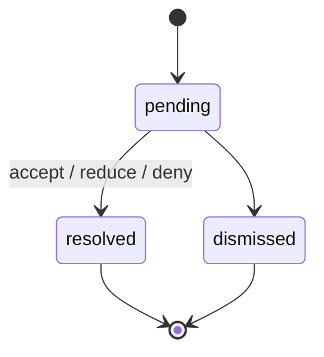

# Moderation Appeals

Moderation appeals allow any signed-in member to formally contest a moderation decision. Supported
targets are community bans, user warnings, post removals (clearance rejections), and platform
suspensions.

See also: [Moderation Flows](./MODERATION-FLOWS.md) · [Review Disputes](./REVIEW-DISPUTES.md) ·
[Entity × Action Matrix](../ENTITY-ACTION-MATRIX.md) · [Entity × Lifecycle Matrix](../ENTITY-LIFECYCLE-MATRIX.md)

## Actors

- **Appellant:** any signed-in member who received a ban, warning, post removal, or suspension.
- **Moderator:** a user with the `moderator` or `administrator` role.
- **AI agent:** the `appeal-resolution` agent, which drafts recommendations but never delivers
  directly.

## Appeal Lifecycle

Resolution actions:

- **accept** — the appealed decision is fully lifted (ban removed, warning revoked, post restored)
- **reduce** — the decision is partially mitigated (e.g., ban duration shortened, warning severity reduced)
- **deny** — the decision stands; no change

## Data Flow

1. Appellant files appeal → `POST /api/v1/appeals` (target: `warning`, `ban`, `removal`, or `suspension`)
2. AI agent runs → drafts `ai_public_response` + `ai_internal_response` + `recommended_action`
3. Moderator edits `public_response` → `PATCH /api/v1/appeals/:id`
4. Moderator approves → `POST /api/v1/appeals/:id/approval` (sets `approved_at`)
5. **Moderator sends** → `POST /api/v1/appeals/:id/delivery` (sets `sent_at`, notifies appellant)
6. Moderator resolves → `POST /api/v1/appeals/:id/resolution` (accept/reduce/deny)

Step 5 (delivery) is the ONLY path where any text reaches a user. It requires human `approved_at`
to be set first. This invariant is enforced in the service layer and regression-tested.

## SLA

Appeals are expected to be resolved within 72 hours (`APPEAL_SLA_HOURS`). Staff-tier appeal list
surfaces an `is_overdue` flag for appeals that have exceeded the SLA window.

## Tiered Access

- **Anonymous:** no access.
- **Signed-in member:** creates own appeals and sees a redacted `/my/appeals` view;
  `public_response` appears only after `sent_at`.
- **Moderation staff:** sees full lifecycle fields, AI drafts, and internal notes at `/appeals`.

The staff destination is available to moderators and administrators. Native navigation keeps
shared staff review work separate from administrator-only moderation operations. Direct native
routes enforce the same role boundary before sending a request.

Staff responses include optional, bounded context so clients never need a request per appeal:

- `target_context` identifies the original warning, community ban, platform or community post
  removal, or suspension and includes the member-safe reason, date, title, and community fields
  appropriate to that target. Platform post-removal moderator notes are internal-only and never
  populate the member-visible `target_context.public_reason`. Post-removal displays render the
  post title and public removal reason independently, even when their text is identical.
- `staff_context.appellant` provides the appellant's current display identity.
- `staff_context.original_decision` provides the internal reason and original decision actor.
- The original decision reason, actor, and timestamp are snapshotted in the append-only creation
  lifecycle event so accepting an appeal cannot rewrite its historical context.

The context fields remain optional for independently deployed clients. Deleted decision actors
retain their stored ID while their unavailable display fields become null. Member list, detail,
creation, and duplicate responses use an explicit allowlist:
`staff_context`, AI recommendations, internal drafts, and staff lifecycle metadata are absent.

## Notifications

- A post rejection notifies its author through
  `backend/services/notifications/create-post-removed-notification.mts` (fire-and-forget).
- A community ban notifies its target through
  `backend/services/notifications/create-community-ban-notification.mts` (fire-and-forget).
- An appeal resolution notifies its appellant through
  `backend/services/notifications/create-moderation-appeal-resolved-notification.mts`.

## Legal Invariant

`public_response` is the only field ever delivered. Delivery requires:

1. `approved_at IS NOT NULL` (human set it)
2. `sent_at IS NULL` (not already sent)

No automated or AI-generated text is sent to any party without a human moderator explicitly
approving and triggering delivery.

Accept, reduce, and deny resolution require `sent_at IS NOT NULL`. An appeal cannot transition out
of pending before its human-approved response has been delivered.

## API Routes

- Any signed-in user can `POST /api/v1/appeals` and access the scoped
  `GET /api/v1/appeals`.
- An appellant or staff member can `GET /api/v1/appeals/:id`.
- Staff can `PATCH /api/v1/appeals/:id`.
- Staff can use the `approval`, `delivery`, `resolution`, and `resolution-drafts` POST subroutes
  under `/api/v1/appeals/:id`.

## Pages

- `/appeals` gives moderators and administrators the full staff queue and action controls.
- `/my/appeals` gives signed-in members redacted, paginated pending, resolved, and dismissed
  tracking.
- `/my/warnings`, `/my/bans`, and `/my/removed-posts` give signed-in members eligible notice entry
  for warnings, active community bans, and community or platform post removals.
- `/my/account-status` gives a signed-in member suspension status and appeal entry.

Swift and .NET provide dedicated staff queues with pending, resolved, and dismissed filters. The
pending filter is the default. Each queue supports cursor pagination, public-response editing,
approval, delivery, AI draft re-runs, and accept, reduce, or deny resolution. Approved and sent are
lifecycle substates shown on pending appeals, not separate list filters.

Native clients save a changed public response before approval. Delivery failures are ambiguous
because the notification can succeed before the response is lost. Clients refresh the appeal from
the server after a delivery error instead of assuming it was not sent. Moderators cannot accept a
suspension appeal. Only administrators can perform that action.

The shared `moderation-appeal-lifecycle` scenarios in
[`api-fixtures/v1/lifecycle-scenarios.json`](../../../api-fixtures/v1/lifecycle-scenarios.json)
lock these role gates together with draft, approval, delivery, resolution, timestamps, and
lifecycle revision behavior across backend, web, Swift, and .NET.

Reloaded appeal rows refresh an untouched public-response editor from the latest server public or
AI draft, while a locally edited draft survives reloads and status-filter switches until a
successful server mutation confirms a replacement. AI resolution drafts can be re-run only while
an appeal is pending, unapproved, and unsent. Native clients poll for a changed AI draft timestamp
and lifecycle revision before replacing the visible row; a bounded timeout preserves the current
row and local edits so staff can refresh later. The worker atomically clears any stale approval if
a queued draft replacement races with approval after enqueue. Before incurring a billed model call,
the worker also rejects a queued run that has reached approval, delivery, or resolution; a manual
re-run bypasses only the existing-draft idempotency check.

Swift and .NET provide the same member appeal entry and tracking workflow as web. Each client uses
the five canonical reasons, keeps drafts scoped to the signed-in account and exact target decision
(including the suspension timestamp), acquires a fresh Turnstile token for an explicit submission
or retry, excludes duplicate concurrent submissions, and presents pending-existing, validation,
failure, and success outcomes. Native appeal forms remain disabled until the pending-appeal
traversal succeeds and is exhausted. Before appending an older notice page, each native client
drains any newly remaining pending-appeal pages so a matching appeal cannot leave that notice
enabled. Notice and status collections otherwise paginate independently; a failed stream can retry
without resetting the others.
Approved, sent, resolved, and resolution-action substates are member-safe tracking data, not staff
controls.

`GET /api/v1/my/removed-posts` remains community-only unless `include_platform=true` is supplied,
preserving the released cursor contract. Opted-in clients receive a globally ordered,
cursor-paginated union of community and platform removals. Community and platform removals for the
same post are distinct appeal targets. During the independent web/backend rollout window, an
opted-in continuation carrying a legacy community-only cursor remains on the legacy list shape for
the rest of that traversal; refreshing page one starts the expanded list. This prevents cursor
errors, gaps, and duplicates across mixed deploy versions.

## Backend Services

- `backend/services/moderation-appeals/` — appeal CRUD, lifecycle, AI agent integration
- `backend/services/notifications/create-post-removed-notification.mts` — post removal notification
- `backend/services/notifications/create-community-ban-notification.mts` — ban notification
- `backend/services/notifications/create-moderation-appeal-resolved-notification.mts` — resolution notification

## Database Tables

- `moderation_appeals` — one row per appeal (migration: `0450-00-00-moderation-appeals.sql`)
- `moderation_appeal_lifecycle_changes` — append-only status change log

## Related Documentation

- [Review Disputes](./REVIEW-DISPUTES.md) — narrower legal-dispute flow for verified topic claimants
- [Community Bans](./COMMUNITY-BANS.md) — ban creation and enforcement
- [User Warnings](./USER-WARNINGS.md) — warning issuance
- [Post Moderation](./POST-MODERATION.md) — post clearance and removal
- [Moderation Flows](./MODERATION-FLOWS.md) — full moderation subsystem map
