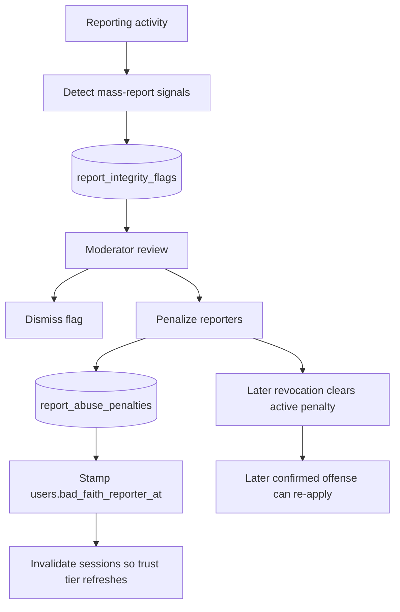

# Report Integrity

Report integrity detects and penalizes coordinated or bad-faith reporting.

## Scope

- Table: `report_integrity_flags`
- Penalty table: `report_abuse_penalties`
- Services: `backend/services/report-integrity/`

## Flow

1. Reporting activity creates detection signals for mass-report patterns.
2. A flag stores the captured reporter IDs in `details.reporter_user_ids`.
3. A moderator resolves the flag as dismissed or penalized.
4. Penalizing inserts `report_abuse_penalties` rows and stamps `users.bad_faith_reporter_at`.
5. Revocation clears the trust-tier penalty state and invalidates sessions because trust tier is cached in JWT claims.

Flag-sourced report-abuse penalties are unique only while active, so a revoked penalty can be re-applied on a later confirmed offense.

Web, Swift, and .NET render the administrator-only report-integrity queue with pending, resolved,
and all filters. Each client can dismiss a flag or penalize its captured reporters, prevents
concurrent actions on the same flag, and replaces the row only with the API-confirmed response.
Penalty revocation is a separate backend lifecycle and is not part of the mapped integrity queue
surface. Vote-integrity resolution follows the same native queue boundary; see the
[Client Parity Matrix](../CLIENT-PARITY-MATRIX.md).

See also: [Penalties](../trust-safety/PENALTIES.md), [Reporting](./REPORTING.md).
