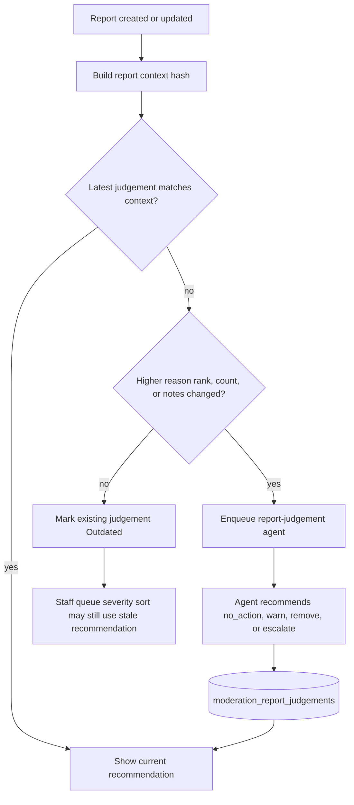

# Report Judgements

The report-judgement agent gives moderation staff a recommendation for a reported entity.

## Scope

- Agent: `backend/agents/report-judgement/`
- Table: `moderation_report_judgements`
- Services: `backend/services/moderation-reports/judgements.mts`

## Recommendations

The agent can recommend `no_action`, `warn`, `remove`, or `escalate`. `escalate` is advisory only: it raises severity sorting and tells staff the case needs senior human review. It is not a terminal `moderator_actions.action_type`.

## Freshness

Judgement rows store the report context hash, report count, note hash, and maximum report-reason
severity rank used by the agent. Automatic refreshes are enqueued when a later report changes the
report count, increases the maximum reason rank, or changes report notes. Reason rank is
`illegal_content` > `harassment` / `vote_manipulation` > `misinformation` > `spam` > `other`.

If the latest judgement no longer matches the current report context, staff and community
moderators see it marked `Outdated`. A lower-severity duplicate reason change can mark a judgement
outdated without automatically spending another AI run.

## Human In The Loop

Judgements do not remove content or penalize users. Staff review the queue, inspect the target and reports, then take enforcement through the appropriate moderation surface.

See also: [Reporting](./REPORTING.md), [Moderation Flows](./MODERATION-FLOWS.md).

Paid transparency never exposes report-judgement recommendations, prompts, or raw AI output. Its
aggregate release rules are defined in [Moderation Analytics](./MODERATION-ANALYTICS.md).
