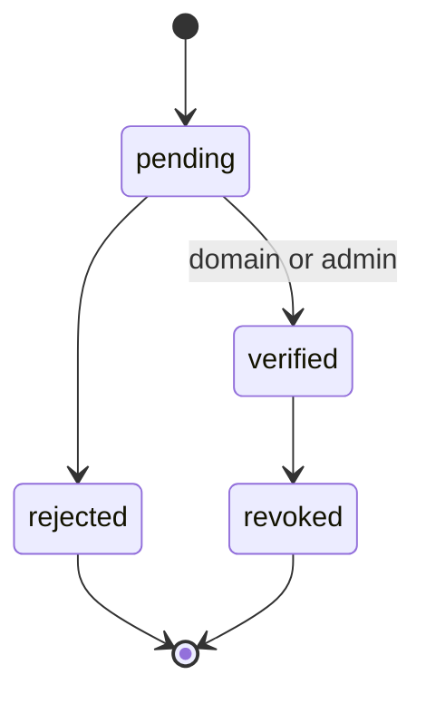
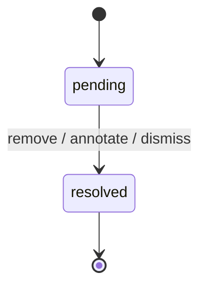
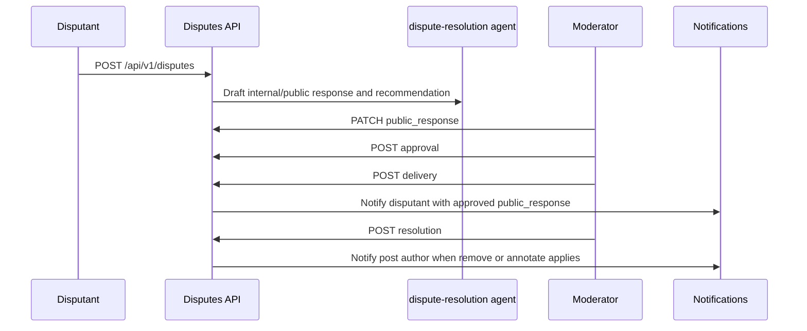

# Review Disputes

Review disputes allow verified topic claimants to formally contest reviews of their topic on legal grounds.

## Actors

| Actor     | Description                                                                      |
| --------- | -------------------------------------------------------------------------------- |
| Disputant | A user with a verified `topic_claim` for the reviewed topic                      |
| Moderator | A user with the `moderator` or `administrator` role                              |
| AI agent  | The `dispute-resolution` agent (drafts recommendations; never delivers directly) |

## Topic Claim Lifecycle

## Dispute Lifecycle

Resolution actions:

- **remove** — the reviewed post is removed from the platform
- **annotate** — a moderator note is attached to the review; the review stays up
- **dismiss** — the dispute is closed without action

## Data Flow

1. Disputant creates dispute → `POST /api/v1/disputes` (requires verified topic claim)
2. AI agent runs → drafts `ai_public_response` + `ai_internal_response` + `recommended_action`
3. Moderator edits `public_response` → `PATCH /api/v1/disputes/:id`
4. Moderator approves → `POST /api/v1/disputes/:id/approval` (sets `approved_at`)
5. **Moderator sends** → `POST /api/v1/disputes/:id/delivery` (sets `sent_at`, notifies disputant)
6. Moderator resolves → `POST /api/v1/disputes/:id/resolution` (remove/annotate/dismiss)

Step 5 (delivery) is the ONLY path where any text reaches a user. It requires human `approved_at`
to be set first. This invariant is enforced in the service layer and regression-tested.

## Tiered Access

| Tier             | Access                                                                             |
| ---------------- | ---------------------------------------------------------------------------------- |
| Anonymous        | No access to `/disputes`                                                           |
| Signed-in member | Redacted list: target link, reason, status, public_response (only after sent_at)   |
| Moderation staff | Full detail: disputant identity, claim_text, AI draft fields, all lifecycle fields |

Staff responses include optional `staff_context` with the disputant identity and bounded original
review context: post summary, topic, and exact rating. Deleted disputants retain an ID fallback.
Member list, detail, creation, and duplicate responses omit the whole staff context plus claim,
internal draft, recommendation, and staff lifecycle fields.

Swift and .NET provide dedicated staff queues for pending, resolved, and dismissed disputes with
independent cursor continuation. They preserve immutable claim text, keep public-response and
annotation drafts separate, save a changed public response before approval, and expose approval,
delivery, AI re-run, remove, annotate, and dismiss actions. Delivery and approval failures are
treated as ambiguous until a targeted refresh reconciles server state. Re-run polling is bounded by
attempt count and page lifecycle and replaces a draft only after both the AI timestamp and lifecycle
revision advance. Approval, delivery, or resolution by another moderator also reconciles a pending
re-run because those terminal lifecycle changes prevent the queued AI draft from being applied.
Workers perform that approval, delivery, and resolution preflight before any billed model call;
manual re-runs bypass only the existing-draft idempotency check.
Native list requests snapshot the targeted-mutation outcome revision and discard responses that
complete after a newer outcome, including refreshes started while the mutation was in flight. The
.NET route factory gives each disputes page ownership of its view model, and AppShell disposes that
page and its locale/property subscriptions when another moderation surface replaces it.
`/my/disputes` remains the redacted member surface.

## SLA

Disputes are expected to be resolved within 72 hours (`DISPUTE_SLA_HOURS = 72` in
`backend/services/review-disputes/config.mts`). The `is_overdue` flag is computed in `get.mts`
using `uuid_extract_timestamp(id)` as the creation timestamp and is surfaced in the staff-tier
dispute list (`/disputes`) to help moderators prioritize.

## Notifications

When a dispute is resolved with `remove` or `annotate`, the **post author** (not the disputant)
receives a fire-and-forget notification via `createReviewActionedNotification` in
`backend/services/notifications/create-review-actioned-notification.mts`. This is triggered from
`resolveReviewDisputeRemove` and `resolveReviewDisputeAnnotate` in `resolve.mts`.

The **disputant** receives a notification when the moderator sends the approved response via
`sendApprovedReviewDisputeResolution` (see `create-review-dispute-resolved-notification.mts`).

## Legal Invariant

`public_response` is the only field ever delivered. Delivery requires:

1. `approved_at IS NOT NULL` (human set it)
2. `sent_at IS NULL` (not already sent)

No automated or AI-generated text is sent to any party without a human moderator explicitly
approving and triggering delivery.
