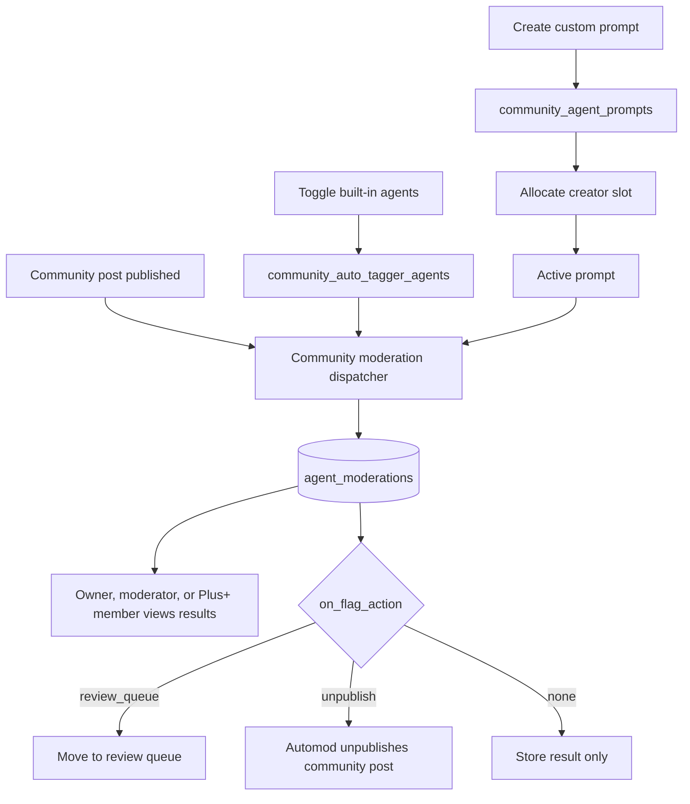

# Community Moderation reference

[Back to Community Moderation](community-moderation.md)

## Overview

1. **Toggle built-in agents** — an owner or moderator enables global label agents for the community
2. **Create a prompt** — an owner or moderator writes a system prompt describing what to flag
3. **Allocate a slot** — the creator allocates one of their plan's slots to activate the prompt
4. **Posts are evaluated** — when a post is published in the community, enabled built-ins and active prompts run against it
5. **View results** — owners, moderators, and Plus+ members can see per-prompt moderation results

## Built-In Community AI Agents

Built-in community AI agents use global agent definitions and system users. The only community-specific state is whether a fixed-label agent is enabled for a community. Posts are community-specific, so the dispatcher evaluates the post's `community_id` and runs only the built-in agents enabled for that community.

Built-ins are disabled by default. Enabling or disabling one records `community_id`, `agent_id`, actor, and timestamps in `community_auto_tagger_agents`. The global prompt, label mapping, and moderation result storage do not fork per community.

| Agent             | Labels                                             | On flag      |
| ----------------- | -------------------------------------------------- | ------------ |
| `self-promotion`  | `self-promotion`                                   | Review queue |
| `marketplace`     | `buying`, `selling`, `trade`, `for-hire`, `hiring` | Review queue |
| `ai-generated`    | `ai-generated`                                     | Review queue |
| `politics-averse` | `political`                                        | Review queue |
| `click-bait`      | `click-bait`                                       | Tag only     |
| `vague-post`      | `vague-post`                                       | Tag only     |
| `shit-post`       | `shit-post`                                        | Tag only     |

The API includes an `entitlement` field for each built-in. For launch, community owner/moderator access is enough. Future paid-plan or community-tier checks must be implemented by changing the entitlement service while preserving the existing response shape.
