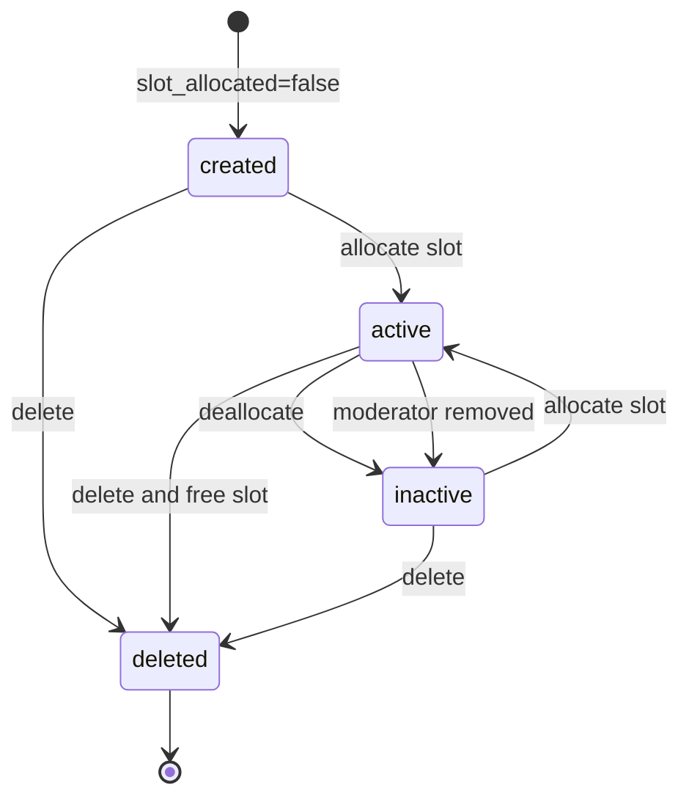

# Community Moderation reference

[Back to Community Moderation](community-moderation.md)

## Slot Limits

Slot limits are **per user across all communities**:

| Plan    | Prompt Slots |
| ------- | ------------ |
| Plus    | 1            |
| Premium | 3            |
| Pro     | 10           |

Free users cannot allocate slots (limit = 0). Creating a prompt does not consume a slot — allocation does.

## Prompt Lifecycle

Active prompts: `slot_allocated = true AND activated_at IS NOT NULL AND deactivated_at IS NULL AND deleted_at IS NULL`
