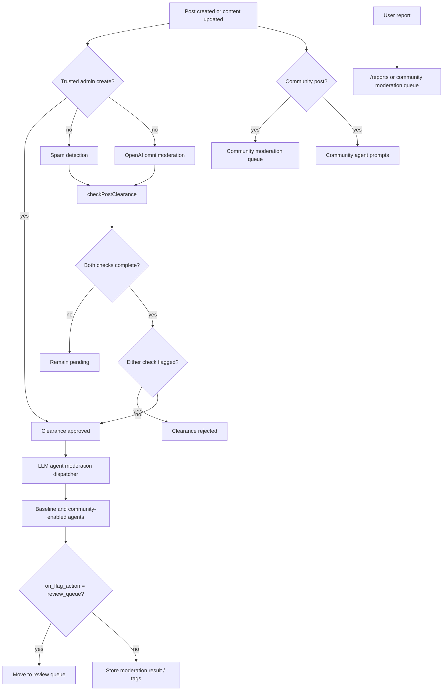

# Moderation Flows reference

[Back to Moderation Flows](MODERATION-FLOWS.md)

## Native Client Capability Boundary

The native moderation destination is not one indivisible capability. Swift and .NET provide full
report triage, staff appeal and dispute lifecycles, a dedicated actionable post review queue with
refresh and cursor pagination, and administrator-only vote/report integrity actions. Native modlog
and moderation-analytics views are full because those two web capabilities are themselves
read-only.

Member moderation is a separate workflow: native clients render personal warnings, bans,
community and platform removed posts, suspension status, appeal submission, and independently
paginated appeal tracking. Keep staff and member boundaries as separate capability records in the
[Client Parity Matrix](../CLIENT-PARITY-MATRIX.md); route presence or a loaded record alone must not
be used as evidence for an action.

| Capability                        | Native coverage | Native action boundary                                               |
| --------------------------------- | --------------- | -------------------------------------------------------------------- |
| Modlog and moderation analytics   | Full            | None; the web capability is read-only                                |
| Report queue                      | Full            | Review, dismiss, judgement refresh, bulk, and enforcement            |
| Staff appeals                     | Full            | Draft, approve, deliver, re-run, dismiss, and resolve                |
| Staff review disputes             | Full            | Draft, approve, deliver, re-run, remove, annotate, and dismiss       |
| Post review queue                 | Full            | Approve, reject, re-review, refresh, media reveal, and pagination    |
| Vote and report integrity queues  | Full            | Dismiss, penalize, suspend, and other web-matched resolution actions |
| Member moderation cases / appeals | Full            | Notice entry, submission, duplicate-safe retry, and lifecycle status |

Staff appeal navigation is available to moderators and administrators without exposing
administrator-only moderation operations. The native appeal queue defaults to pending and supports
resolved and dismissed filters plus cursor pagination. It saves a changed public response before
approval, refreshes after an ambiguous delivery failure, and prevents moderators from accepting
suspension appeals. The detailed lifecycle contract remains canonical in
[Moderation Appeals](./MODERATION-APPEALS.md).

## Pipeline diagram

## 1. Post Clearance Gate

**Trigger:** Any time spam detection or OpenAI moderation completes for a post.

**Logic (`backend/services/post-clearance/check-clearance.mts`):**

- Post stays `pending` until both spam detection AND OpenAI moderation have completed (`_created_at` columns set)
- If either is flagged → post becomes `rejected`
- If both complete and neither flagged → post becomes `approved`
- On approval → enqueues LLM agent moderation dispatcher
- Admin-created non-story posts start as `approved` and skip create-time spam detection, OpenAI
  moderation, and LLM moderator dispatch. Community publication approval still applies when the
  target community requires post approval or raid-mode approval. `processPostCreated` bases the
  automated-moderation bypass on the post's own derived `clearance_status`, not the creator's
  current role, so role changes between insert and async processing do not change the
  trusted-content boundary.
- Story posts are pre-approved for immediate visibility. Their initial empty-summary insert still
  runs the normal `processPostCreated` path with create-time moderation enabled, so it queues
  spam detection and OpenAI moderation before generated content is stored.
  `updateStoryPostAgentResult` later stores the generated summary, resets clearance, and
  re-enqueues OpenAI moderation and spam detection for that generated content;
  `checkPostClearance()` can demote the story if moderated content is flagged.
- Content edits call `resetPostClearance()` and re-enter the normal update pipeline, including
  admin-created posts.

**Clearance statuses:** `pending` | `approved` | `rejected` | `in_review`

**Database:** `posts.approved_at`, `posts.rejected_at`, `posts.in_review_at`, `post_clearance_changes` (audit log)

**Services:** `backend/services/post-clearance/`
