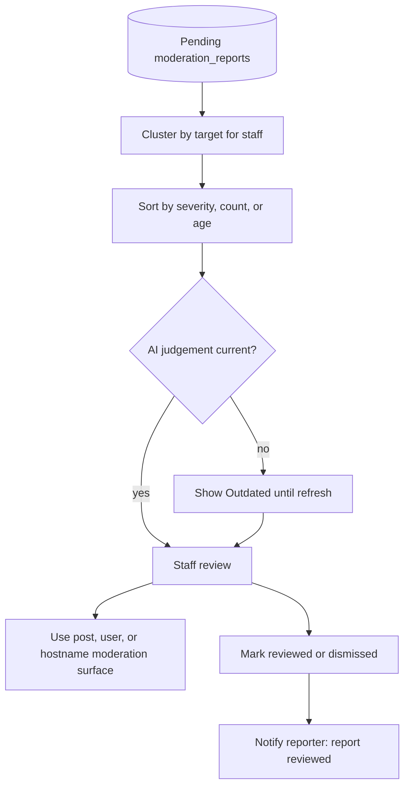

# Reporting & Content Moderation reference

[Back to Reporting & Content Moderation](REPORTING.md)

## Rate limiting

`POST /api/v1/reports` is registered under the `sensitive` category with a 3600-second TTL. Effective limits by trust tier:

| Trust tier | Max reports/hour |
| ---------- | ---------------- |
| 0          | 1                |
| 1          | 3                |
| 2          | 5                |
| 3          | 10               |
| 4          | 15               |
| 5          | 20               |

A 429 response includes a `Retry-After` header. The UI surfaces a toast: "You are reporting too often. Please wait an hour."

---

## Reporter privacy

- The `reporter_user_id` is stored but never exposed to the reported user.
- The reported user receives no notification when a report is submitted.
- Site administrators and moderators can view full `moderation_reports` rows via `/reports`.
- Community owners/moderators can view community-scoped post/comment report summaries without reporter identity, reporter notes, or note-derived AI judgements.

---

## Admin queue



Pending reports are visible at `/reports`. The route requires authentication. It is discoverable in
navigation only for administrators, while moderators can open it directly. Signed-in non-staff
members receive a redacted, read-only flat list; anonymous viewers receive a sign-in gate.

Staff see clustered queue cards by default: all reports
for the same target are grouped into one collapsible item with report count, reporter count, reason
breakdown, target link, notes, AI judgement details, and links to existing moderation surfaces.
Staff can sort the flat queue by severity, most reported, oldest first, or newest first; severity
uses the latest AI report judgement ordered `escalate`, `remove`, `warn`, `no_action`, then missing
judgement. Status filters cover pending, reviewed, actioned, and dismissed reports. Changing a
filter, sort, or mode clears selection and pagination state. A failed initial clustered request
falls back to the flat staff queue with a visible notice. Incremental failures retain already loaded
records and their cursor state.

AI judgement details include an `Outdated` state for staff/moderator-tier viewers when new report
context has arrived since the latest judgement was generated. Outdated judgements can still
participate in severity sorting until the queued refresh produces a newer recommendation.

Staff can request the same grouped contract directly with `GET /api/v1/reports?cluster=entity`.
Clustered mode is staff-only. The flat `GET /api/v1/reports` response remains available for
existing callers.

Post report clusters show duplicate and brigade indicators from existing stored signals:

- `content_hash_duplicate` and `embeddings_similarity` come from bounded spam-detection evidence on
  the current `post_moderation_dispositions` row.
- Duplicate-wave cards appear when at least 3 returned post clusters match within 24 hours by stored
  content hash or stored post embedding similarity.
- The brigade badge appears when the reported post has an unresolved
  `vote_integrity_flags.flag_type = 'velocity_spike'` record.

Duplicate-wave sidecars are page-local enrichments of the paginated entity clusters. The backend
does not issue an unbounded lookup to reconstruct a duplicate group across pages: a group below the
duplicate threshold on an individual page is intentionally omitted on that page. When qualifying
members of the same content-hash group occur on multiple pages, each page may repeat the sidecar
with the same `content-hash:<hash>` stable ID and only that page's members. Clients merge recurring
sidecar IDs and member cluster IDs, replacing stale member counts before recomputing totals.

Duplicate-wave cards expose an administrator-only "Remove all" action that deletes each unique
post target once through the existing post moderation endpoint. Post deletion dismisses matching
pending reports through the existing report-resolution flow.

Flat report rows show `created_at`, an SLA age badge (green under 1 hour, yellow 1-24 hours, red
over 24 hours), per-entity report count, reporter link for staff, entity type, entity link, reason,
note, derived status, and links to existing moderation surfaces.

Administrators and moderators can mark an ordinary pending report reviewed or dismissed, rerun an
AI judgement in any status, issue a global warning to the reported user, and confirm or dismiss a
pending system-generated ban-evasion report through its dedicated action. A warning linked to a
report resolves it as actioned. Only administrators can remove reported post or comment targets.
No destructive or resolving action except judgement rerun is available after a report leaves
pending status.

Bulk dismiss is available to administrators and moderators. Bulk target removal is administrator
only and deletes each loaded target once. Cluster and duplicate-wave actions operate on loaded
reports, skip ban-evasion reports from ordinary actions, settle each mutation independently, and
retain failed or skipped selections with visible errors. Successful grouped mutations refresh the
server-owned totals, reporter counts, reason breakdowns, and cluster visibility.

Resolving a report records `reviewed_at` and `resolved_by_id`, removes the report from the pending
queue, and creates one generic reporter notification: "Your report was reviewed." That row persists
`target_intent: notifications_inbox` so clients do not treat it as a content link. The notification
is delivered in-app and through the existing browser push pipeline when push is enabled. Reports do
not send email. Web, Swift, and .NET expose these report-triage behaviors natively; see the
[Client Parity Matrix](../CLIENT-PARITY-MATRIX.md).

Community owners/moderators see pending reports for posts/comments in their community moderation queue. The queue shows the same SLA age and report-count badges as the admin queue, and can sort reports by severity, most reported, oldest first, or newest first. They can mark those community-scoped reports reviewed or dismissed, but do not see reporter identity, reporter notes, note-derived AI judgements, or ban-evasion context. Site staff retain those staff-only fields. Community queue claim/release and escalation/de-escalation mutations must be scoped to the URL community before mutating queue state.

Reports never auto-hide or auto-takedown content. Moderators and admins must use the existing post, user, and hostname moderation surfaces for enforcement actions. Voucha does not provide a report-specific appeals flow. Self-reports remain blocked with HTTP 422.

Moderation queue UI changes must preserve destructive/bulk confirmation, server-driven fallback for best-effort enrichment, semantic cursor validation, optimistic state eviction and reappearance, action-specific loading indicators, valid interactive HTML, and Storybook coverage for changed controls.

---

## Database schema

The schema example below is checked by `static-code-analysis/repo-file-policy/schema-doc-drift-guard.mts`
(via `pnpm run repo-file-policy`), which blocks legacy polymorphic target columns, random UUID
defaults, mutable `created_at`, and physical `status` columns from returning.

```sql
CREATE TABLE moderation_reports (
  id               uuid PRIMARY KEY DEFAULT uuidv7(),
  created_at       timestamptz GENERATED ALWAYS AS (uuid_extract_timestamp(id)) VIRTUAL,
  reviewed_at      timestamptz,
  reporter_user_id uuid NOT NULL REFERENCES users(id) ON DELETE CASCADE,
  post_id          uuid REFERENCES posts(id) ON DELETE CASCADE,
  reported_user_id uuid REFERENCES users(id) ON DELETE CASCADE,
  hostname_id      uuid REFERENCES url_hostnames(id) ON DELETE CASCADE,
  rss_feed_item_id uuid REFERENCES rss_feed_items(id) ON DELETE CASCADE,
  case_id          uuid NOT NULL REFERENCES moderation_cases (id) ON DELETE CASCADE,
  reason           moderation_report_reason NOT NULL,
  -- moderation_report_reason values: 'spam', 'harassment', 'misinformation', 'illegal_content', 'vote_manipulation', 'other'
  note             text CHECK (note IS NULL OR char_length(note) <= 1000),
  resolution_action moderation_report_resolution_action,
  resolved_by_id   uuid REFERENCES users(id),
  escalated_at     timestamptz,
  escalated_by_id  uuid REFERENCES users(id) ON DELETE SET NULL,
  CHECK (num_nonnulls(post_id, reported_user_id, hostname_id, rss_feed_item_id) = 1),
  CHECK ((reviewed_at IS NULL AND resolution_action IS NULL) OR (reviewed_at IS NOT NULL AND resolution_action IS NOT NULL)),
  CHECK (escalated_at IS NOT NULL OR escalated_by_id IS NULL)
);
```

The API derives report status from `reviewed_at` and `resolution_action`: unresolved rows are `pending`,
resolved rows return their final resolution value.

Service: `backend/services/moderation-reports/`

Endpoints: `POST /api/v1/reports`, `GET /api/v1/reports`, `PATCH /api/v1/reports/:id`, `GET /api/v1/communities/:slug/reports/pending`, `PATCH /api/v1/communities/:slug/reports/:reportId`

Queue: `backend/queues/report-integrity/` for asynchronous integrity checks. Report review itself is table-backed.

---

## Deleted targets

Pending queues hide reports whose target has been deleted. Post/comment deletion also dismisses matching pending reports automatically; user and RSS item reports become non-actionable in pending queues once the target is deleted.
