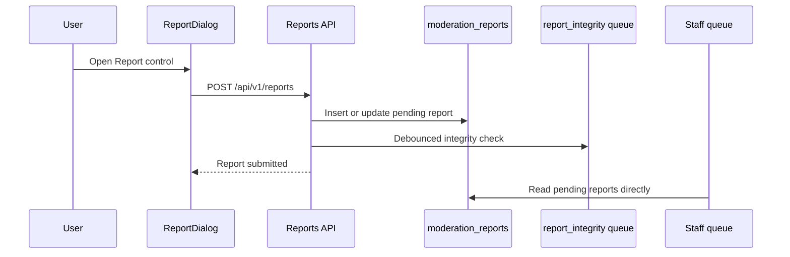

# Reporting & Content Moderation reference

[Back to Reporting & Content Moderation](REPORTING.md)

## Report reasons

| Value               | Label                                           |
| ------------------- | ----------------------------------------------- |
| `spam`              | Spam                                            |
| `harassment`        | Harassment                                      |
| `misinformation`    | Misinformation                                  |
| `illegal_content`   | Illegal content                                 |
| `vote_manipulation` | Vote manipulation — only valid for post reports |
| `other`             | Other                                           |

An optional free-text note (max 1000 characters) may be added with any reason.

### Adding a report reason

When adding a report reason, update all of these surfaces in the same change:

- Shared source: `MODERATION_REPORT_REASONS` and `MODERATION_REPORT_REASON_OPTIONS` in `@ts-shared/utils/moderation-reports`.
- Database: the `moderation_reports.reason` check constraint and any migration/backfill required for existing rows.
- Backend validation and tests: report parsing, create/update paths, test helpers, clustered reason breakdown ordering, and DB insertion coverage for every shared reason.
- Frontend/admin: client report reason exports, report dialog options, clustered admin state, and typed admin report response surfaces.
- Storybook and fixtures: examples that mirror report reasons or reason breakdowns.
- LLM judgement policy: `REPORT_REASON_CONTENT_POLICY_COVERAGE` in `backend/services/moderation/content-policy.mts`, with either content-policy categories or explicit guidance/exemption for each reason.
- Docs: this table and any moderation/report-judgement requirement pages that mention reason semantics or entity constraints.

---

## Submission flow

1. User clicks the Report control (kebab menu item or inline button).
2. `ReportDialog` opens with a reason radio group and optional note textarea.
3. User selects a reason and submits.
4. `POST /api/v1/reports` creates an unresolved `moderation_reports` row.
5. Dialog body replaces with "Report submitted — thank you" success state.
6. A debounced `report_integrity` queue job checks for mass-report patterns; staff review reads pending rows directly from `moderation_reports`.

---

## Idempotency

One active pending report per reporter and target FK is enforced by partial unique indexes. A
duplicate submission updates the existing pending report's reason/note, returns HTTP 200 with the
existing report's ID, and does not create a duplicate row.

The web UI persists a `report:<entityType>:<entityId>=submitted` flag in `sessionStorage`. Native
clients render "Reported" for the current mounted detail session and reset that state when the
detail reloads or is discarded.

---
