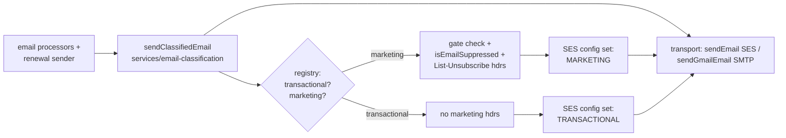

# Email Classification

Every outbound email has exactly one authoritative classification — `transactional` or
`marketing` — enforced structurally so a new email type cannot ship unclassified. Service
implementation: [`backend/services/email-classification/README.md`](../../../backend/services/email-classification/README.md).

## Why

Before this system, classification was implicit and scattered per-processor: nothing forced a
new email type to declare transactional vs. marketing, and SES `ConfigurationSetName` was defined in
Terraform but never passed to the send call (no reputation isolation). Mixing transactional and
marketing traffic on one SES identity means a marketing bounce/complaint spike can degrade
deliverability for auth emails (login tokens, email verification).

## Architecture

## Single Choke Point

All email processors and the membership renewal-price-increase sender call
`sendClassifiedEmail()` — direct imports of `sendEmail` (`@modules/aws/ses`) or `sendGmailEmail`
(`@modules/gmail-smtp`) are test-forbidden outside
`backend/services/email-classification/send.mts` (`no-direct-send.test.mts`, a grep-based test).
This is what makes an out-of-band sender impossible to add unclassified — the historical gap that
let `renewal-price-increase` send from the memberships worker, outside the `emails` queue, with no
classification at all.

## Classification Table

| Email type                                     | Classification | Unsubscribe scheme                   | Notes                                                                                                                                                           |
| ---------------------------------------------- | -------------- | ------------------------------------ | --------------------------------------------------------------------------------------------------------------------------------------------------------------- |
| `processSendCommunityInviteEmail`              | transactional  | —                                    |                                                                                                                                                                 |
| `processSendEmailAddressLoginToken`            | transactional  | —                                    | Never suppressed by bounce/preference checks — see [Bounce/Complaint Suppression Policy](#bouncecomplaint-suppression-policy)                                   |
| `processSendDataExportReadyEmail`              | transactional  | —                                    |                                                                                                                                                                 |
| `processSendEmailVerificationToken`            | transactional  | —                                    | Never suppressed — see [Bounce/Complaint Suppression Policy](#bouncecomplaint-suppression-policy)                                                               |
| `processSendSupportEmail`                      | transactional  | —                                    |                                                                                                                                                                 |
| `processSendWelcomeEmail`                      | transactional  | —                                    | Judgment call: one-shot onboarding, no unsubscribe/gate today — see [Judgment Calls](#judgment-calls)                                                           |
| `processSendCommunityApplicationDecisionEmail` | transactional  | —                                    |                                                                                                                                                                 |
| `processSendCommunityRoleChangeEmail`          | transactional  | —                                    |                                                                                                                                                                 |
| `processSendCommunityOwnershipTransferEmail`   | transactional  | —                                    |                                                                                                                                                                 |
| `processSendRenewalPriceIncreaseEmail`         | transactional  | —                                    | Sent from the memberships worker, outside the `emails` queue — the superset `EmailType` key exists so this can't be silently omitted                            |
| `processSendFollowTopicsEmail`                 | marketing      | `user-category` (`outcome_emails`)   |                                                                                                                                                                 |
| `processSendPostReferralLinkEmail`             | marketing      | `user-category` (`outcome_emails`)   |                                                                                                                                                                 |
| `processSendFollowNewsSourcesEmail`            | marketing      | `user-category` (`outcome_emails`)   |                                                                                                                                                                 |
| `processSendCommunityModerationSummaryEmail`   | marketing      | `user-category` (`community_digest`) | Judgment call: recurring + preference-gated + already attaches `community_digest` headers → behaves like a subscription — see [Judgment Calls](#judgment-calls) |
| `newsDigest`                                   | marketing      | `user-category` (`news_digest`)      | Registry-only — no sender exists yet, `hasActiveSender: false` — see [Planned: news_digest](#planned-news_digest)                                               |

Source of truth: `EMAIL_CLASSIFICATIONS` in
[`backend/services/email-classification/registry.mts`](../../../backend/services/email-classification/registry.mts).
`registry.test.mts` cross-checks this table against every `processSend*Email` export under
`backend/workers/{emails,memberships}/processors` that imports `@email-templates/core`, so a new
processor without a registry entry fails CI — the `Record<EmailType, EmailClassificationEntry>`
type gives compile-time exhaustiveness on top of that runtime check.

## Judgment Calls

- **`welcome` → transactional.** One-shot onboarding email sent once at signup; not a recurring
  subscription, so it carries no unsubscribe path or gate today.
- **`community-moderation-summary` → marketing.** Recurring, preference-gated
  (`community_digest` cadence setting), and already attached `community_digest` unsubscribe
  headers before this system existed — it behaves like a subscription even though it is
  operational/moderation content rather than promotional. Consequence: its template carries a
  **visible** unsubscribe link in the template shell (not just a `settingsUrl`), matching the
  other marketing templates.

## Bounce/Complaint Suppression Policy

`sendClassifiedEmail` checks `isEmailSuppressed()` (`@services/ses-bounce-events`) for **marketing
email only**, before dispatch. It suppresses on a permanent bounce or a spam complaint. Transactional
email is never suppressed on a bounce/complaint record. Suppressing transactional sends on a stale
or misclassified permanent bounce would lock users out of `login-token` / `email-verification` — an
availability regression on the highest-volume, security-sensitive send path — and would add a DB
read to that path for no compliance benefit (transactional email doesn't need bounce/complaint-driven
suppression the way bulk marketing does).

## Suppression Order (marketing only)

`sendClassifiedEmail` returns `null` without sending, in order:

1. User has opted out of the entry's `user-category` (`getEmailPreferences`).
2. Recipient address has a permanent SES bounce or complaint on file (`isEmailSuppressed`).

This is a backstop on top of, not a replacement for, each processor's existing claim /
`mark*Sent` dedup state machine — those are unrelated idempotency concerns (see
[Job Replayability](JOB-REPLAYABILITY.md)) and are not touched by classification.

## SES Configuration Sets

Two SES configuration sets isolate marketing and transactional reputation:
`SES_CONFIGURATION_SET_TRANSACTIONAL` / `SES_CONFIGURATION_SET_MARKETING`, both defined in
`vouchington-infra/opentofu/ses.tf` (`aws_sesv2_configuration_set`, one per environment) and passed through to
`SendEmailCommand`/`SendRawEmailCommand` via `ConfigurationSetName`
(`backend/modules/aws/ses.mts`). The marketing configuration set has its own SES event
destination routed to the same `aws_sns_topic.ses_bounce` SNS topic as the transactional set, so
marketing bounces/complaints still reach `isEmailSuppressed()` — a separate config set with no event
destination would make marketing bounce/complaint suppression silently stop working. Locally, both
env vars are unset, so no configuration set is passed (correct for local/dev sends).

## CAN-SPAM Footer

Marketing templates require a `physicalAddress` prop — the CAN-SPAM postal
address requirement for commercial email. The backend supplies
`process.env.MARKETING_POSTAL_ADDRESS ?? MARKETING_POSTAL_ADDRESS_PLACEHOLDER`
(`@modules/utils`); no real address is configured yet, so the placeholder renders until one is
set. Because `physicalAddress` is a **required** prop on marketing template prop types
(`email-templates/types.mts`), a transactional template cannot accidentally render it, and
`marketing-footer.test.mts` fails if any marketing template omits the address or unsubscribe
link.

## Planned: news_digest

`news_digest` is registered (`hasActiveSender: false`) so its unsubscribe category and preference
gate exist, but no processor or enqueue path is built. Building the newsletter sender itself is
out of scope here — tracked by #1167 / #1351.

## Related

- Service implementation: [`backend/services/email-classification/README.md`](../../../backend/services/email-classification/README.md)
- Membership renewal notifications: [Membership refunds, renewal notifications, and grants](../users/memberships.md#refunds-renewal-notifications-admin-grants-feature-flag-and-agent-prompt-slots)
- Job replayability (non-replayable email queue): [JOB-REPLAYABILITY.md](JOB-REPLAYABILITY.md)
- Email templates catalog: [`email-templates/README.md`](../../../email-templates/README.md)
