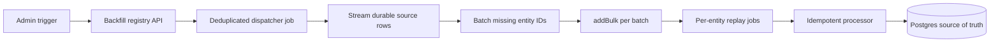

# Job Replayability & Idempotency reference

[Back to Job Replayability & Idempotency](JOB-REPLAYABILITY.md)

## Backfill Implementation Pattern

Backfills follow the **dispatcher pattern**: the trigger enqueues a single low-priority,
deduplicated dispatcher job. The dispatcher streams IDs from the source-of-truth over a
single `pg-cursor` connection (via `createAsyncGeneratorFromCursor` from `@data-stores/psql`,
in the service layer) and **bulk-enqueues** each batch (via `createBulkEnqueueFunction` /
`addBulk`) — one `addBulk` round-trip per batch, not one per row, and one streamed pass,
not a per-batch re-query.

- Priority: `100` (lowest urgency — yields to normal work)
- Deduplication: `throttle` with 1 hour TTL on the dispatcher (prevents flooding on repeated
  triggers); each per-entity job keeps its own debounce dedup so re-runs don't double-enqueue
- The streamed scan runs inside the worker, not the API request (returns immediately)

Service (canonical example): `backend/services/openai-moderation/backfill.mts`
(`streamUnmoderated*IdBatches`) + `backend/queues/openai-moderation/enqueues.mts`
(`enqueueCreate*ModerationBatch`)
Registry: `backend/api/v1/mq/backfills-registry.mts`
API: `backend/api/v1/mq/backfills.mts`

## BackfillEntry Eligibility

A `BackfillEntry` is allowed only when all of these are true:

- **Durable source:** `source_table` names one or more real Postgres tables. External
  replay sources must use `external:<provider>` and be allowlisted by registry tests.
- **Exhaustive scan:** the dispatcher covers the full durable source, not only a recent
  cron page, live feed, backlog gate, or current in-memory queue state.
- **Awaited fanout:** the trigger and dispatcher must return or await every child enqueue
  and every `addBulk` call. A route must not return success while enqueue failures are still
  unobserved.
- **Retry-safe effects:** every child job is idempotent and uses dedupe, upsert,
  uniqueness, content-sha guards, or skip-if-exists checks.
- **No irreversible sends:** jobs that send email, push, SMS, webhooks, or other external
  side effects need a durable delivery marker and an explicitly documented retryable or
  at-most-once contract before replay can be considered. Otherwise they belong in the exclusion
  table.
- **Failure visibility:** dispatcher progress must not advance past a batch until the batch's
  child enqueue succeeds, and unrecoverable per-row failures must be durably marked or remain
  discoverable by the next scan.

## Async Fanout Checklist

For worker fanout that enqueues follow-up jobs from committed state:

- Commit or persist the intent before enqueueing children, so failed child enqueue can be
  retried from Postgres.
- Await `addBulk` / enqueue promises unless the enqueue helper documents internal
  `.catch(onError)` reporting and the caller intentionally uses statement-level `void`.
- Use stable dedupe IDs that include the durable source identifier and operation.
- Advance cursors or mark rows complete only after the downstream enqueue/write succeeds.
- Treat deleted recipients/entities and zero-recipient batches as explicit success states.
- Mark retry-exhausted or permanently invalid rows with enough durable metadata that retries
  do not loop forever and audits can explain skipped work.

## Delayed-Job Audit Checklist

For every scheduled, delayed, or fanout job whose eligibility can change between enqueue and
processing:

- Revalidate the recipient and destination at processing time. Do not trust a queued email address,
  notification preference, membership, or authorization snapshot after a delay.
- Bound the source scan and claim with explicit durable timestamps. Use the claimed-time or
  eligibility window that selected the row so concurrent dispatchers and late workers cannot widen
  a run to newly eligible or indefinitely old work.
- Exclude soft-deleted, processing-restricted, and suspended users in both the durable source scan
  and the processor's final revalidation where recipient lifecycle affects delivery.
- When enqueueing is deduplicated, suppressed, or fails after a database write commits, keep a
  durable fallback that a dispatcher, backfill, or reconciliation scan can rediscover. Queue state
  or a suppressed enqueue must never be the only record that work remains.
- Persist terminal skip reasons or terminal state for invalid/deleted recipients and empty batches
  so replay audits can distinguish completed work from lost work.
- For at-most-once external delivery, write the attempt marker only after final revalidation and
  immediately before the provider call; test the marker from inside the provider boundary.
