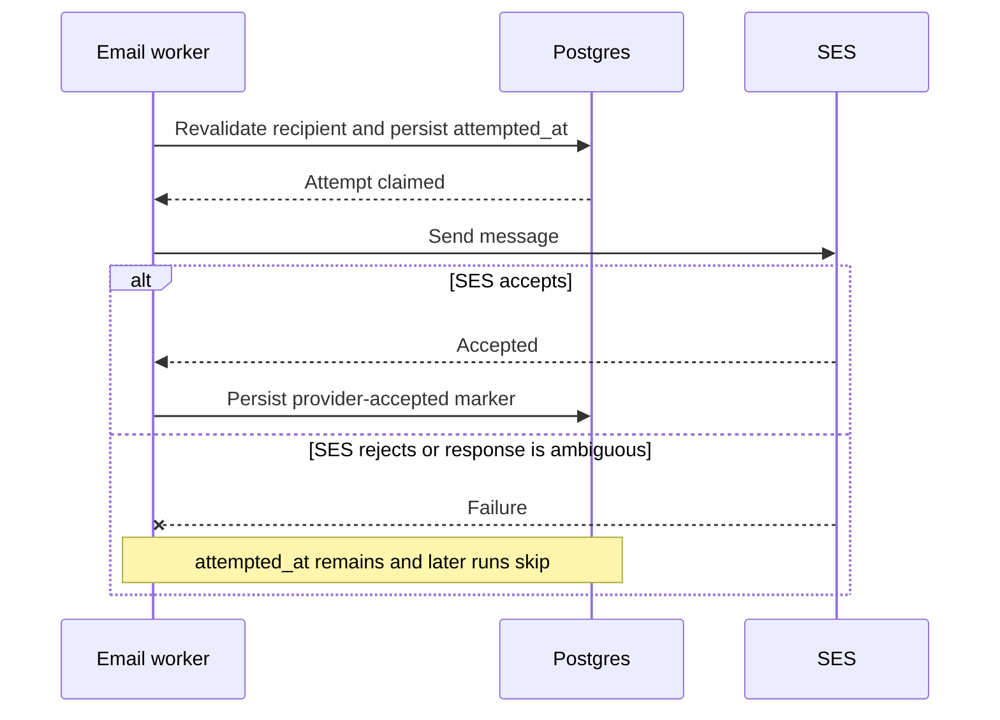

# Job Replayability & Idempotency reference

[Back to Job Replayability & Idempotency](JOB-REPLAYABILITY.md)

## Non-Replayable Queues (by design)

Some jobs send irreversible external side-effects that cannot be undone on replay.
These are **explicitly excluded** from the backfill guarantee:

| Queue                  | Excluded jobs                                                                                                                                                                                                                                                                                                                                                    | Reason                                                                                                                                                                                                                                                                                                                                                                                                                                                                                                                                                                                                                                                                                                                    |
| ---------------------- | ---------------------------------------------------------------------------------------------------------------------------------------------------------------------------------------------------------------------------------------------------------------------------------------------------------------------------------------------------------------- | ------------------------------------------------------------------------------------------------------------------------------------------------------------------------------------------------------------------------------------------------------------------------------------------------------------------------------------------------------------------------------------------------------------------------------------------------------------------------------------------------------------------------------------------------------------------------------------------------------------------------------------------------------------------------------------------------------------------------- |
| `emails`               | `processSendCommunityInviteEmail`, `processSendDataExportReadyEmail`, `processSendEmailAddressLoginToken`, `processSendEmailVerificationToken`, `processSendCrmEmail`, `processSendSupportEmail`, `processSendWelcomeEmail`, `processSendCommunityApplicationDecisionEmail`, `processSendCommunityRoleChangeEmail`, `processSendCommunityOwnershipTransferEmail` | Transactional email delivery — re-sending duplicates email                                                                                                                                                                                                                                                                                                                                                                                                                                                                                                                                                                                                                                                                |
| `emails`               | `processSendFollowTopicsEmail`, `processSendPostReferralLinkEmail`, `processSendFollowNewsSourcesEmail`                                                                                                                                                                                                                                                          | At-most-once delivery marker prevents repeats but accepts loss after a failed or ambiguous provider response                                                                                                                                                                                                                                                                                                                                                                                                                                                                                                                                                                                                              |
| `emails`               | `processSendCommunityModerationSummaryEmail`                                                                                                                                                                                                                                                                                                                     | Retryable delivery; ambiguous provider acceptance can duplicate the summary                                                                                                                                                                                                                                                                                                                                                                                                                                                                                                                                                                                                                                               |
| `memberships`          | `processSendRenewalPriceIncreaseEmail`                                                                                                                                                                                                                                                                                                                           | At-most-once renewal delivery; failed attempts remain terminally skipped                                                                                                                                                                                                                                                                                                                                                                                                                                                                                                                                                                                                                                                  |
| `activitypub-delivery` | `distributeActivity`, `deliverActivity`                                                                                                                                                                                                                                                                                                                          | Outbound HTTP delivery to remote fediverse inboxes — re-sending can duplicate a Follow/Like/Undo delivery. PostgreSQL retains a 500-candidate-page fan-out cursor, so ordinary retry resumes after a committed page, but it records Valkey acceptance rather than per-inbox consumption or receipt. An enqueue/commit crash window and ambiguous remote POST remain at least once; there is no reconciliation/backfill or Valkey-wipe recovery. Stable known Follow/Like generations retain exact Undo linkage; legacy unknown generations skip Undo, and pre-upgrade missing-original Undo jobs are terminally dropped before effects. See the [queue contract](../../../backend/queues/activitypub-delivery/README.md). |

These queues are **not** backfillable after a Valkey wipe — events that were never enqueued in
the first place are lost.

### Irreversible delivery contracts

Postgres and an external delivery provider such as SES cannot participate in one atomic commit.
Exactly-once delivery is therefore unavailable: an ambiguous transport or provider failure can hide
that the provider accepted a message before its response was lost. An explicit provider rejection
is distinguishable and means the message was not accepted.

- A **retryable** processor leaves the send eligible after provider failure. It favors eventual
  delivery and accepts that retrying an ambiguous response can duplicate the message.
- An **at-most-once** processor commits a durable attempt marker immediately before the provider
  call. Every later run skips when the marker exists, including after an explicit provider
  rejection. It prevents duplicates and accepts possible message loss.

The engagement onboarding processors use
`user_engagement_email_sends.delivery_attempted_at`, with `claimed_at` recording dispatcher
ownership and `sent_at` recording provider acceptance. Renewal price-increase delivery uses
`memberships.renewal_price_increase_delivery_attempted_at` before SES and
`memberships.renewal_price_increase_notified_at` afterward. Neither flow clears its attempt marker
on provider failure, so a queue retry is terminally skipped. These markers make the individual
sends at-most-once; they do not make external delivery exactly-once or make the email queues
automatically backfillable.

Community moderation summary delivery deliberately uses the retryable contract. Its durable claim
deduplicates dispatcher fanout, but SES rejection leaves the send row's `sent_at` unset, allowing a
queue retry. An ambiguous SES acceptance can therefore produce a duplicate summary.

