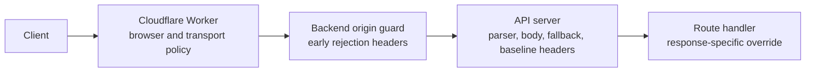

# Backend (defence-in-depth)

[Back to Security Architecture reference](reference-security-response-headers.md#backend-defence-in-depth)

Set by `@jongleberry/api-server` on normal backend responses. Early origin-guard
rejects in `backend/api/app.mts` mirror the same headers before handing requests to
the API server:

| Header                   | Value        |
| ------------------------ | ------------ |
| `X-XSS-Protection`       | `0`          |
| `X-Frame-Options`        | `SAMEORIGIN` |
| `X-Content-Type-Options` | `nosniff`    |

#### API server runtime controls

[`createVouchaApiApp()`](../../../backend/api/app.mts) pins the request-boundary behavior below.
These values are deliberate deployment decisions, even where they match the API server package's
current defaults.

| Control                          | Pinned setting                                                                                                                                 | Ownership and rationale                                                                                                                                                                                                                                                                                                                                                                                                                                                                                                  | Revisit when                                                                                                                                         |
| -------------------------------- | ---------------------------------------------------------------------------------------------------------------------------------------------- | ------------------------------------------------------------------------------------------------------------------------------------------------------------------------------------------------------------------------------------------------------------------------------------------------------------------------------------------------------------------------------------------------------------------------------------------------------------------------------------------------------------------------ | ---------------------------------------------------------------------------------------------------------------------------------------------------- |
| HTTP method validation           | `strictHttpMethods: false`                                                                                                                     | Node's HTTP parser remains the protocol boundary: parser-unknown methods receive `400` before application dispatch, while the router decides which parser-supported methods have routes.                                                                                                                                                                                                                                                                                                                                 | The Node parser, load balancer method policy, or route-builder method coverage changes.                                                              |
| Oversized request bodies         | `bodyLimit: 1 MiB`; `oversizedBodyStrategy: 'drain'`                                                                                           | Requests exceeding the pinned 1 MiB threshold receive `413`; the backend consumes the remainder of declared-length and chunked oversized bodies before reusing an HTTP/1.1 connection. This preserves origin connection reuse after the response.                                                                                                                                                                                                                                                                        | The origin proxy stops reusing connections, request-body limits move entirely to the edge, or drain-based denial-of-service risk changes materially. |
| Framework fallback CSP           | `fallbackContentSecurityPolicy: false`                                                                                                         | Framework-generated fallbacks are plain text. Browser-document CSP remains route-aware at the Cloudflare edge, so a generic backend fallback policy would duplicate and potentially conflict with edge policy.                                                                                                                                                                                                                                                                                                           | The backend starts serving browser HTML outside an existing route-scoped CSP or becomes directly public.                                             |
| Backend defence-in-depth headers | `X-XSS-Protection: 0`, `X-Frame-Options: SAMEORIGIN`, `X-Content-Type-Options: nosniff`; all other package-supported security headers disabled | The backend guarantees the three safe baseline headers on success and framework fallbacks. HSTS and referrer policy remain edge-owned. `X-DNS-Prefetch-Control` offers no benefit on API and plain-text fallback responses, `X-Download-Options` targets obsolete Internet Explorer download behavior, and `X-Permitted-Cross-Domain-Policies` targets obsolete Adobe policy-file clients, so those three are intentionally omitted. Routes may override a baseline before sending when a narrower response requires it. | An origin becomes client-facing, edge header ownership changes, or a route needs a documented override.                                              |

The deployed request path keeps policy ownership at the layer with the necessary context:

Cloudflare is authoritative for externally observed transport and browser policy because it knows
the public route and deployment mode. The origin guard and API server retain the three baseline
headers so early rejects, normal responses, and framework fallbacks remain safe if a response is
inspected before edge normalization. Characterization tests in
[`app-hardening.test.mts`](../../../backend/api/app-hardening.test.mts) protect the parser boundary,
body-drain connection reuse, fallback behavior, and header ownership split.
