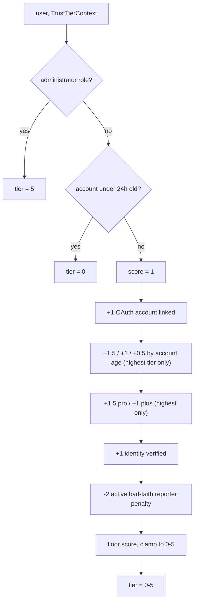

# Trust System reference

[Back to Trust System](trust-system.md)

## Official Accounts and Material Connections

Voucha-affiliated accounts are operational identities, not independent consumer identities. Role-bearing users such as administrators, investors, and customer support, plus agent/system users, must not influence community trust scores, rankings, aggregates, or referral-link social proof through public votes, reviews, data points, or personal endorsements.

Staff or other affiliated people may use separate non-role personal accounts for genuine personal consumer activity, but those accounts must disclose material connections where relevant.

### Official Account Permissions

| Action                                            | Official Account  | Type                 |
| ------------------------------------------------- | ----------------- | -------------------- |
| Vote on entity relations (tags, categories, FAQs) | ✅ Allowed        | Structural           |
| Vote on posts / topics / hostnames / feed items   | ❌ Blocked        | Sentiment            |
| User trust or user-tag votes                      | ❌ Blocked        | Sentiment / relation |
| Create/edit community reviews or data points      | ❌ Blocked        | Sentiment            |
| Creator auto-positive choice on own post          | ❌ Suppressed     | Sentiment            |
| Personal referral-link endorsement                | ❌ Blocked        | Endorsement          |
| Official Voucha referral link (admin-only)        | ✅ Allowed        | Platform             |
| Admin moderation vote                             | ✅ Allowed        | Internal tooling     |
| Moderator agent: tag post + move to review queue  | ✅ Allowed        | Structural           |
| Following / commenting / reporting                | ✅ Not restricted | Social               |

## Trust Tier (Rate-Limit Scoring)

### Current Architecture

Separately from the vote-weight multiplier below, every authenticated user also gets a 0–5 trust tier (see `backend/services/user-rate-limits/trust-tier.mts`) that scales per-user rate-limit thresholds — see [Rate Limiting](../../overview/architecture/rate-limiting.md#layer-3-user-aware-trust-tier-backend) and [User Rate Limits](../../../backend/services/user-rate-limits/README.md) for the full scoring table. Administrators and accounts under 24 hours old short-circuit to fixed tiers; otherwise the tier is an additive score, clamped to 0–5:

