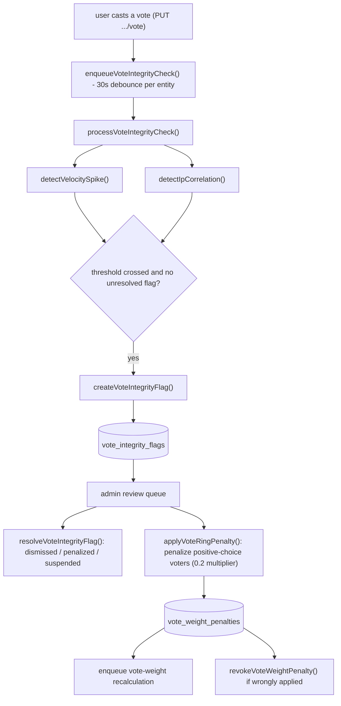

# Vote Integrity

Vote integrity is the system for detecting and acting on suspicious voting patterns, including velocity spikes and coordinated IP-based voting rings.

## Overview

When a user casts a vote on any entity, a fire-and-forget job is enqueued (`processVoteIntegrityCheck`) to:

1. Check for a **velocity spike** — too many votes from young accounts in a short window
2. Check for **IP correlation** — multiple distinct users voting from the same IP

When a threshold is crossed, a `vote_integrity_flags` record is created for admin review.

Admins can then:

- **Resolve** a flag (dismiss, mark penalized, mark suspended)
- **Penalize** the voting ring by applying a `vote_weight_penalties` multiplier to all positive-choice voters

Web, Swift, and .NET expose the same administrator-only queue actions. Native clients preserve the
distinction between the two mutations: applying a voting-ring penalty returns only the affected
user count and does not resolve the flag; resolution requires the separate PATCH action.

## Detection Algorithms

### Velocity Spike

| Parameter     | Value                                   |
| ------------- | --------------------------------------- |
| Vote window   | 5 minutes                               |
| Threshold     | 20 votes from young accounts            |
| Young account | Account created within the last 30 days |

When more than 20 votes come from accounts under 30 days old within the last 5 minutes on the same entity, a `velocity_spike` flag is created.

UUIDv7 lower-bound filtering is used for efficient range queries on the entity vote table's `id` column.

### IP Correlation

| Parameter   | Value                                     |
| ----------- | ----------------------------------------- |
| Vote window | 60 minutes                                |
| Threshold   | 3 or more distinct users from the same IP |

When 3 or more distinct users vote from the same IP address within 60 minutes on the same entity, an `ip_correlation` flag is created.

## Deduplication

Flags are deduplicated: only one unresolved flag per `(entity_type, entity_id, flag_type)` can exist at a time. A new flag is only created if there is no existing unresolved flag for the same entity and type.

Job deduplication: the integrity check job for a given entity is debounced with a 30-second TTL to avoid redundant checks during vote bursts.

## Admin Workflow

1. **Review queue** — `GET /api/v1/vote-integrity/flags?status=pending`
2. **Inspect flag** — `GET /api/v1/vote-integrity/flags/:id`
3. **Penalize ring** (optional) — `POST /api/v1/vote-integrity/flags/:id/penalties`
   - Queries users whose latest choice is positive from the entity's vote table
   - Inserts `vote_weight_penalties` records with `penalty_multiplier = 0.2`
   - Enqueues vote weight recalculation for all affected users
4. **Resolve flag** — `PATCH /api/v1/vote-integrity/flags/:id` with `{ resolution: "dismissed" | "penalized" | "suspended" }`
5. **Revoke penalty** (if wrongly applied) — `DELETE /api/v1/vote-integrity/penalties/:id`

Before submitting the destructive penalty action, clients snapshot every penalty ID in the exact
flag-scoped, all-status ledger. If the POST outcome is ambiguous, reconciliation compares a fresh
exact snapshot with that baseline: any new row proves the mutation committed, while no new row
permits a retry. A failed snapshot, invalid pagination cursor, or mismatched `filter_scope` fails
closed; baseline failure prevents the POST, and reconciliation failure keeps the mutation locked.

## Vote Weight Penalty Integration

Vote weight penalties are multiplicative and stack with the user's existing calculated weight. The `gather-factors` function queries `vote_weight_penalties` for active (non-revoked) penalties and applies them as a combined multiplier.

Default penalty multiplier: **0.2** (reduces vote weight to 20% of normal).

## Architecture

The full lifecycle from vote cast through detection, flagging, admin review, and penalty/revoke:

## Data Model

| Table                   | Purpose                                      |
| ----------------------- | -------------------------------------------- |
| `vote_integrity_flags`  | Admin review queue for flagged entities      |
| `vote_weight_penalties` | Active/revoked multiplier penalties per user |

## Related

- [Web rules](../../../web/CLAUDE.md) — UI, routing, and client conventions
- [Backend rules](../../../backend/CLAUDE.md) — service, API, and data conventions

- Service: [backend/services/vote-integrity/README.md](../../../backend/services/vote-integrity/README.md)
- System: [backend/queues/vote-integrity/README.md](../../../backend/queues/vote-integrity/README.md)
- API: [backend/api/v1/vote-integrity/README.md](../../../backend/api/v1/vote-integrity/README.md)
