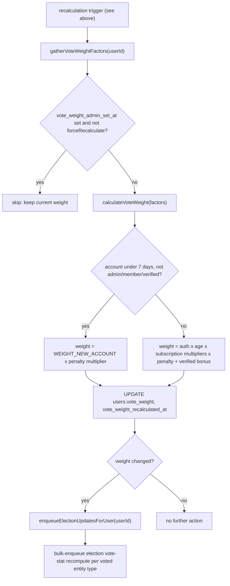

# Vote Weight System

> **Note:** Fresh accounts with verified non-disposable email can vote immediately. Paid members and administrators bypass contribution gating, and the weight rules below still limit new-account influence.

Users have a `vote_weight` multiplier (default 1.0) that scales their voting influence. The system automatically recalculates weights based on auth strength, account age, and subscription tier.

Accounts less than 7 days old (without a paid membership or admin role) receive a base weight of `0.01` (`WEIGHT_NEW_ACCOUNT`) instead of the full multiplier stack. Active penalties still apply, so the effective weight may be lower than `0.01`. At 7 days, the weight is recalculated using the full multiplier stack (auth, age, membership).

A successfully identity-verified Free user also bypasses this **new-account-only** minimal-weight
rule. This does not remove active vote penalties or add a public subscription multiplier. The
verification webhook recalculates the user's persisted vote weight and immediately enqueues the
aggregate refresh for every election the user has voted in.

## Multipliers

All applicable multipliers multiply together. Base weight is 1.0.

### Auth (multiply together)

- **1.5×** — 2+ distinct auth methods (email, phone, passkey, and each OAuth provider each count as 1)
- **1.5×** — has at least 1 OAuth provider connected
- **2×** — has 2+ OAuth providers connected
- **1.5×** — has 2+ OAuth providers connected for more than 1 year
- **3×** — has 2+ OAuth providers connected for more than 5 years (stacks with 1yr → 4.5× total)

### Account Age (multiply together, one per threshold)

- **2×** — account older than 30 days
- **2×** — account older than 1 year
- **2×** — account older than 2 years
- **2×** — account older than 5 years

### Subscription (only highest applies)

- **50×** — Plus subscriber
- **50×** — Premium subscriber (legacy, equals Plus)
- **200×** — Pro subscriber
- **10,000×** — Administrator role

### Maximum possible weight

Base (1.0) × MFA (1.5) × has_oauth (1.5) × 2+\_oauth (2.0) × oauth_1yr (1.5) × oauth_5yr (3.0) × age_30d (2) × age_1yr (2) × age_2yr (2) × age_5yr (2) × admin (10,000) = enormous

## Access Control

Vote weight values and configuration are **admin-only**. Non-admin users must never be able to view or modify vote weights. All vote weight API endpoints require the `administrator` role.

## Admin Override

Admins can set any user's weight to a specific value (e.g., 0 for shadow-banning). This sets `vote_weight_admin_set_at` and skips auto-recalculation. Subscription changes clear the override.

## Recalculation Triggers

- User created or logged in (via entity listeners)
- OAuth provider connected. The provider link and
  `users.vote_weight_recalculated_at = NULL` commit atomically; the immediate queue enqueue is a
  latency optimization and the daily dispatcher recovers crashes or Valkey failures from that
  marker.
- Passkey added or removed
- Subscription changed (clears admin override, forces recalculation)
- Role changed
- Daily scheduled job for age-threshold crossings (4 AM UTC)

### Recalculation Pipeline

Each trigger enqueues `recalculateUserVoteWeight`, which gathers factors, computes the new weight, writes it, and — only when the weight actually changed — re-enqueues election vote-stat recompute for every entity the user has voted on:

## API

- `PUT /api/v1/users/:userId/vote-weight` — admin set weight `{ weight: number }`
- `DELETE /api/v1/users/:userId/vote-weight` — admin clear override, trigger recalculation

## System Users

System users (bot accounts) have `vote_weight_admin_set_at` set at creation, so they retain `vote_weight = 1` and skip auto-recalculation.

## Related

- [Membership plans and public/private entitlement boundary](../users/reference-memberships-plans.md)

- [Web rules](../../../web/CLAUDE.md) — UI, routing, and client conventions
- [Backend rules](../../../backend/CLAUDE.md) — service, API, and data conventions

- [backend/services/vote-weight/README.md](../../../backend/services/vote-weight/README.md)
- [backend/queues/vote-weight/README.md](../../../backend/queues/vote-weight/README.md)
