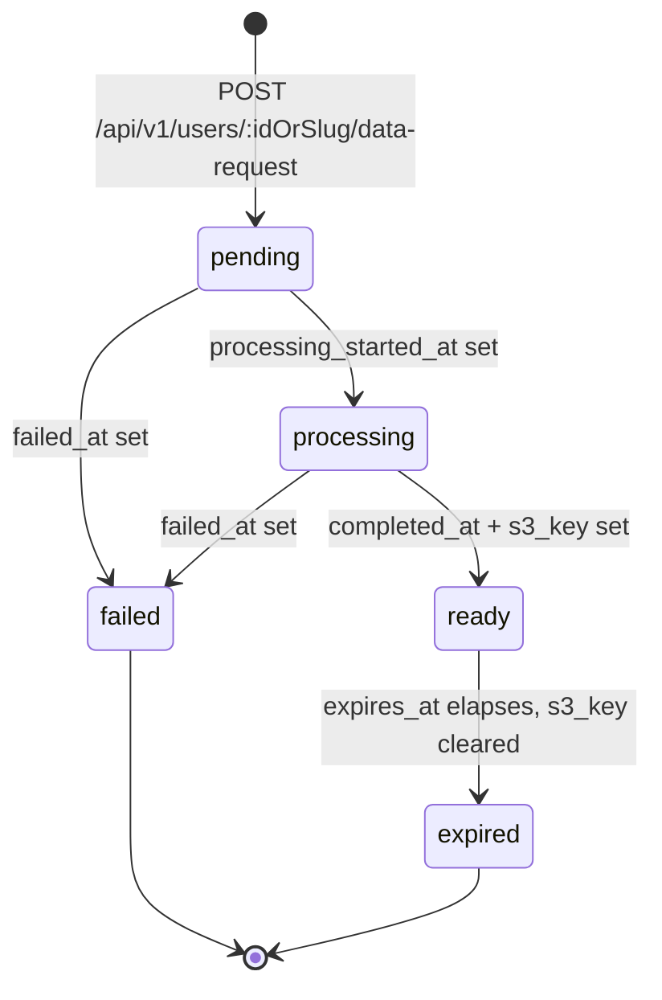

# Account Data Export

Users can download a copy of their personal data from account settings (`/my/data`). This feature
satisfies GDPR "Right to Data Portability" and CCPA "Right to Know" requirements. See
[account deletion](ACCOUNT-DELETION-DATA-REQUEST.md) for the separate erasure lifecycle.

## Data Export

- Users can request a download of all their personal data from account settings.
- Native clients expose the in-app request, status refresh, and ready export download link from the
  settings account-data section.
- Only one active export request is allowed at a time.
- Export is prepared as a background job and may take a few minutes.
- User is notified in the UI when the export is ready (polls for status every 5 seconds).
- The download is a ZIP file containing CSV files for each data category:
  - `profile.csv` – username, display preferences, bio, privacy/processing settings, marketing consent, created date
  - `posts.csv` – all non-deleted posts created by the user
  - `votes.csv` – all votes cast by the user
  - `emails.csv` – email addresses
  - `phones.csv` – phone numbers
  - `passkeys.csv` – passkey metadata, never private keys
  - `oauth-accounts.csv` – connected OAuth account metadata
  - `followed-rss-feeds.csv` – followed RSS feeds with source URLs and topic details
  - `followed-topics.csv` – followed topics with slugs and topic types
  - `entity-relations.csv` – follows, mutes, blocks, and other relation predicates
  - `bookmarks.csv` – saved/bookmarked data
  - `consents.csv` – legal and cookie consent ledger records
  - `referral-attributions.csv` – referral click attributions
- Boolean fields in export CSVs use `true`/`false`; unset values remain empty.
- Download link expires after 7 days.
- Users can request a new export at any time after the previous one has expired, failed, or is ready.
- Admins can request exports on behalf of any user.

## Data Request Lifecycle

Status is not a stored enum — `deriveDataRequestStatus()` computes it from the timestamp/`s3_key`
columns on read: `failed_at` set means `failed`; `completed_at` set with no `s3_key`, or with
`expires_at` in the past, means `expired`; `completed_at` set with a live `s3_key` means `ready`;
`processing_started_at` set (and not yet completed/failed) means `processing`; otherwise `pending`.

## Export Statuses

- `pending`: Job has been enqueued but not started.
- `processing`: Job is running.
- `ready`: ZIP is available for download.
- `failed`: Export failed; the user can retry.
- `expired`: Download window has closed.

## API Endpoints

| Method | Route                                         | Description                                                                              |
| ------ | --------------------------------------------- | ---------------------------------------------------------------------------------------- |
| `POST` | `/api/v1/users/:idOrSlug/data-request`        | Create a new export request                                                              |
| `GET`  | `/api/v1/users/:idOrSlug/data-request`        | Get latest export status and `download_url`                                              |
| `GET`  | `/api/v1/users/:idOrSlug/data-request/stream` | Server-Sent Events stream of status until a terminal status (`ready`/`failed`/`expired`) |

Authorization: Users can only access their own requests; admins can access any user's requests.
