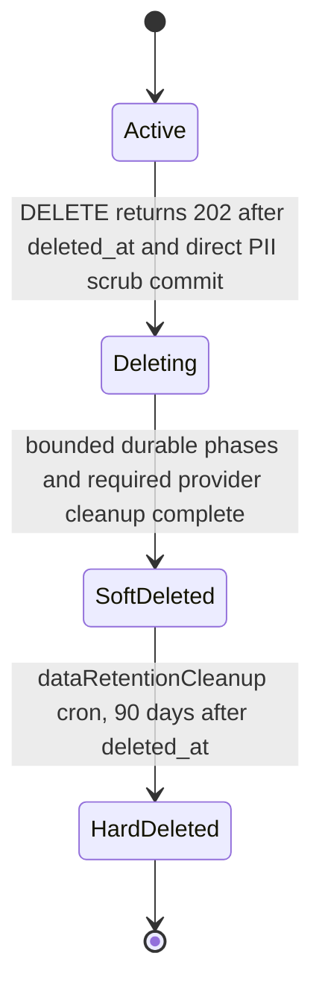
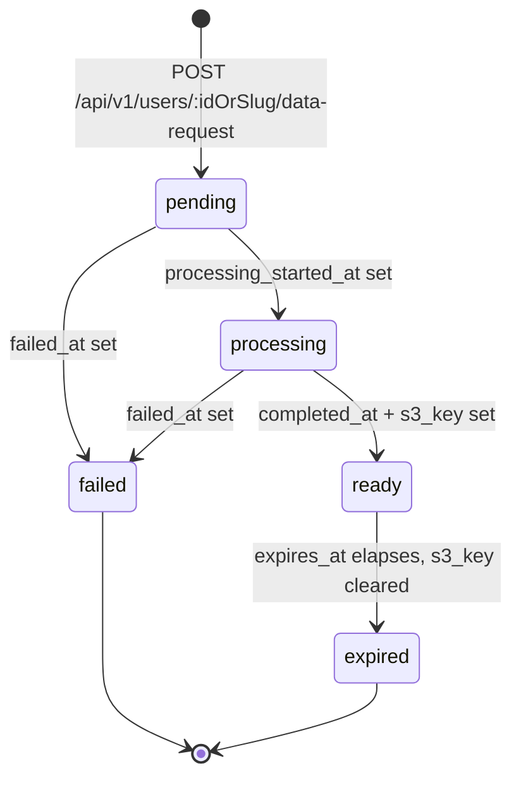

# Account Deletion & Data Request

## Overview

Users can delete their accounts and download a copy of their personal data from the account settings page (`/my/data`). These features satisfy GDPR "Right to Erasure" / "Right to Data Portability" and CCPA "Right to Delete" / "Right to Know" requirements. See the [User Privacy Feature Matrix](./USER-PRIVACY-MATRIX.md) for coverage.

---

## Account Deletion

- Users can delete their own account from account settings
- Account invisibility, profile scrubbing, and access revocation are immediate and irreversible;
  high-volume erasure continues durably in the background
- Before deletion completes, the user must confirm by typing the phrase `delete my account`
- Native clients expose the same in-app deletion flow: Windows through .NET MAUI settings, and
  macOS plus Android-via-Swift through the shared Swift settings surface. Native clients must not
  redirect to web for account deletion.
- Posts created by the deleted user are attributed to `[deleted]` (a system tombstone account)
- Bookmarks, votes, follows, saves, and other user-specific data are permanently removed
- The user is logged out immediately upon deletion
- Admins can delete any account
- Deletion returns 409 while the account has an operative copyright repeat-infringer incident, or
  an unresolved qualifying legal hold on a placement that account owns. An open staff review alone
  does not refuse deletion. See [Copyright notices](../moderation/COPYRIGHT-NOTICES.md).

### Deletion Lifecycle

The request transaction sets `users.deleted_at`, scrubs direct profile and verification PII, and
creates the durable deletion request before the API returns `202`. Existing active-user predicates
therefore hide the account immediately. Cache-backed ID, username, private-user, and public-user
reads confirm that the cached user's database row is still active before returning it, so a stale
Valkey entry cannot bypass that privacy fence. The request boundary also attempts the durable
Cloudflare user-tag purge immediately after commit. A successful purge completes its recorded work;
a failed purge remains pending for the background deletion worker instead of being acknowledged.

Mutations that can create user-owned deletion data acquire the same user-scoped transaction lock
and reject a deleted owner before writing. This serializes an in-flight mutation ahead of the
deletion request or rejects it after the privacy fence, preventing a completed phase from being
repopulated while later phases run.

The `user-deletions` worker then commits one bounded phase page at a time. Each job carries the
request ID and an exact processing-attempt fencing token; the successor is enqueued only after the
page commits. A final queue-attempt failure rotates its token before the failed job is retained. A
five-minute recovery pass reuses tokens for ordinary unstarted work and replaces tokens for work
that has been processing for 30 minutes. This keeps failed jobs and stale workers fenced without
invalidating queued work. `user_deletion_requests.completed_at` is the internal
completion marker and is written only after every database phase, relation recomputation, Stripe
sanitization, export-object deletion, and Cloudflare user-tag purge completes.
Every claimed export token is retained as a deterministic S3-key ledger entry, so stale recovery
cannot forget an older worker that may still upload. Deletion turns every retained key into durable
cleanup work before it expires the export request. A worker must acquire a bounded,
PostgreSQL-clock lease under the active-user fence immediately before S3 upload and pass S3 an
abort deadline before the lease expires. The account-data deletion phase cannot advance while a
future lease remains, which prevents an upload from landing after its durable cleanup is complete.
Stale token rotation retains the displaced attempt's deterministic object key so deletion can still
purge it after the lease expires.

The daily `data-retention-cleanup-daily` cron permanently deletes a soft-deleted row after 90 days
only when its deletion request is complete. It reassigns FK references that lack `ON DELETE
CASCADE`/`SET NULL` (for example verified identities) before the
hard delete. Before removing the account, the same transaction revokes every retained administrator
grant with reason `account_hard_deleted`, terminalizes its source state, and closes any open
activation period without allowing its end to precede its start. Identity-verification attempt rows
are similarly reassigned to the tombstone for both
the attempted account and the administrator who issued a support grant; this retains an anonymized
payment/support audit without retaining either deleted account identifier.

### Deletion Cascade

1. The request transaction creates the audit and lifecycle records, sets `deleted_at`, clears the
   username and profile/verification PII, and records required provider cleanup.
2. Authored and contributed post-publication preimages are captured in bounded pages before authored
   posts are reassigned to the tombstone `deleted` user.
3. Active lists, configured election votes, and user-subject relations are removed in bounded pages.
4. Entity-relation vote targets are durably recorded, their votes are removed in bounded pages, and
   only recorded targets are recomputed.
5. Email addresses, phone numbers, passkeys, social links, OAuth PII, Bluesky data, referral
   attribution, and data-export rows are drained idempotently. Claimed exports first record their
   deterministic S3 key as durable deletion work, so an in-flight worker cannot leave an orphaned
   archive after its request is expired.
6. Stripe customers and ready export objects are sanitized/deleted from durable work records, and
   the Cloudflare user cache tag is purged.
7. A final transaction acquires the user and author lifecycle locks, verifies every phase is empty,
   performs an independent residual-data sweep across deletion-owned tables, and sets
   `user_deletion_requests.completed_at` only when both checks are empty. It also clears the copied
   prior username, redacts completed external-work keys while retaining non-identifying audit
   metadata and timestamps, and deletes the fully recomputed relation-impact worklist so its vote-
   target identifiers do not outlive successful finalization.

Stripe customer anonymization uses a request-derived provider idempotency key. The per-provider
egress flag selects the direct or HTTP CONNECT transport without changing the operation or retrying
through a second transport. A provider response that the customer is already missing is treated as
successful idempotent cleanup. Other provider failures leave the durable work item pending and
block the internal completion marker while the immediate database privacy fence remains in effect.

---

## Data Export

- Users can request a download of all their personal data from account settings
- Native clients expose the in-app request, status refresh, and ready export download link from the
  settings account-data section.
- Only one active export request is allowed at a time
- Export is prepared as a background job and may take a few minutes
- User is notified in the UI when the export is ready (polls for status every 5 seconds)
- The download is a ZIP file containing CSV files for each data category:
  - `profile.csv` – username, display preferences, bio, privacy/processing settings, marketing consent, created date
  - `posts.csv` – all non-deleted posts created by the user
  - `votes.csv` – all votes cast by the user
  - `emails.csv` – email addresses
  - `phones.csv` – phone numbers
  - `passkeys.csv` – passkey metadata, never private keys
  - `oauth-accounts.csv` – connected OAuth account metadata
  - `followed-rss-feeds.csv` – followed RSS feeds with source URLs and topic details
  - `followed-topics.csv` – followed topics with slugs and topic types
  - `entity-relations.csv` – follows, mutes, blocks, and other relation predicates
  - `bookmarks.csv` – saved/bookmarked data
  - `consents.csv` – legal and cookie consent ledger records
  - `referral-attributions.csv` – referral click attributions
- Boolean fields in export CSVs use `true`/`false`; unset values remain empty.
- Download link expires after 7 days
- Users can request a new export at any time after the previous one has expired, failed, or is ready
- Admins can request exports on behalf of any user

### Data Request Lifecycle

Status is not a stored enum — `deriveDataRequestStatus()` computes it from the timestamp/`s3_key`
columns on read: `failed_at` set means `failed`; `completed_at` set with no `s3_key`, or with
`expires_at` in the past, means `expired`; `completed_at` set with a live `s3_key` means `ready`;
`processing_started_at` set (and not yet completed/failed) means `processing`; otherwise `pending`.

### Export Statuses

| Status       | Meaning                                |
| ------------ | -------------------------------------- |
| `pending`    | Job has been enqueued, not yet started |
| `processing` | Job is running                         |
| `ready`      | ZIP is available for download          |
| `failed`     | Export failed; user can retry          |
| `expired`    | Download window has closed             |

---

## API Endpoints

| Method   | Route                                         | Description                                                                              |
| -------- | --------------------------------------------- | ---------------------------------------------------------------------------------------- |
| `DELETE` | `/api/v1/users/:idOrSlug`                     | Accept deletion; returns `202 { logout: true }` after the privacy fence commits          |
| `POST`   | `/api/v1/users/:idOrSlug/data-request`        | Create a new export request                                                              |
| `GET`    | `/api/v1/users/:idOrSlug/data-request`        | Get latest export status and `download_url`                                              |
| `GET`    | `/api/v1/users/:idOrSlug/data-request/stream` | Server-Sent Events stream of status until a terminal status (`ready`/`failed`/`expired`) |

Authorization: Users can only access their own requests; admins can access any user's requests.

## Related

- [Web rules](../../../web/CLAUDE.md) — UI, routing, and client conventions
- [Backend rules](../../../backend/CLAUDE.md) — service, API, and data conventions
- [User Privacy Feature Matrix](./USER-PRIVACY-MATRIX.md)

- [docs/requirements/navigation/ACCESSIBILITY.md](../navigation/ACCESSIBILITY.md)
- [docs/requirements/navigation/ACTIONS.md](../navigation/ACTIONS.md)
