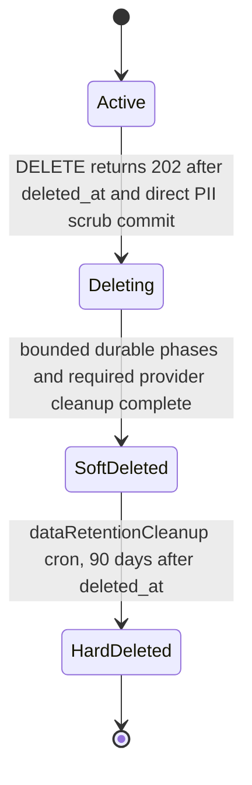

# Account Deletion

## Overview

Users can delete their accounts from the account settings page (`/my/data`). This feature satisfies
GDPR "Right to Erasure" and CCPA "Right to Delete" requirements. Data export has its own
[requirements](./ACCOUNT-DATA-EXPORT.md); see the [User Privacy Feature Matrix](./USER-PRIVACY-MATRIX.md)
for coverage.

---

## Account Deletion

- Users can delete their own account from account settings
- Account invisibility, profile scrubbing, and access revocation are immediate and irreversible;
  high-volume erasure continues durably in the background
- Before deletion completes, the user must confirm by typing the phrase `delete my account`
- Native clients expose the same in-app deletion flow: Windows through .NET MAUI settings, and
  macOS plus Android-via-Swift through the shared Swift settings surface. Native clients must not
  redirect to web for account deletion.
- Posts created by the deleted user are attributed to `[deleted]` (a system tombstone account)
- Bookmarks, votes, follows, saves, and other user-specific data are permanently removed
- The user is logged out immediately upon deletion
- Admins can delete any account

### Deletion Lifecycle

```mermaid
stateDiagram-v2
    [*] --> Active
    Active --> Deleting: DELETE returns 202 after deleted_at and direct PII scrub commit
    Deleting --> SoftDeleted: bounded durable phases and required provider cleanup complete
    SoftDeleted --> HardDeleted: dataRetentionCleanup cron, 90 days after deleted_at
    HardDeleted --> [*]
```

The request transaction sets `users.deleted_at`, scrubs direct profile and verification PII, and
creates the durable deletion request before the API returns `202`. Existing active-user predicates
therefore hide the account immediately. Cache-backed ID, username, private-user, and public-user
reads confirm that the cached user's database row is still active before returning it, so a stale
Valkey entry cannot bypass that privacy fence. The request boundary also attempts the durable
Cloudflare user-tag purge immediately after commit. A successful purge completes its recorded work;
a failed purge remains pending for the background deletion worker instead of being acknowledged.

Writers of user-owned deletion data take the user-scoped lock and reject deleted owners. In-flight
writes finish before the deletion fence; later writes fail, so completed phases cannot be repopulated.

The `user-deletions` worker then commits one bounded phase page at a time. Each job carries the
request ID and an exact processing-attempt fencing token; the successor is enqueued only after the
page commits. A final queue-attempt failure rotates its token before the failed job is retained. A
five-minute recovery pass reuses tokens for ordinary unstarted work and replaces tokens for work
that has been processing for 30 minutes. This keeps failed jobs and stale workers fenced without
invalidating queued work. `user_deletion_requests.completed_at` is the internal
completion marker and is written only after every database phase, relation recomputation, Stripe
sanitization, export-object deletion, and Cloudflare user-tag purge completes.
Every claimed export token is retained as a deterministic S3-key ledger entry, so stale recovery
cannot forget an older worker that may still upload. Deletion turns every retained key into durable
cleanup work before it expires the export request. A worker must acquire a bounded,
PostgreSQL-clock lease under the active-user fence immediately before S3 upload and pass S3 an
abort deadline before the lease expires. The account-data deletion phase cannot advance while a
future lease remains, which prevents an upload from landing after its durable cleanup is complete.
Stale token rotation retains the displaced attempt's deterministic object key so deletion can still
purge it after the lease expires.

The daily `data-retention-cleanup-daily` cron permanently deletes a soft-deleted row after 90 days
only when its deletion request is complete. It reassigns FK references that lack `ON DELETE
CASCADE`/`SET NULL` (for example verified identities) before the
hard delete. Before removing the account, the same transaction revokes every retained administrator
grant with reason `account_hard_deleted`, terminalizes its source state, and closes any open
activation period without allowing its end to precede its start. Identity-verification attempt rows
are similarly reassigned to the tombstone for both
the attempted account and the administrator who issued a support grant; this retains an anonymized
payment/support audit without retaining either deleted account identifier.

### Deletion Cascade

1. The request transaction creates the audit and lifecycle records, sets `deleted_at`, clears the
   username and profile/verification PII, and records required provider cleanup.
2. Authored and contributed post-publication preimages are captured in bounded pages before authored
   posts are reassigned to the tombstone `deleted` user.
3. Active lists, configured election votes, and user-subject relations are removed in bounded pages.
4. Entity-relation votes are removed in bounded pages by their full concrete key. Their actual
   `DELETE RETURNING` tuples supply the relation table, subject ID, and relation ID for 17 concrete
   retained identity families and an exact-one typed impact. Recompute, publication, and effect
   work use that full key; if a relation cascade removed the vote first, no impact is recorded.
5. Email addresses, phone numbers, passkeys, social links, OAuth PII, Bluesky data, referral
   attribution, data-export rows, and [OAuth credentials](../security/OAUTH-AUTHORIZATION-SERVER.md#account-deletion)
   are drained idempotently. Claimed exports first record their
   deterministic S3 key as durable deletion work, so an in-flight worker cannot leave an orphaned
   archive after its request is expired.
6. Stripe customers and ready export objects are sanitized/deleted from durable work records, and
   the Cloudflare user cache tag is purged.
7. A final transaction acquires the user and author lifecycle locks, verifies every phase is empty,
   performs an independent residual-data sweep across deletion-owned tables and OAuth credentials, and sets
   `user_deletion_requests.completed_at` only when both checks are empty. It also clears the copied
   prior username, clears completed provider work keys to `NULL` while retaining non-identifying
   audit metadata and timestamps, and deletes the fully recomputed relation-impact worklist. A
   completed relation-effect pointer may then become `NULL`; pending effects require their typed
   same-request impact pointer. A separate bounded retention sweep reclaims unreferenced retained
   relation identities without expiring request or audit history.

Stripe customer anonymization uses a request-derived provider idempotency key. The per-provider
egress flag selects the direct or HTTP CONNECT transport without changing the operation or retrying
through a second transport. A provider response that the customer is already missing is treated as
successful idempotent cleanup. Other provider failures leave the durable work item pending and
block the internal completion marker while the immediate database privacy fence remains in effect.

### Deletion Refusals

`DELETE /api/v1/users/:idOrSlug` returns `409` with one message, `Account deletion is blocked while
a copyright incident or legal hold is unresolved`, for the account holder and for an administrator
alike, in any of these cases:

- an unresolved qualifying court or CCB hold covers a placement the account owns (in
  [copyright notices](../moderation/COPYRIGHT-NOTICES.md)); or
- an administrator has an open **legal-process preservation hold** on the account (below).

The check runs in the request transaction under the user and author lifecycle locks, before the
privacy fence, so a refused request changes nothing. The single message does not say which case
applies, so it does not tell the account holder that legal process exists. `deleteUser` is the only
path that sets `deleted_at`. The retention cron and the erasure phases act only on accounts that are
already soft-deleted, so they have no second check.

An operative repeat-infringer incident does not block deletion. The normal deletion phases erase
the account's personal data. Incident rows and repeat-infringer review outcomes and dates remain
linked to `retained_user_identities` as the minimal 17 USC 512(i) record. Staff may finish an open
review after deletion; a restrict or terminate outcome is recorded without attempting to suspend
the deleted account.

A preservation hold keeps an account's records while the owner decides, on a lawyer's advice, what
a subpoena requires (see the
[§512(h) runbook](../../runbooks/copyright-notices.md#dmca-512h-subpoenas)). It stores who
placed it, when, an encrypted short matter reference, and who released it and when. It has no
duration or scope, because the owner decides both. Release writes the release columns once and the
row is never deleted, so the history persists. All three user references target
`retained_user_identities` with `ON DELETE RESTRICT`: the history survives the account's hard
delete, a released hold never blocks it, and the hold cannot be removed by deleting the user.
Placing a hold on an account that is already deleted is refused, so an open hold never coexists
with a deleted account. An administrator releases a hold to let deletion proceed.

---

## API Endpoints

`DELETE /api/v1/users/:idOrSlug` accepts deletion and returns `202 { logout: true }` after the
privacy fence commits, or the `409` above. The
[data-export requirements](./ACCOUNT-DATA-EXPORT.md#api-endpoints) document the request and status
routes. Administrators place, list, and release a preservation hold with
`PUT|GET|DELETE /api/v1/users/:userId/preservation-hold`; see the
[users endpoint reference](../api/v1/users/reference-endpoints.md).

Authorization: Users can only access their own requests; admins can access any user's requests.

## Related

- [Web rules](../../../web/AGENTS.md) — UI, routing, and client conventions
- [Backend rules](../../../backend/AGENTS.md) — service, API, and data conventions
- [User Privacy Feature Matrix](./USER-PRIVACY-MATRIX.md)
- [Account Data Export](./ACCOUNT-DATA-EXPORT.md)

- [docs/requirements/navigation/ACCESSIBILITY.md](../navigation/ACCESSIBILITY.md)
- [docs/requirements/navigation/ACTIONS.md](../navigation/ACTIONS.md)
