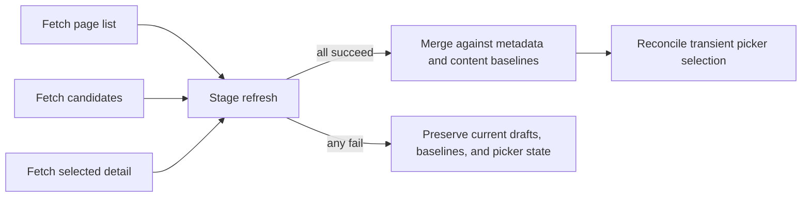

# Landing Page Management

Landing pages let a member curate profile links, reviews, referral links, topic groups, and manual
links into an ordered public page. Web, Swift, and .NET use the same authenticated API contract and
must preserve the draft and refresh behavior defined here.

See [Landing Pages Strategy](../../strategy/landing-pages-strategy.md) for the growth objective and
[Referral Links](REFERRAL-LINKS.md) for referral ownership and attribution.

## Item selection

Editors support five top-level item types:

| Type          | Source                         | Add requirement                                            | Saved shape                             |
| ------------- | ------------------------------ | ---------------------------------------------------------- | --------------------------------------- |
| Profile link  | Landing-page candidates        | One unused live candidate                                  | `profile_link` with `profile_link_id`   |
| Review        | Landing-page candidates        | One unused live candidate                                  | `review` with `review_id`               |
| Referral link | Landing-page candidates        | One unused live candidate                                  | `referral_link` with `referral_link_id` |
| Topic group   | Topics derived from candidates | One unused topic and at least one eligible selected member | `topic_group` with ordered entries      |
| Manual link   | Member input                   | A nonempty label and fragment-free absolute HTTP(S) URL    | `link` with label and URL               |

Candidate controls show a meaningful human label, using the candidate's name, handle, title,
program name, or URL as an ordered fallback. Raw candidate IDs are never user-facing labels.

An ID used anywhere in the current draft is unavailable everywhere else in that draft. This
includes IDs nested inside a topic group. Topics are deduplicated by ID and sorted by display name;
reviews retain candidate order and precede referral links inside a newly created group. A topic
group requires explicit member selection and is reordered or removed only as a top-level unit.

Every add action revalidates the current candidate, topic, group membership, or URL. A stale
selection cannot bypass the unused-candidate and input rules.

## Draft and persistence contract

Adding, removing, or reordering an item changes only the local ordered draft. The client persists
content only through `PUT /api/v1/my/landing-pages/{id}/items`. Metadata uses its existing update
endpoint and remains independent from content.

Clients derive dirtiness from two persisted baselines:

- metadata: title, subtitle, and slug;
- content: the ordered save-input projection of all draft items.

There is no manually maintained dirty flag. Saving one section advances only that section's
baseline, so unsaved work in the other section remains dirty and visible. Failed or cancelled saves
preserve the draft, ordering, baselines, and picker input.

## Refresh and page lifecycle

The member landing-pages screen is an explicit refresh surface. Swift refresh and .NET page
appearance stage the page list, candidates, and selected-page detail before committing any of
them.

For a same-page refresh, each dirty section wins over the server value while each clean section
accepts the refreshed value. Both persisted baselines advance to the staged server state. Candidate
changes reconcile only transient picker selection: disappearance may clear an uncommitted picker
choice but must not delete an already-added draft item. Newly available candidates appear once and
used IDs remain excluded.

If the selected page no longer exists, the client clears selected-page state. Explicitly selecting
a different page discards unsaved state and loads that page's persisted state; this is distinct from
a same-page refresh.

## Shared contract evidence

The fixture `native.landing-page-items-mutation.default` is the canonical five-type PUT example.
Like the rest of the API fixture corpus, it uses readable symbolic IDs; its semantic tests validate
the backend item-placement rules rather than UUID parsing. Web, Swift, and .NET must independently
build its exact request body through their real API helpers. Response decoding is covered
separately. Fixture semantic tests ensure that every placed item is candidate-backed, standalone
and grouped candidates are globally unique, and every grouped member belongs to its topic.

Production entry points:

- Web: [`item-picker.tsx`](../../../web/components/my/landing-pages-manager/item-picker.tsx)
- Swift: [`LandingPagesView.swift`](https://github.com/vouchington/vouchington-clients/blob/main/swift-clients/ui/Sources/VouchaFeatures/LandingPages/LandingPagesView.swift)
- .NET: [`LandingPagesPage.xaml`](https://github.com/vouchington/vouchington-clients/blob/main/dotnet-clients/src/Voucha.Client.App/Pages/LandingPagesPage.xaml)

This feature reuses the existing list, detail, candidates, metadata mutation, and item replacement
endpoints. It does not introduce a new HTTP, schema, database, or backend production contract.
