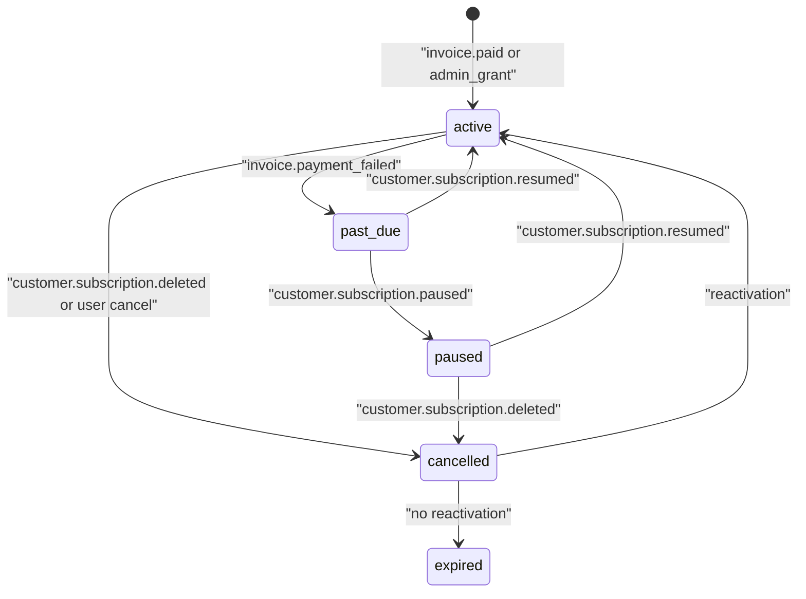

# Memberships reference

[Back to Memberships](memberships.md)

## Membership Statuses

Statuses are derived, not stored in a status column. `view_memberships` exposes `status` for API and
UI callers based on lifecycle timestamps.

`expires_at` is a grant clock only when `stripe_subscription_id` is null. The view derives
`expired` for those rows as soon as `expires_at <= now()`, without waiting for a lifecycle
update. A Stripe row keeps `active` / `past_due` / `paused` after period end — the stored
timestamp is the current billing period, and Stripe webhooks own the status. Entitlement
helpers in [`@modules/membership-helpers`](../../../backend/modules/membership-helpers/README.md)
and `getUserActiveMembership` follow that same split. The view lives in
[`backend/data-stores/psql/views/2025-01-01-view-memberships.sql`](../../../backend/data-stores/psql/views/2025-01-01-view-memberships.sql).

| Status      | Description                                          |
| ----------- | ---------------------------------------------------- |
| `active`    | User has an active, paid (or granted) membership     |
| `past_due`  | Payment failed; subscription still exists            |
| `paused`    | Stripe paused the subscription; access is suspended  |
| `cancelled` | Subscription ended (Stripe deleted or admin revoked) |
| `expired`   | Subscription expired (incomplete/incomplete_expired) |

### Status Transitions

```
                               invoice.paid
                             or admin grant
                              │
                              ▼
                         ┌─────────┐
                    ┌───▶│  active  │◀──────────────┐
                    │    └────┬─────┘               │
                    │         │                     │
          payment   │    payment_      customer.subscription.updated
          issue     │    failed        / resumed
                    │    failed        = reactivation
                    │         │                     │
                    │         ▼                     │
                    │    ┌──────────┐               │
                    └────┤ past_due │               │
                         └────┬─────┘               │
                              │                     │
                 customer.subscription.paused        │
                              │                      │
                              ▼                      │
                         ┌────────┐                  │
                         │ paused │──────────────────┘
                         └────────┘
                              │
                    customer.subscription.deleted
                    or user cancel
                              │                     │
                              ▼                     │
                         ┌───────────┐              │
                         │ cancelled │──────────────┘
                         └───────────┘
                              │
                    (no reactivation)
                              │
                              ▼
                         ┌─────────┐
                         │ expired │
                         └─────────┘
```

The same transitions, redrawn as a state machine:



### Change Types (Audit Log)

| Change Type     | Trigger                                              |
| --------------- | ---------------------------------------------------- |
| `renewal`       | New membership from checkout; status-only updates    |
| `upgrade`       | Plan changed to higher tier (plus → pro)             |
| `downgrade`     | Plan changed to lower tier                           |
| `cancellation`  | User or Stripe cancels subscription                  |
| `pause`         | Stripe pauses the subscription                       |
| `reactivation`  | Previously cancelled subscription becomes active     |
| `sku_migration` | SKU changed without plan change (price change)       |
| `admin_grant`   | Administrator grants membership                      |
| `admin_revoke`  | Administrator revokes membership                     |
| `expiration`    | Subscription expired                                 |
| `refund`        | Admin or CS issues a refund that also revokes access |
