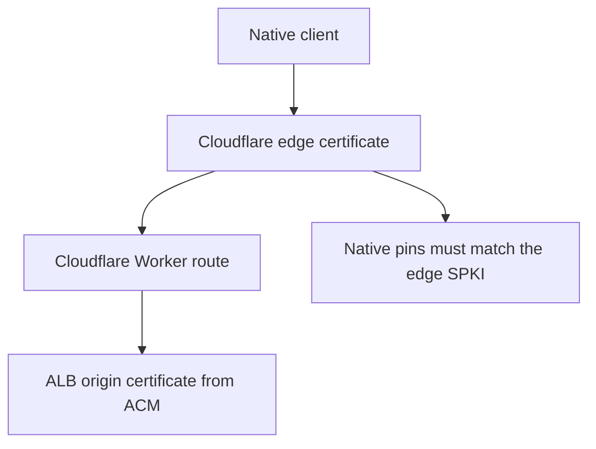

# Native TLS Pinning

Native API clients support SPKI public-key pinning for the public API hosts derived from the
OpenTofu environment topology: `voucha.ai` and `staging.voucha.ai`. Pinning is intentionally
disabled until those hosts use controlled Cloudflare edge certificate keys.

## Routing Source Of Truth

The native client sees the Cloudflare edge certificate for the API hosts. Do not pin the
`aws_acm_certificate.alb` certificate from OpenTofu; that certificate protects the
Cloudflare-to-ALB origin leg, not the native-client-to-Cloudflare leg.

## Enabling Enforcement

1. Provision a Cloudflare custom edge certificate for `voucha.ai` and `staging.voucha.ai` with a
   key lifecycle controlled by operations. Do not store private TLS keys in OpenTofu state.
2. Generate two SPKI SHA-256 pins: the active key and a backup key already prepared for rollover.
   Store pins as base64-encoded SHA-256 digests of the DER SubjectPublicKeyInfo bytes.
3. Add both pins to the Swift and .NET native pin policies in a linked
   `vouchington/vouchington-clients` PR. The checked-in default must contain either zero pins or at
   least two pins for each enforced host. This is operational rollout guidance; constructors do not
   enforce the two-pin minimum because tests and emergency rollback tooling may need to model
   partial pin sets.
4. Release native clients and wait until the enforced version is broadly available before rotating
   the Cloudflare edge certificate.
5. After rotation and rollout, remove the retired trailing pin in a later release.

## Failure Handling

Pin mismatches on configured production or staging API hosts fail the request after normal platform
trust evaluation. Local development origins, localhost, and custom `VOUCHA_API_BASE_URL` values are
not pinned. If a mismatch happens in production, treat it as either an active interception signal or
an unsafe certificate rotation; do not ask users to bypass it.

This runbook is only the public API SPKI pin. It is not the local-LLM cleartext peer check:
`OpenAICompatibleResponsesClient` re-validates the resolved IP before a local-model `http` request
(see [Native client architecture](https://github.com/vouchington/vouchington-clients/blob/main/docs/architecture/native-clients.md)).

## Validation

- Swift and .NET validation commands are owned by the [client repository](https://github.com/vouchington/vouchington-clients).
- Infrastructure changes: run the validation documented in the private `vouchington-infra`
  repository.
